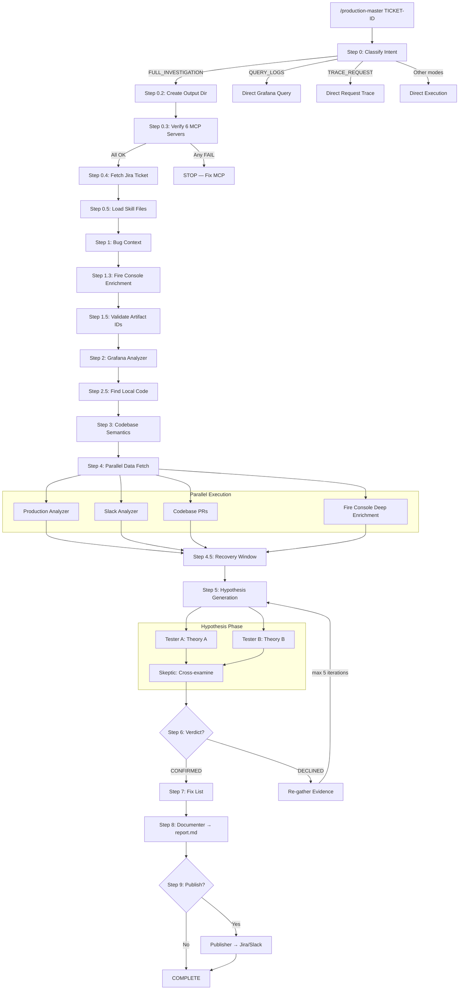
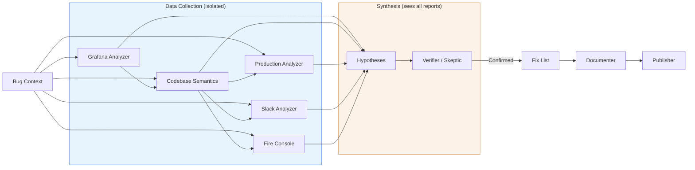

# Production Master

Autonomous production investigation pipeline for Claude Code. Classifies user intent, routes to specialized agents, and executes multi-step bug investigations with hypothesis loops.

## Quick Start

### Install via Plugin Marketplace

```bash
claude plugin marketplace add TamirCohen-Wix/production-master
claude plugin install production-master
```

### Local Testing (from cloned repo)

```bash
git clone https://github.com/TamirCohen-Wix/production-master.git
claude --plugin-dir ./production-master
```

### Set Up Domain for Your Repo

After installing, run in Claude Code from your repo:
```
/update-context
```

This interactively builds `domain.json`, `CLAUDE.md`, and `MEMORY.md` for your repo, stored under `~/.claude/production-master/domains/<repo>/`, then offers to PR it back.

### Enable Agent Teams (Recommended)

Add this to your `~/.claude/settings.json` manually:
```json
{
  "env": {
    "CLAUDE_CODE_EXPERIMENTAL_AGENT_TEAMS": "1"
  }
}
```

This enables competing hypothesis testing with skeptic cross-examination during investigations.

### Uninstall

```bash
claude plugin uninstall production-master
```

---

## Usage

After installation, use `/production-master` in Claude Code:

```
/production-master SCHED-45895                                  # Full investigation
/production-master get errors from bookings-service last 2h     # Query logs
/production-master trace 1769611570.535540810122211411840        # Trace request
/production-master show me error rate for bookings-service      # Query metrics
/production-master search slack for SCHED-45895                 # Search Slack
/production-master check toggle specs.bookings.SomeToggle       # Check toggles
```

Use `/update-context` after investigations to learn from them and contribute back.

---

## Plugin Structure

```
production-master/
├── .claude-plugin/
│   └── plugin.json              ← Plugin metadata
├── agents/                      ← 12 pipeline agents
├── commands/                    ← 3 commands (production-master, update-context, git-update-agents)
├── skills/                      ← 9 MCP skill references
├── hooks/
│   └── hooks.json               ← Notification + link validation hooks
├── scripts/
│   └── validate-report-links.sh ← Report link validator
├── output-styles/               ← Investigation report + publisher formatting
├── Domain/                      ← Company/team/repo domain configs
│   └── Bookings/Server/scheduler/
├── README.md
└── .gitignore
```

---

## Architecture

12 specialized agents, 3 commands, 9 skill references, 2 output styles, 1 link validation hook.

| Agent | Role |
|-------|------|
| `bug-context` | Parses Jira tickets into structured briefs |
| `artifact-resolver` | Validates service names against Grafana |
| `grafana-analyzer` | Queries production logs, reports raw findings |
| `codebase-semantics` | Maps code flows, error propagation, service boundaries |
| `production-analyzer` | Finds PRs, commits, feature toggle changes |
| `slack-analyzer` | Searches Slack for related discussions |
| `hypotheses` | Generates testable root cause theories |
| `verifier` | Quality gate — evaluates hypothesis proof |
| `skeptic` | Cross-examines competing hypotheses (agent teams) |
| `fix-list` | Creates actionable fix plans with feature toggles |
| `documenter` | Compiles pipeline output into investigation reports |
| `publisher` | Publishes findings to Jira and/or Slack |

Commands: `/production-master` (main orchestrator), `/update-context` (domain management & learning), `/git-update-agents` (sync back to repo).

### Domain Config

Each repository gets a domain directory containing:

- **`domain.json`** — Machine-readable config: artifact IDs, Jira project, GitHub org, Slack channels
- **`CLAUDE.md`** — Repo-specific Claude instructions: service descriptions, debugging tips
- **`memory/MEMORY.md`** — Accumulated investigation knowledge

You don't create these manually — use `/update-context` and it will guide you interactively. Domain configs live in `Domain/` for contribution via PR and are installed at runtime to `~/.claude/production-master/domains/<repo>/`.

---

## Investigation Flow



### Agent Data Flow



**Key principle:** Data agents never see each other's outputs. Only Hypothesis and Verifier/Skeptic synthesize across all data sources, preventing confirmation bias.

---

## Output Directory Structure

Each investigation creates a timestamped output directory:

```
.claude/debug/debug-SCHED-45895-2026-02-14-143000/
├── findings-summary.md              ← Persistent state file (updated after every step)
├── report.md                        ← Final investigation report (Step 8)
│
├── bug-context/
│   ├── bug-context-output-V1.md
│   └── bug-context-trace-V1.md      ← Action log (human debugging only)
├── grafana-analyzer/
│   ├── grafana-analyzer-output-V1.md
│   └── grafana-analyzer-output-V2.md ← Re-run after Declined
├── codebase-semantics/
│   ├── codebase-semantics-output-V1.md
│   └── codebase-semantics-prs-output-V1.md
├── production-analyzer/
│   └── production-analyzer-output-V1.md
├── slack-analyzer/
│   └── slack-analyzer-output-V1.md
├── fire-console/
│   └── fire-console-output-V1.md
├── hypotheses/
│   ├── hypotheses-tester-A-output-V1.md
│   └── hypotheses-tester-B-output-V1.md
├── skeptic/
│   └── skeptic-output-V1.md
├── fix-list/
│   └── fix-list-output-V1.md
├── documenter/
│   └── documenter-output-V1.md
└── publisher/
    └── publisher-output-V1.md
```

**Naming:** `{agent}-output-V{N}.md` where N increments per re-invocation. Trace files (`-trace-`) are for human debugging only — never passed between agents.

**Location:** Inside a git repo: `.claude/debug/`. Outside: `./debug/`.

---

## Contributing

### Contributing a new domain

The easiest way — use `/update-context`:

1. Install Production Master
2. Run `/update-context` — it guides you through creating domain config interactively
3. Say "yes" when it asks to open a PR
4. The PR lands in `Domain/<Division>/<Side>/<repo>/`

### Contributing pipeline improvements

1. **Fork & clone** this repo
2. **Edit files** directly (agents, commands, skills, hooks, output-styles, scripts)
3. **Test locally** — run `claude --plugin-dir .` and use `/production-master` on a real ticket
4. **Open a PR** with what you changed and why

### Guidelines

- **Don't hardcode company-specific values** in pipeline files — use `domain.json` for anything repo-specific
- **Keep agents focused** — each agent has one job. Don't add analysis to data-collection agents
- **Test with real tickets** — the best way to validate changes
- **Update MEMORY.md** — if you learn something from an investigation, capture it

---

## Requirements

- [Claude Code CLI](https://docs.anthropic.com/en/docs/claude-code)
- MCP servers: Grafana, Slack, Jira, GitHub, Octocode, FT-release (configured via your organization)
- `gh` CLI (for `/update-context` PR flow)
