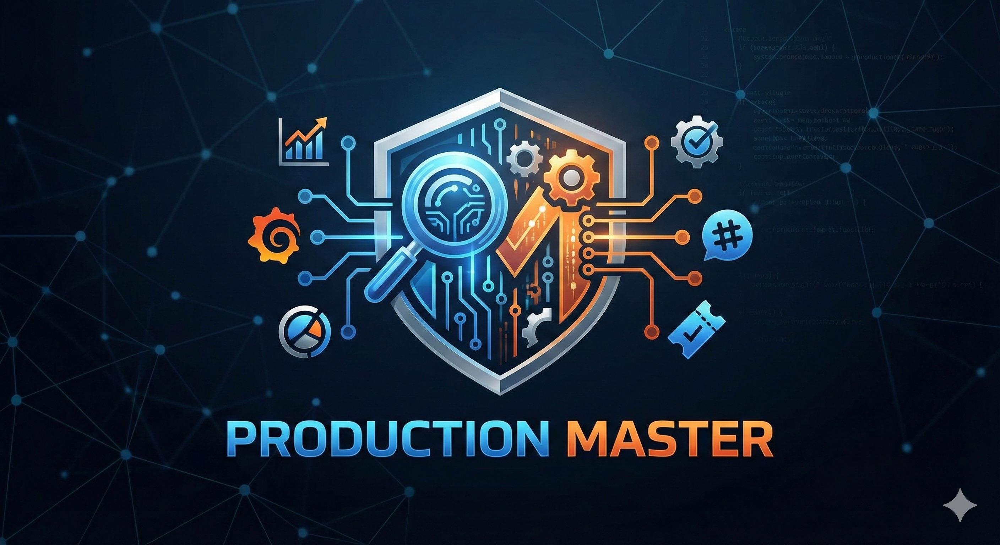

<p align="center">
  
</p>

# Production Master

[](https://github.com/TamirCohen-Wix/production-master/releases/tag/v1.0.2-beta)
[](https://github.com/TamirCohen-Wix/production-master/actions/workflows/ci.yml)
[](https://wix.slack.com/team/U09H3AHE3C7)
[](https://github.com/anthropics/claude-code/blob/main/plugins/README.md)

Autonomous production investigation pipeline for [Claude Code](https://docs.anthropic.com/en/docs/claude-code). Classifies user intent, routes to specialized agents, and executes multi-step bug investigations with hypothesis loops.

> [!WARNING]
> **This plugin is in beta.** It is under active development and may have rough edges. We recommend trying it **per-session first** (see below) before committing to a persistent install. If you do install, use **`local` scope** (the default) so it only affects your current project.

> [!CAUTION]
> **MCP connectivity can be unstable.** The MCP gateway service (`mcp-s`) may experience intermittent connection issues that can cause tool failures during a run. A full investigation run takes **~40 minutes** to complete, so a mid-run failure can be costly. If you experience MCP connection errors (401s, timeouts, or tools not loading), check [#mcp-gw-support](https://wix.slack.com/archives/C093RAT0NLS) for known issues and status updates.

## Table of Contents

- [Quick Start](#quick-start--try-per-session-recommended)
- [Install](#install-persistent)
- [Install on Cursor](#install-on-cursor)
- [Plugin Scopes](#plugin-scopes)
- [Plugin Management](#plugin-management)
- [Usage](#usage)
- [Output Format](#output-format)
- [Architecture](#architecture)
- [Documentation](#documentation)
- [Plugin Structure](#plugin-structure)
- [Contributing](#contributing)
- [Requirements](#requirements)

## Quick Start — Try Per-Session (Recommended)

The safest way to try Production Master is per-session — nothing is installed, and it's gone when you close Claude Code:

```bash
gh repo clone TamirCohen-Wix/production-master
claude --plugin-dir ./production-master
```

Then use `/production-master:production-master TICKET-ID` to run an investigation. If you like it, proceed to install it persistently below.

> **Note:** With `--plugin-dir`, commands are prefixed with `production-master:` (e.g., `/production-master:grafana-query`). With a persistent install, they're available directly (e.g., `/grafana-query`).

## Install (Persistent)

Clone the repo and run the installer:

```bash
gh repo clone TamirCohen-Wix/production-master
cd production-master
bash scripts/install.sh
```

Or [download the ZIP](https://github.com/TamirCohen-Wix/production-master/archive/refs/tags/v1.0.2-beta.zip), unzip, and run:

```bash
unzip production-master-v1.0.2-beta.zip
cd production-master-v1.0.2-beta
bash scripts/install.sh
```

The installer will:
1. Ask you to choose an install scope (defaults to **local** — see [Plugin Scopes](#plugin-scopes) below)
2. Register the **`production-master`** marketplace in Claude Code
3. Install the **`production-master`** plugin from that marketplace
4. Configure MCP servers — prompts for your [access key](https://mcp-s-connect.wewix.net/mcp-servers) (or reuses an existing one)
5. Enable agent teams in `~/.claude/settings.json`

> **Requires:** [Claude Code CLI](https://docs.anthropic.com/en/docs/claude-code), [GitHub CLI](https://cli.github.com) (`gh`), and `jq` (auto-installed via Homebrew if missing)

## Install on Cursor

To use Production Master in **Cursor IDE** (no Claude Code extension): run the Cursor install script. Commands become rules, sub-agents are run by the single agent following `agents/*.md`, and skills/MCPs are installed into `.cursor/`. See **[docs/CURSOR_INSTALL.md](docs/CURSOR_INSTALL.md)** for the full guide. Then run:

```bash
bash scripts/install-cursor.sh
```

## Plugin Scopes

When installing, you choose where the plugin is available:

| Scope | Location | Shared via git? | Available in | Best for |
|-------|----------|-----------------|--------------|----------|
| **`local`** (default) | `.claude/plugins/` in current project | No (gitignored) | Current project only | Trying it out, personal use |
| `project` | `.claude/plugins/` in current project | Yes (committed) | Current project only | Sharing with your team via the repo |
| `user` | `~/.claude/plugins/` | No | All your projects | Power users who want it everywhere |

> [!WARNING]
> **Recommended: `local` scope.** This keeps the blast radius small — the plugin only affects the project where you installed it, and uninstalling is clean. Use `project` or `user` scope only after you've validated it works well for your workflow.

## Plugin Management

```bash
# List installed plugins and their status
claude plugin list

# Install (after marketplace is registered)
claude plugin install production-master --scope local

# Uninstall (must specify the scope it was installed with)
claude plugin uninstall production-master --scope local

# Remove the marketplace registration
claude plugin marketplace remove production-master

# Run per-session without installing
claude --plugin-dir /path/to/production-master

# Validate your installation
bash scripts/validate-install.sh
```

## Usage

After installing (or loading with `--plugin-dir`), restart Claude Code / Cursor, then use `/production-master`:

```
/production-master SCHED-45895                                  # Full investigation
/production-master get errors from bookings-service last 2h     # Query logs
/production-master trace 1769611570.535540810122211411840        # Trace request
/production-master show me error rate for bookings-service      # Query metrics
/production-master search slack for SCHED-45895                 # Search Slack
/production-master check toggle specs.bookings.SomeToggle       # Check toggles
```

For the full list of modes and examples, see the [commands reference](docs/commands.md).

### All commands

| Command | Description |
|---------|-------------|
| `/production-master` | Full investigation pipeline |
| `/grafana-query` | Query Grafana logs & metrics directly |
| `/slack-search` | Search Slack discussions |
| `/production-changes` | Find PRs, commits, and feature toggle changes |
| `/resolve-artifact` | Validate and resolve service artifact IDs |
| `/fire-console` | Query domain objects via Fire Console gRPC |
| `/update-context` | Create or update your domain config (see below) |
| `/git-update-agents` | Sync agent updates back to the repo |

### Set up your repo

Run `/update-context` from within your repo in Claude Code. It:
- **New domain**: Analyzes your repo structure, asks interactive questions, and creates `domain.json`, `CLAUDE.md`, and `MEMORY.md` for your repo
- **Existing domain**: Learns from past investigations and updates the config with new services, error patterns, and channels
- Optionally opens a PR to contribute the config back to this repository

## Output Format

Investigation reports follow a structured format designed for clarity in the terminal. Reports include status updates at each pipeline stage, structured findings tables, inline code references, and hyperlinks to Grafana dashboards, Jira tickets, and Slack threads.

When publishing to external tools (Jira, Slack, GitHub), the output is automatically adapted to each platform's markup — Jira wiki syntax, Slack mrkdwn, or GitHub-flavored markdown.

For details on formatting rules and cross-platform publishing, see the [investigation report style guide](docs/architecture.md#output-directory-structure) and the templates in `output-styles/`.

## Architecture

12 specialized agents, 8 commands, 9 MCP skill references. The pipeline classifies user intent, gathers context from multiple sources in parallel, generates testable hypotheses, and iterates through a verification loop (up to 5 rounds) until a root cause is confirmed.

### Model configuration

The `/production-master` orchestrator runs on your session's current model (typically **Opus 4.6**). All 12 subagents run on **Sonnet** by default because Opus token usage is limited — a full investigation spawns 12+ subagents across multiple pipeline steps, and running all of them on Opus would quickly exhaust your token budget. Sonnet handles data fetching, MCP queries, and report writing well at a fraction of the cost, while Opus is reserved for the orchestrator where complex reasoning and coordination matter most.

To change the subagent model, edit the `model` parameter in `commands/production-master.md` — every `Task` call specifies `model="sonnet"`. Replace with `"opus"` or `"haiku"` as needed. The orchestrator's own model is determined by your Claude Code session (use `/model` to switch).

| Agent | Role |
|-------|------|
| `bug-context` | Parses Jira tickets into structured briefs |
| `artifact-resolver` | Validates service names against Grafana |
| `grafana-analyzer` | Queries production logs, reports raw findings |
| `codebase-semantics` | Maps code flows, error propagation, service boundaries |
| `production-analyzer` | Finds PRs, commits, feature toggle changes |
| `slack-analyzer` | Searches Slack for related discussions |
| `hypotheses` | Generates testable root cause theories |
| `verifier` | Quality gate — evaluates hypothesis proof |
| `skeptic` | Cross-examines competing hypotheses (agent teams) |
| `fix-list` | Creates actionable fix plans with feature toggles |
| `documenter` | Compiles pipeline output into investigation reports |
| `publisher` | Publishes findings to Jira and/or Slack |

For the full design, including flow diagrams, the hypothesis loop state machine, and data flow between agents, see the [architecture overview](docs/architecture.md).

## Documentation

| Topic | Description |
|-------|-------------|
| [Architecture overview](docs/architecture.md) | Pipeline design, agent interactions, data flow, and the hypothesis verification loop |
| [Investigation flow](docs/investigation-flow.md) | Step-by-step pipeline state machine from initialization through completion |
| [Commands reference](docs/commands.md) | All 8 commands with modes, parameters, and usage examples |
| [Agent catalog](docs/agents.md) | Detailed profiles of each agent — inputs, outputs, and skills used |
| [Contributing guide](docs/contributing.md) | How to add domain configs, improve agents, and submit PRs |
| [Domain configs](docs/domain-configs.md) | How domain configs work, field reference, creation guide, and config loading order |
| [Troubleshooting](docs/troubleshooting.md) | Diagnosing MCP server issues and recovering from mid-investigation failures |

## Plugin Structure

```
production-master/
├── .claude-plugin/
│   ├── plugin.json              ← Plugin metadata
│   └── marketplace.json         ← Marketplace definition
├── agents/                      ← 12 pipeline agents
├── commands/                    ← 8 slash commands
├── skills/                      ← 9 MCP skill references
├── hooks/
│   └── hooks.json               ← Notification + link validation hooks
├── scripts/
│   ├── install.sh               ← Installer
│   ├── validate-install.sh      ← Installation diagnostics
│   └── validate-report-links.sh ← Report link validator
├── output-styles/               ← Investigation report + publisher formatting
├── Domain/                      ← Domain configs (per-repo investigation context)
├── mcp-servers.json             ← MCP server template (used by install.sh)
└── README.md
```

### Why `mcp-servers.json` instead of `.mcp.json`?

Claude Code plugins can declare MCP servers via a `.mcp.json` file at the plugin root, which auto-starts servers when the plugin loads. However, our 9 MCP servers require **personal access keys** — auto-starting them with placeholder keys would fail. Instead, `mcp-servers.json` serves as a **template** that `install.sh` processes: it substitutes your real access key and merges only missing servers into `~/.claude.json`, without overwriting any existing server configs.

### Domain configs

The `Domain/` folder is a shared knowledge base that gives the pipeline context about your repo — which services to query, what artifact IDs to use in Grafana, which Slack channels to search, and patterns learned from past investigations. It's organized as `Domain/{Division}/{Side}/{Repo}/`:

```
Domain/
└── Bookings/
    └── Server/
        └── scheduler/
            ├── domain.json          ← Services, artifact IDs, Jira project, Slack channels, toggles
            ├── CLAUDE.md            ← Human-readable repo context loaded into agent prompts
            └── memory/
                └── MEMORY.md        ← Debugging patterns learned from past investigations
```

Without a domain config, the pipeline runs in "generic mode" and will ask for service names and artifact IDs during the investigation. With one, it works autonomously.

**Create yours** by running `/update-context` from your repo — it analyzes the repo structure, asks a few questions, and generates the config. You can then PR it back so the whole team benefits.

For the full field reference, config loading order, and how configs improve over time, see the [domain configs guide](docs/domain-configs.md).

## Contributing

### Set up your development environment

```bash
gh repo fork TamirCohen-Wix/production-master --clone
cd production-master
```

Test your changes per-session before committing:

```bash
claude --plugin-dir .
```

All PRs to `main` require:
- Passing CI checks (plugin validation, shell lint, install/uninstall test)
- At least 1 approving review

For detailed contribution guidelines — adding domain configs, improving agents, and writing new commands — see the [contributing guide](docs/contributing.md).

### Quick links

- [Add your repo's domain config](docs/contributing.md#contributing-a-new-domain) — run `/update-context` and PR the result
- [Improve the pipeline](docs/contributing.md#contributing-pipeline-improvements) — edit agents, commands, or skills and open a PR

## Requirements

- [Claude Code CLI](https://docs.anthropic.com/en/docs/claude-code)
- [GitHub CLI](https://cli.github.com) (`gh`)
- [MCP servers](https://mcp-s-connect.wewix.net/mcp-servers): Grafana, Slack, Jira, GitHub, Octocode, FT-release, Context-7, Grafana-MCP, Fire Console — see [`mcp-servers.json`](mcp-servers.json)

---

Made by [Tamir Cohen](https://wix.slack.com/team/U09H3AHE3C7)
