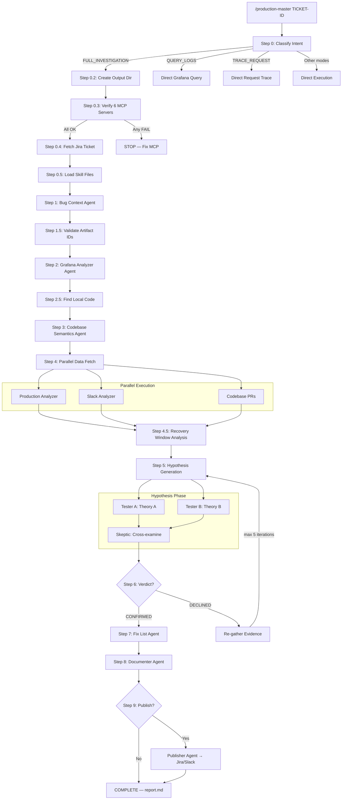
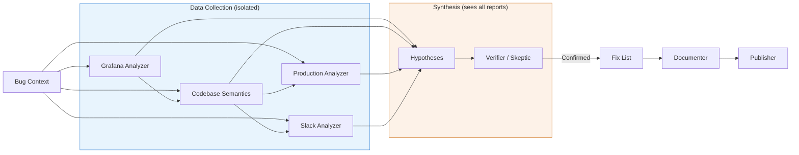

# Production Master

Autonomous production investigation pipeline for Claude Code. Classifies user intent, routes to specialized agents, and executes multi-step bug investigations with hypothesis loops.

## Architecture: 3 Layers

```
production-master/
├── Common/          ← Generic pipeline (agents, commands, skills, hooks, output-styles)
├── Domain/          ← Company/team/repo specific context
│   └── Bookings/
│       └── Server/
│           └── scheduler/
│               ├── domain.json
│               ├── CLAUDE.md
│               └── memory/MEMORY.md
├── Claude/          ← Installation tooling
│   ├── install.sh
│   └── templates/settings.json
└── README.md
```

### Common — Generic Pipeline Components

12 specialized agents, 3 commands, 9 skill references, 2 output styles, 1 link validation hook.

| Agent | Role |
|-------|------|
| `bug-context` | Parses Jira tickets into structured briefs |
| `artifact-resolver` | Validates service names against Grafana |
| `grafana-analyzer` | Queries production logs, reports raw findings |
| `codebase-semantics` | Maps code flows, error propagation, service boundaries |
| `production-analyzer` | Finds PRs, commits, feature toggle changes |
| `slack-analyzer` | Searches Slack for related discussions |
| `hypotheses` | Generates testable root cause theories |
| `verifier` | Quality gate — evaluates hypothesis proof |
| `skeptic` | Cross-examines competing hypotheses (agent teams) |
| `fix-list` | Creates actionable fix plans with feature toggles |
| `documenter` | Compiles pipeline output into investigation reports |
| `publisher` | Publishes findings to Jira and/or Slack |

Commands: `/production-master` (main orchestrator), `/update-context` (domain management & learning), `/git-update-agents` (sync back to repo).

### Domain — Company/Team/Repo Context

Each repository gets a domain directory containing:

- **`domain.json`** — Machine-readable config: artifact IDs, Jira project, GitHub org, Slack channels, service mappings
- **`CLAUDE.md`** — Repo-specific Claude instructions: service descriptions, artifact patterns, debugging tips
- **`memory/MEMORY.md`** — Accumulated investigation knowledge that persists across sessions

You don't create these manually — use the `/update-context` command and it will guide you through setup interactively, then offer to PR it back to this repo.

### Claude — Installation Tooling

- `install.sh` — One-liner installer that detects context and assembles config
- `templates/settings.json` — Base Claude Code settings template

---

## Investigation Flow

### Full Investigation Pipeline



### Agent Data Flow



Key design principle: **Data agents never see each other's outputs.** Only the Hypothesis and Verifier/Skeptic agents synthesize across all data sources. This prevents confirmation bias.

---

## Output Directory Structure

Each investigation creates a timestamped output directory with per-agent subdirectories:

```
.claude/debug/debug-SCHED-45895-2026-02-14-143000/
├── findings-summary.md              ← Persistent state file (updated after every step)
├── report.md                        ← Final investigation report
│
├── bug-context/
│   ├── bug-context-output-V1.md     ← Structured brief from Jira ticket
│   └── bug-context-trace-V1.md      ← Action log (human debugging only)
│
├── grafana-analyzer/
│   ├── grafana-analyzer-output-V1.md    ← Raw log findings, error counts, URLs
│   ├── grafana-analyzer-trace-V1.md
│   ├── grafana-analyzer-output-V2.md    ← Re-run after Declined (targeted queries)
│   └── grafana-analyzer-trace-V2.md
│
├── codebase-semantics/
│   ├── codebase-semantics-output-V1.md      ← Error propagation, flow mapping
│   ├── codebase-semantics-trace-V1.md
│   ├── codebase-semantics-prs-output-V1.md  ← PR/change analysis (Step 4)
│   └── codebase-semantics-prs-trace-V1.md
│
├── production-analyzer/
│   ├── production-analyzer-output-V1.md     ← PRs, toggles, timeline
│   └── production-analyzer-trace-V1.md
│
├── slack-analyzer/
│   ├── slack-analyzer-output-V1.md          ← Slack threads, attributions
│   └── slack-analyzer-trace-V1.md
│
├── hypotheses/
│   ├── hypotheses-tester-A-output-V1.md     ← Theory A findings
│   ├── hypotheses-tester-A-trace-V1.md
│   ├── hypotheses-tester-B-output-V1.md     ← Theory B findings
│   └── hypotheses-tester-B-trace-V1.md
│
├── skeptic/
│   └── skeptic-output-V1.md                 ← Cross-examination verdict
│
├── verifier/
│   └── verifier-output-V1.md                ← (sequential mode fallback)
│
├── fix-list/
│   ├── fix-list-output-V1.md                ← Actionable fix with toggle
│   └── fix-list-trace-V1.md
│
├── documenter/
│   ├── documenter-output-V1.md
│   └── documenter-trace-V1.md
│
└── publisher/
    ├── publisher-output-V1.md               ← What was published where
    └── publisher-trace-V1.md
```

**Naming convention:** `{agent-name}-output-V{N}.md` where N increments per re-invocation. Trace files (`-trace-`) are for human debugging only and are never passed between agents.

**Location:** Inside a git repo → `.claude/debug/`. Outside a repo → `./debug/`.

---

## Quick Start

### One-liner install (from any repo)

```bash
curl -fsSL https://raw.githubusercontent.com/TamirCohen-Wix/production-master/main/Claude/install.sh | bash
```

### Install from cloned repo

```bash
git clone https://github.com/TamirCohen-Wix/production-master.git
cd production-master
./Claude/install.sh
```

### Force global install

```bash
./Claude/install.sh --force-global
```

### Set up domain for your repo

After installing, run in Claude Code from your repo:
```
/update-context
```

This interactively builds `domain.json`, `CLAUDE.md`, and `MEMORY.md` for your repo, then offers to PR it back.

---

## Usage

After installation, use the `/production-master` command in Claude Code:

```
/production-master SCHED-45895                                  # Full investigation
/production-master get errors from bookings-service last 2h     # Query logs
/production-master trace 1769611570.535540810122211411840        # Trace request
/production-master show me error rate for bookings-service      # Query metrics
/production-master search slack for SCHED-45895                 # Search Slack
/production-master check toggle specs.bookings.SomeToggle       # Check toggles
```

Use `/update-context` after investigations to:
- Learn from recent investigations and update MEMORY.md
- Discover new services and add them to domain.json
- Contribute improvements back via PR

---

## Contributing

We welcome contributions! The best way to improve Production Master is by using it and feeding back what you learn.

### Contributing a new domain

The easiest way to contribute — just use `/update-context`:

1. Install Production Master in your repo
2. Run `/update-context` — it guides you through creating `domain.json`, `CLAUDE.md`, and `MEMORY.md`
3. Say "yes" when it asks to open a PR
4. The PR lands in `Domain/<Division>/<Side>/<repo>/`

### Contributing pipeline improvements

To improve agents, commands, skills, or other Common layer components:

1. **Fork & clone** this repo
2. **Edit files** in `Common/` (agents, commands, skills, hooks, output-styles)
3. **Test locally** by running `./Claude/install.sh` and using `/production-master` on a real ticket
4. **Open a PR** with:
   - What you changed and why
   - Which investigation exposed the gap
   - Before/after comparison if applicable

### What makes a good contribution

| Type | Example | Where |
|------|---------|-------|
| New domain config | "Added support for payments-service repo" | `Domain/Payments/Server/payments/` |
| Agent improvement | "Grafana agent now handles NULL meta_site_id fallback" | `Common/agents/grafana-analyzer.md` |
| New skill reference | "Added Datadog MCP skill" | `Common/skills/datadog/SKILL.md` |
| Memory update | "Documented retry backoff pattern for notifications" | `Domain/Bookings/Server/scheduler/memory/MEMORY.md` |
| Bug fix | "Fixed install.sh failing on Linux" | `Claude/install.sh` |

### Guidelines

- **Don't hardcode company-specific values** in `Common/` — use `domain.json` for anything repo-specific
- **Keep agents focused** — each agent has one job. Don't add analysis to data-collection agents
- **Test with real tickets** — the best way to validate changes is to run an actual investigation
- **Update MEMORY.md** — if you learn something from an investigation, capture it

---

## Requirements

- [Claude Code CLI](https://docs.anthropic.com/en/docs/claude-code)
- MCP servers: Grafana, Slack, Jira, GitHub, Octocode, FT-release (configured via your organization)
- `gh` CLI (for `/update-context` PR flow)
- `jq` (optional, for settings merge during install)
