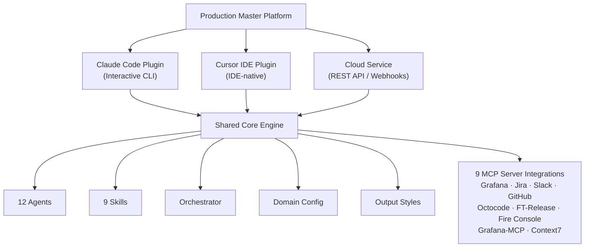

<p align="center">
  
</p>

# Production Master

[](https://github.com/TamirCohen-Wix/production-master/releases/tag/v1.0.3-beta)
[](https://github.com/TamirCohen-Wix/production-master/actions/workflows/ci.yml)
[](https://wix.slack.com/team/U09H3AHE3C7)

Autonomous production investigation **platform** with a shared core engine and three surfaces: Claude Code plugin, Cursor IDE plugin, and Cloud REST API.

> [!WARNING]
> **Beta.** For the Claude Code surface, try it **per-session first** before installing persistently. Use **`local` scope** (the default) to limit blast radius.

> [!CAUTION]
> **MCP connectivity can be unstable.** A full investigation takes ~40 minutes. If you hit MCP errors, check [#mcp-gw-support](https://wix.slack.com/archives/C093RAT0NLS).

## Quick Start

Pick your surface and follow the setup guide:

- If you use Claude Code, start with the [Claude adapter setup guide](adapter-claude/README.md).
- If you use Cursor, follow the [Cursor adapter setup guide](adapter-cursor/README.md).
- If you deploy the service, use the [Cloud adapter deployment guide](adapter-cloud/README.md).

After setup, run your first investigation from Claude Code:

```text
/production-master SCHED-45895
```

For troubleshooting and operational recovery steps, see the [troubleshooting guide](docs/troubleshooting.md).

## Platform Architecture



This diagram is an overview only. For pipeline internals and data flow, read the [architecture documentation](docs/architecture.md).

## Repository Structure

```
production-master/
├── core/                    # Shared, adapter-agnostic logic
│   ├── agents/              # 12 investigation agents
│   ├── skills/              # 9 MCP skill definitions
│   ├── output-styles/       # Report & publisher formats
│   ├── orchestrator/        # Pipeline orchestration logic
│   ├── domain/              # Domain config schema & loading
│   │   └── examples/        # Reference domain config samples
│   ├── tests/               # Core unit tests
│   └── mcp-servers.json     # MCP server definitions
├── adapter-claude/          # Claude Code adapter
│   ├── commands/            # Slash commands for Claude Code
│   ├── hooks/               # Claude Code lifecycle hooks
│   ├── scripts/             # Install, validate, sync scripts
│   └── tests/               # Adapter-specific tests
├── adapter-cursor/          # Cursor IDE adapter
│   ├── rules/               # Cursor-specific rule files
│   ├── commands/            # Cursor command definitions
│   ├── agents/              # Cursor agent configurations
│   ├── hooks/               # Lifecycle hooks
│   └── tests/               # Adapter-specific tests
├── adapter-cloud/           # Cloud adapter / REST service
│   ├── src/                 # API, workers, MCP client, storage
│   ├── helm/                # Kubernetes Helm charts
│   ├── migrations/          # Database migrations
│   └── tests/               # Unit, integration, e2e tests
├── docs/                    # User-facing documentation
├── docs/platform-design-docs/ # Architecture & design documents
├── mcp-servers.json         # Root MCP server config
└── cursor-models.json       # Cursor adapter model config
```

## Install

### Claude Code

```bash
gh repo clone TamirCohen-Wix/production-master
cd production-master
bash adapter-claude/scripts/install.sh
```

The installer asks for an install scope, registers the plugin, configures MCP servers (prompts for your [access key](https://mcp-s-connect.wewix.net/mcp-servers)), and enables agent teams.

**Quick trial (per-session, nothing installed):**

```bash
claude --plugin-dir ./production-master
```

<details>
<summary>Plugin scopes & management (Claude Code)</summary>

#### Plugin scopes

| Scope | Location | Shared via git? | Best for |
|-------|----------|-----------------|----------|
| **`local`** (default) | `.claude/plugins/` in project | No | Trying it out |
| `project` | `.claude/plugins/` in project | Yes | Team sharing |
| `user` | `~/.claude/plugins/` | No | All projects |

#### Plugin management

```bash
claude plugin list                                    # Show installed plugins
claude plugin install production-master --scope local # Install
claude plugin uninstall production-master --scope local # Uninstall
claude plugin marketplace remove production-master    # Remove marketplace
bash adapter-claude/scripts/validate-install.sh        # Diagnose issues
```

</details>

### Cursor IDE

```bash
gh repo clone TamirCohen-Wix/production-master
cd production-master
export PRODUCTION_MASTER_ACCESS_KEY="<your-mcp-access-key>"
cursor adapter-cursor
```

Then follow the step-by-step setup in the [Cursor installation guide](adapter-cursor/README.md) to verify MCP connectivity and run your first command.

### Cloud Service

```bash
cd adapter-cloud
cp .env.example .env   # Edit with your API keys
docker compose up -d   # API at http://localhost:3000
```

For deployment details (including Wix Serverless), follow the [Cloud deployment guide](adapter-cloud/README.md).

## Usage

Commands below use Claude Code slash-command syntax. Cursor and Cloud surfaces expose equivalent capabilities through their own UX/API.

```
/production-master SCHED-45895                                  # Full investigation
/production-master get errors from bookings-service last 2h     # Query logs
/production-master trace 1769611570.535540810122211411840        # Trace request
/production-master show me error rate for bookings-service      # Query metrics
/production-master search slack for SCHED-45895                 # Search Slack
/production-master check toggle specs.bookings.SomeToggle       # Check toggles
```

### Commands

| Command | Description |
|---------|-------------|
| `/production-master` | Full investigation pipeline |
| `/grafana-query` | Query Grafana logs & metrics |
| `/slack-search` | Search Slack discussions |
| `/production-changes` | Find PRs, commits, and feature toggle changes |
| `/resolve-artifact` | Validate and resolve service artifact IDs |
| `/fire-console` | Query domain objects via Fire Console gRPC |
| `/update-context` | Create or update your domain config |
| `/git-update-agents` | Sync agent updates back to the repo |
| `/production-master-report` | Submit bug reports, enhancements, or questions via GitHub issue |

### Command options and flags

Every command supports `--help` to show its full usage, flags, and examples:

```
/production-master --help
/grafana-query --help
```

The main pipeline supports these flags:

```
/production-master SCHED-45895 --skip-slack      # Skip Slack search
/production-master SCHED-45895 --skip-grafana    # Skip Grafana log analysis
/production-master SCHED-45895 --service my-svc  # Override primary service name
/production-master SCHED-45895 --verbose         # Show detailed agent outputs
```

You can also use natural language — the orchestrator classifies your intent automatically:

```
/production-master errors from bookings-service since 2pm       # → QUERY_LOGS mode
/production-master what PRs were merged to scheduler this week  # → SEARCH_CODE mode
```

### Set up your repo

Run `/update-context` from your repo in Claude Code. It analyzes your repo, asks a few questions, and generates a domain config (`domain.json`, `CLAUDE.md`, `MEMORY.md`). With a domain config, the pipeline works autonomously — without one, it asks for service names and artifact IDs during the investigation.

## Architecture

12 agents, 9 commands, 9 MCP skill references. The orchestrator (in `core/orchestrator/`) classifies intent, gathers context from multiple sources in parallel, generates testable hypotheses, and iterates through a verification loop until a root cause is confirmed. Agent definitions live in `core/agents/`, and adapter-specific commands in each `adapter-*/commands/` directory.

| Agent | Role |
|-------|------|
| `bug-context` | Parses Jira tickets into structured briefs |
| `service-resolver` | Validates and resolves service identifiers |
| `log-analyzer` | Queries production logs, reports raw findings |
| `codebase-semantics` | Maps code flows and error propagation |
| `change-analyzer` | Finds PRs, commits, feature toggle changes |
| `comms-analyzer` | Searches team communications for related discussions |
| `hypotheses` | Generates testable root cause theories |
| `verifier` | Quality gate — evaluates hypothesis proof |
| `skeptic` | Cross-examines competing hypotheses |
| `fix-list` | Creates actionable fix plans |
| `documenter` | Compiles investigation reports |
| `publisher` | Publishes findings to Jira and/or Slack |

For pipeline design, data flow, hypothesis loops, output format, and platform internals, see the [architecture overview](docs/architecture.md).

## Documentation

| Topic | Description |
|-------|-------------|
| [Documentation index](docs/README.md) | Start here for documentation navigation and audience-specific paths |
| [Architecture](docs/architecture.md) | Pipeline design, agent table, data flow, output format |
| [Investigation flow](docs/investigation-flow.md) | Step-by-step state machine |
| [Commands reference](docs/commands.md) | All 9 commands with parameters and examples (Claude Code) |
| [Agent catalog](docs/agents.md) | Agent profiles — inputs, outputs, skills |
| [Domain configs](docs/domain-configs.md) | Field reference, creation guide, config loading order |
| [Contributing](docs/contributing.md) | How to add domains, improve agents, submit PRs |
| [Troubleshooting](docs/troubleshooting.md) | MCP issues, mid-investigation recovery |
| [Claude Code adapter](adapter-claude/README.md) | Claude Code-specific setup, hooks, scripts |
| [Cursor adapter](adapter-cursor/README.md) | Cursor IDE-specific setup, rules, agents |
| [Cloud adapter](adapter-cloud/README.md) | Cloud API, webhooks, workers, deployment |

## Updating

To update to the latest version (Claude Code):

```bash
claude plugin update production-master
```

To install a specific version:

```bash
git checkout v1.0.3-beta         # Switch to a specific release tag
bash adapter-claude/scripts/install.sh
```

To downgrade:

```bash
git checkout v1.0.1-beta         # Any previous tag
bash adapter-claude/scripts/install.sh
```

> All available versions are listed on the [releases page](https://github.com/TamirCohen-Wix/production-master/releases).

## Feature Requests & Bug Reports

- **Request a feature:** [Open an issue](https://github.com/TamirCohen-Wix/production-master/issues/new?labels=enhancement&template=feature_request.md) with the `enhancement` label
- **Report a bug:** [Open an issue](https://github.com/TamirCohen-Wix/production-master/issues/new?labels=bug&template=bug_report.md) with the `bug` label
- **Ask a question:** [Start a discussion](https://github.com/TamirCohen-Wix/production-master/discussions)

## Contributing

```bash
gh repo fork TamirCohen-Wix/production-master --clone
cd production-master
claude --plugin-dir .   # Test changes per-session
```

PRs to `main` require passing CI and 1 approving review. See the [contributing guide](docs/contributing.md).

## Requirements

| Surface | Requirements |
|---------|-------------|
| **Claude Code** | [Claude Code CLI](https://docs.anthropic.com/en/docs/claude-code), [GitHub CLI](https://cli.github.com) (`gh`), [MCP access key](https://mcp-s-connect.wewix.net/mcp-servers) |
| **Cursor IDE** | [Cursor IDE](https://cursor.com) v0.40+, `PRODUCTION_MASTER_ACCESS_KEY` env var |
| **Cloud** | Node.js 22+, Docker, PostgreSQL 16+, Redis 7+ |

---

Made by [Tamir Cohen](https://wix.slack.com/team/U09H3AHE3C7)
