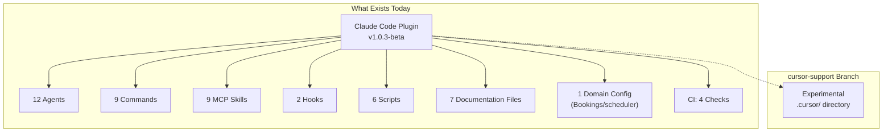
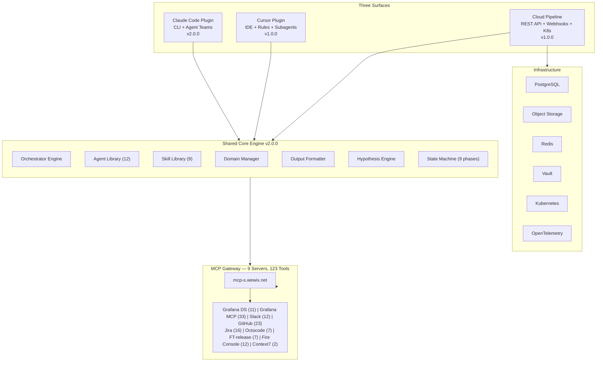
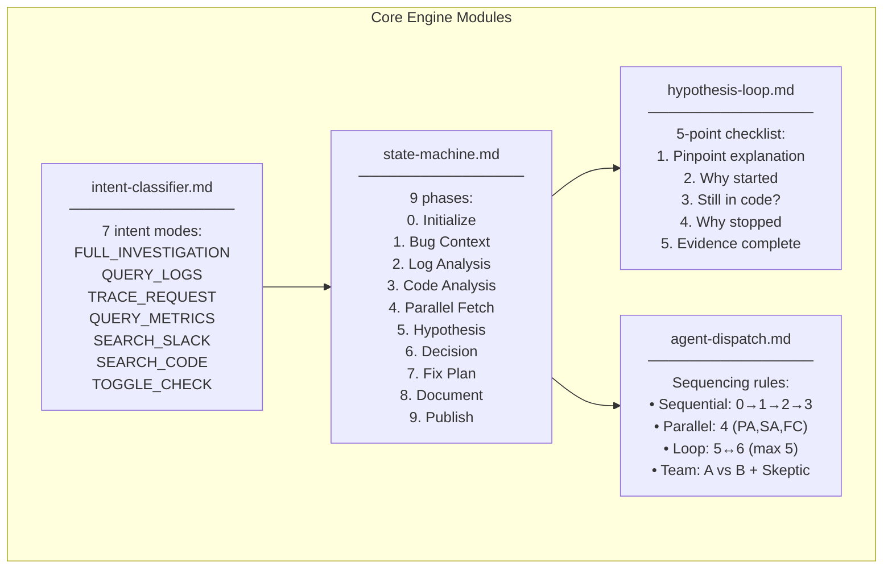
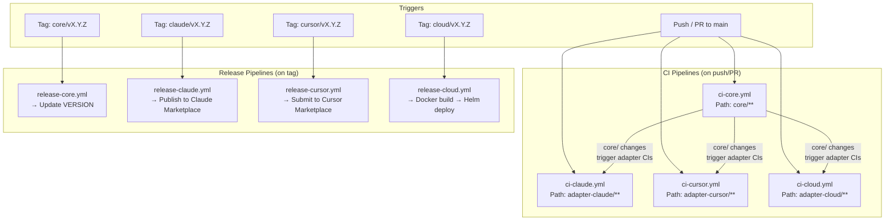
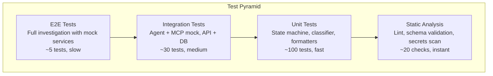
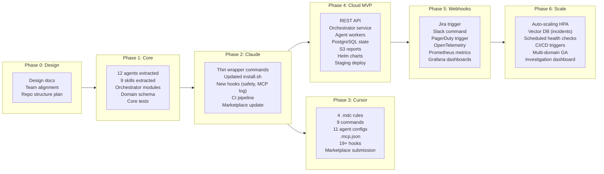

# Production Master: Implementation Plan

> **Document Type:** Master Implementation Plan — The Blueprint
> **Version:** 1.0
> **Date:** 2026-02-21
> **Author:** Tamir Cohen
> **Status:** Draft
> **Priority:** P0 — Flagship Product

---

> **This is the most important product we have ever built.** Production Master transforms how Wix engineers investigate and resolve production incidents. It is the single system that turns a 4-hour human debugging session into a 15-minute autonomous investigation with full audit trails. Every design decision, every sprint, every line of code must reflect this gravity. We are not building a "nice to have" plugin — we are building the nervous system of Wix's production reliability.

---

## Table of Contents

1. [Executive Summary](#1-executive-summary)
2. [Product Vision](#2-product-vision)
3. [Current State & What We're Building On](#3-current-state--what-were-building-on)
4. [Target Architecture](#4-target-architecture)
5. [Complete Repository Structure](#5-complete-repository-structure)
6. [Core Engine Specification](#6-core-engine-specification)
7. [Claude Code Plugin — Full Feature Specification](#7-claude-code-plugin--full-feature-specification)
8. [Cursor Plugin — Full Feature Specification](#8-cursor-plugin--full-feature-specification)
9. [Cloud Pipeline — Full Feature Specification](#9-cloud-pipeline--full-feature-specification)
10. [MCP Integration Layer — Complete Registry](#10-mcp-integration-layer--complete-registry)
11. [Agent Catalog — Full Specification](#11-agent-catalog--full-specification)
12. [CI/CD — Complete Pipeline Design](#12-cicd--complete-pipeline-design)
13. [Testing Strategy](#13-testing-strategy)
14. [Security Implementation](#14-security-implementation)
15. [Observability Implementation](#15-observability-implementation)
16. [Domain Configuration System](#16-domain-configuration-system)
17. [Migration Plan — From Current to Monorepo](#17-migration-plan--from-current-to-monorepo)
18. [Roadmap — Phased Delivery](#18-roadmap--phased-delivery)
19. [Success Metrics & KPIs](#19-success-metrics--kpis)
20. [Team & Ownership](#20-team--ownership)
21. [Risks & Mitigations](#21-risks--mitigations)
22. [Dependencies & Prerequisites](#22-dependencies--prerequisites)
23. [Open Questions & Decisions](#23-open-questions--decisions)
24. [References & Citations](#24-references--citations)

---

## 1. Executive Summary

We are transforming Production Master from a single Claude Code plugin (v1.0.3-beta) into a **three-surface platform**: a Claude Code plugin, a Cursor IDE plugin, and a cloud pipeline service — all powered by a shared core engine.

**What exists today:**
- 12 specialized agents, 9 MCP integrations, 9 commands
- Hypothesis-verification loops with competing theories (agent teams)
- Domain-aware investigation with per-repo configuration
- Multi-format output publishing (Jira wiki, Slack mrkdwn, GitHub markdown)
- CI/CD with 4 validation checks, branch protection, automated releases

**What we're building:**
- A **shared core engine** extracted from the current monolith
- A **Cursor plugin** adapter providing IDE-native investigation
- A **cloud pipeline** service enabling automated, API-triggered investigations
- A **unified CI/CD** with independent release pipelines per surface
- **Enterprise observability** with OpenTelemetry, metrics, and audit trails

Source: [Current repository](https://github.com/TamirCohen-Wix/production-master), [Architecture docs](../docs/architecture.md)

---

## 2. Product Vision

### The North Star

```
┌─────────────────────────────────────────────────────────────────────────┐
│                                                                         │
│   A production incident happens.                                        │
│                                                                         │
│   Within 60 seconds, an autonomous investigation begins —               │
│   whether triggered by an alert, a Jira ticket, a Slack message,        │
│   or an engineer typing a command in their IDE.                         │
│                                                                         │
│   Within 15 minutes, the engineer has:                                  │
│   • A confirmed root cause with evidence                                │
│   • A fix plan with rollback instructions                               │
│   • A report posted to Jira and Slack                                   │
│   • A full audit trail they can replay step by step                     │
│                                                                         │
│   The same quality. The same depth. Regardless of entry point.          │
│                                                                         │
└─────────────────────────────────────────────────────────────────────────┘
```

### Product Principles

| # | Principle | Meaning |
|---|-----------|---------|
| 1 | **Autonomy first** | The system investigates without asking. It decides what to query, what to test, what to re-check. Engineers review results, not babysit agents. |
| 2 | **Evidence over guessing** | Every claim must have a citation — a log line, a code reference, a Grafana URL, a Slack message. No hallucinated conclusions. |
| 3 | **Same brain, different body** | All surfaces run the same core engine. An investigation in Cursor produces the same result as one in Claude Code or the cloud. |
| 4 | **Fail loud, recover fast** | If an MCP server is down, say so immediately. If a hypothesis fails, try again with new evidence. Never silently fabricate data. |
| 5 | **The investigation is the artifact** | The output isn't just a fix — it's a traceable, replayable, auditable investigation that becomes organizational knowledge. |

---

## 3. Current State & What We're Building On

### Current Production Master (v1.0.3-beta)



### Inventory of Existing Assets

| Asset Category | Count | Files | Status |
|---------------|-------|-------|--------|
| **Agent definitions** | 12 | `agents/*.md` | Production-ready |
| **Commands** | 9 | `commands/*.md` | Production-ready |
| **Skills** | 9 | `skills/*/SKILL.md` | Production-ready |
| **Hooks** | 2 | `hooks/hooks.json` | Production-ready |
| **Output styles** | 2 | `output-styles/*.md` | Production-ready |
| **Scripts** | 6 | `scripts/*.sh` | Production-ready |
| **Documentation** | 7 | `docs/*.md` | Production-ready |
| **Domain configs** | 1 | `Domain/Bookings/Server/scheduler/` | Production-ready |
| **CI workflows** | 1 | `.github/workflows/ci.yml` | Production-ready |
| **MCP template** | 1 | `mcp-servers.json` | Production-ready |
| **Plugin manifest** | 2 | `.claude-plugin/{plugin,marketplace}.json` | Production-ready |
| **Cursor model map** | 1 | `cursor-models.json` | Experimental |

Source: [Current repository](https://github.com/TamirCohen-Wix/production-master)

### What Carries Forward Unchanged

These assets are **proven in production** and carry forward to the core engine as-is:

- All 12 agent definitions (prompts, model assignments, tool restrictions)
- All 9 skill files (MCP tool documentation)
- The 9-phase pipeline state machine
- The hypothesis-verification loop (5-point checklist, max 5 iterations)
- The output format templates
- The domain configuration schema
- The data isolation principle (data agents never see each other's outputs)
- The model tiering strategy (Haiku for structured, Sonnet for reasoning)

---

## 4. Target Architecture

### Three-Surface Platform Architecture



---

## 5. Complete Repository Structure

### Monorepo Layout

```
production-master/
│
├── .github/
│   ├── workflows/
│   │   ├── ci-core.yml                    # Core engine validation
│   │   ├── ci-claude.yml                  # Claude Code adapter CI
│   │   ├── ci-cursor.yml                  # Cursor adapter CI
│   │   ├── ci-cloud.yml                   # Cloud service CI
│   │   ├── release-core.yml               # Core release (tag: core/vX.Y.Z)
│   │   ├── release-claude.yml             # Claude plugin release (tag: claude/vX.Y.Z)
│   │   ├── release-cursor.yml             # Cursor plugin release (tag: cursor/vX.Y.Z)
│   │   └── release-cloud.yml              # Cloud deploy (tag: cloud/vX.Y.Z)
│   ├── ISSUE_TEMPLATE/
│   │   ├── bug_report.md
│   │   ├── feature_request.md
│   │   └── domain_request.md
│   ├── PULL_REQUEST_TEMPLATE.md
│   └── CODEOWNERS
│
├── core/                                   # ═══ SHARED CORE ENGINE ═══
│   ├── VERSION                             # Core version (semver)
│   │
│   ├── agents/                             # 12 agent definitions
│   │   ├── bug-context.md                  # Jira parsing (haiku)
│   │   ├── artifact-resolver.md            # Service validation (haiku)
│   │   ├── grafana-analyzer.md             # Log/metric queries (sonnet)
│   │   ├── codebase-semantics.md           # Code flow analysis (sonnet)
│   │   ├── production-analyzer.md          # PR/commit analysis (sonnet)
│   │   ├── slack-analyzer.md               # Slack search (sonnet)
│   │   ├── hypotheses.md                   # Theory generation (sonnet)
│   │   ├── verifier.md                     # Hypothesis validation (sonnet)
│   │   ├── skeptic.md                      # Cross-examination (sonnet)
│   │   ├── fix-list.md                     # Fix planning (sonnet)
│   │   ├── documenter.md                   # Report compilation (haiku)
│   │   └── publisher.md                    # Jira/Slack publishing (haiku)
│   │
│   ├── skills/                             # 9 MCP skill references
│   │   ├── octocode/SKILL.md               # 7 tools — semantic code search
│   │   ├── grafana-datasource/SKILL.md     # 11 tools — SQL, PromQL, LogQL
│   │   ├── grafana-mcp/SKILL.md            # 33 tools — dashboards, alerts
│   │   ├── slack/SKILL.md                  # 12 tools — search, post, threads
│   │   ├── github/SKILL.md                 # 23 tools — PRs, commits, code
│   │   ├── jira/SKILL.md                   # 16 tools — issues, comments
│   │   ├── fire-console/SKILL.md           # 12 tools — gRPC domain queries
│   │   ├── ft-release/SKILL.md             # 7 tools — feature toggles
│   │   └── context7/SKILL.md               # 2 tools — library docs
│   │
│   ├── orchestrator/                       # Pipeline logic (extracted from 71KB command)
│   │   ├── intent-classifier.md            # 7 intent modes
│   │   ├── state-machine.md                # 9-phase pipeline definition
│   │   ├── hypothesis-loop.md              # Generate→verify→decide→regather cycle
│   │   ├── agent-dispatch.md               # Agent sequencing, parallelism, data flow
│   │   ├── findings-summary-schema.md      # Persistent state file format
│   │   └── recovery-protocol.md            # Mid-investigation recovery rules
│   │
│   ├── output-styles/                      # Output format templates
│   │   ├── investigation-report.md         # Professional terminal/markdown format
│   │   └── publisher-format.md             # Jira wiki, Slack mrkdwn, GitHub md
│   │
│   ├── domain/                             # Domain config system
│   │   ├── schema.json                     # domain.json JSON Schema (validation)
│   │   ├── loader.md                       # Loading priority rules
│   │   └── defaults.json                   # Default values for optional fields
│   │
│   ├── mcp-servers.json                    # MCP server template (9 servers)
│   │
│   └── tests/                              # Core validation tests
│       ├── validate-agents.sh              # All 12 agents have required fields
│       ├── validate-skills.sh              # All 9 skills present
│       ├── validate-schema.sh              # domain.json schema validation
│       └── validate-orchestrator.sh        # State machine completeness
│
├── adapter-claude/                         # ═══ CLAUDE CODE ADAPTER ═══
│   ├── .claude-plugin/
│   │   ├── plugin.json                     # Plugin manifest
│   │   └── marketplace.json                # Marketplace listing
│   │
│   ├── commands/                           # 9 commands (reference core logic)
│   │   ├── production-master.md            # Main orchestrator
│   │   ├── grafana-query.md                # Direct Grafana queries
│   │   ├── slack-search.md                 # Slack search
│   │   ├── production-changes.md           # PR/commit/toggle search
│   │   ├── resolve-artifact.md             # Service artifact validation
│   │   ├── fire-console.md                 # gRPC domain queries
│   │   ├── update-context.md               # Domain config creation
│   │   ├── production-master-report.md     # GitHub issue submission
│   │   └── git-update-agents.md            # Agent sync to repo
│   │
│   ├── hooks/
│   │   └── hooks.json                      # Notification + link validation
│   │
│   ├── scripts/
│   │   ├── install.sh                      # Claude Code installer
│   │   ├── validate-install.sh             # Installation diagnostics
│   │   ├── validate-report-links.sh        # Report link validator (hook)
│   │   ├── statusline.sh                   # Claude Code status bar
│   │   └── bump-version.sh                 # Version bump & release
│   │
│   ├── tests/
│   │   ├── test-install.sh                 # Install script dry-run
│   │   └── test-hooks.sh                   # Hook execution test
│   │
│   └── README.md                           # Claude Code-specific docs
│
├── adapter-cursor/                         # ═══ CURSOR ADAPTER ═══
│   ├── .cursor-plugin/
│   │   └── plugin.json                     # Plugin manifest
│   │
│   ├── rules/                              # Cursor-specific always-on rules (.mdc)
│   │   ├── investigation-guardrails.mdc    # Citation, data isolation, evidence standards
│   │   ├── model-tiering.mdc              # Agent-to-model assignments
│   │   ├── output-conventions.mdc         # File naming, directory rules
│   │   └── mcp-usage.mdc                  # MCP tool discovery patterns
│   │
│   ├── commands/                           # 9 commands (adapted for Cursor)
│   │   ├── production-master.md
│   │   ├── grafana-query.md
│   │   ├── slack-search.md
│   │   ├── production-changes.md
│   │   ├── resolve-artifact.md
│   │   ├── fire-console.md
│   │   ├── update-context.md
│   │   ├── production-master-report.md
│   │   └── sync-agents.md
│   │
│   ├── agents/                             # Cursor agent configs (reference core agents)
│   │   ├── bug-context.md
│   │   ├── artifact-resolver.md
│   │   ├── grafana-analyzer.md
│   │   ├── codebase-semantics.md
│   │   ├── production-analyzer.md
│   │   ├── slack-analyzer.md
│   │   ├── hypotheses.md
│   │   ├── verifier.md
│   │   ├── fix-list.md
│   │   ├── documenter.md
│   │   └── publisher.md
│   │
│   ├── skills/                             # Symlinks → core/skills/
│   │
│   ├── hooks/
│   │   └── hooks.json                      # Cursor-specific hooks (19+ events)
│   │
│   ├── .mcp.json                           # MCP server config (env var based)
│   │
│   ├── assets/
│   │   └── logo.svg                        # Marketplace logo
│   │
│   ├── scripts/
│   │   ├── install.sh                      # Cursor-specific installer
│   │   └── validate-report-links.sh        # Report link validator
│   │
│   ├── tests/
│   │   ├── test-install.sh
│   │   ├── test-rules.sh                   # Validate .mdc frontmatter
│   │   └── test-mcp-json.sh               # Validate .mcp.json
│   │
│   └── README.md                           # Cursor-specific docs
│
├── adapter-cloud/                          # ═══ CLOUD PIPELINE ═══
│   ├── src/
│   │   ├── api/                            # REST API layer
│   │   │   ├── server.ts                   # Express/Fastify server
│   │   │   ├── routes/
│   │   │   │   ├── investigate.ts          # POST /api/v1/investigate
│   │   │   │   ├── investigations.ts       # GET /api/v1/investigations/:id
│   │   │   │   ├── queries.ts              # Direct query endpoints
│   │   │   │   ├── domains.ts              # Domain config CRUD
│   │   │   │   └── health.ts               # Health & metrics
│   │   │   ├── middleware/
│   │   │   │   ├── auth.ts                 # API key + JWT auth
│   │   │   │   ├── rate-limit.ts           # Rate limiting
│   │   │   │   └── validation.ts           # Request validation
│   │   │   └── webhooks/
│   │   │       ├── jira.ts                 # Jira webhook adapter
│   │   │       ├── slack.ts                # Slack command adapter
│   │   │       ├── pagerduty.ts            # PagerDuty webhook adapter
│   │   │       └── grafana-alert.ts        # Grafana alert adapter
│   │   │
│   │   ├── orchestrator/                   # Pipeline orchestration
│   │   │   ├── engine.ts                   # State machine implementation
│   │   │   ├── dispatcher.ts               # Agent job dispatch
│   │   │   └── hypothesis-loop.ts          # Hypothesis iteration logic
│   │   │
│   │   ├── workers/                        # Agent execution
│   │   │   ├── agent-runner.ts             # LLM API + MCP tool execution
│   │   │   ├── tool-handler.ts             # MCP tool call handler
│   │   │   └── prompt-builder.ts           # Agent prompt construction
│   │   │
│   │   ├── mcp/                            # MCP client
│   │   │   ├── client.ts                   # HTTP MCP client
│   │   │   ├── stdio-client.ts             # stdio MCP client (Octocode)
│   │   │   └── registry.ts                 # Server registry & health
│   │   │
│   │   ├── storage/                        # Persistence layer
│   │   │   ├── db.ts                       # PostgreSQL client
│   │   │   ├── object-store.ts             # S3/GCS client
│   │   │   ├── cache.ts                    # Redis client
│   │   │   └── models/                     # Data models
│   │   │       ├── investigation.ts
│   │   │       ├── agent-run.ts
│   │   │       └── domain-config.ts
│   │   │
│   │   ├── observability/                  # Telemetry
│   │   │   ├── tracing.ts                  # OpenTelemetry setup
│   │   │   ├── metrics.ts                  # Prometheus metrics
│   │   │   └── logging.ts                  # Structured logging
│   │   │
│   │   └── config/                         # Configuration
│   │       ├── index.ts                    # Config loader
│   │       ├── mcp-config.yaml             # MCP server config
│   │       └── models.yaml                 # LLM model config
│   │
│   ├── Dockerfile                          # Multi-stage build
│   ├── docker-compose.yml                  # Local development stack
│   │
│   ├── helm/                               # Kubernetes deployment
│   │   ├── Chart.yaml
│   │   ├── values.yaml                     # Default values
│   │   ├── values-staging.yaml             # Staging overrides
│   │   ├── values-production.yaml          # Production overrides
│   │   └── templates/
│   │       ├── deployment-api.yaml
│   │       ├── deployment-orchestrator.yaml
│   │       ├── deployment-worker.yaml
│   │       ├── deployment-webhook.yaml
│   │       ├── service.yaml
│   │       ├── ingress.yaml
│   │       ├── hpa.yaml
│   │       ├── configmap.yaml
│   │       ├── secret.yaml
│   │       └── cronjob.yaml
│   │
│   ├── migrations/                         # Database migrations
│   │   ├── 001_create_investigations.sql
│   │   ├── 002_create_agent_runs.sql
│   │   ├── 003_create_domain_configs.sql
│   │   └── 004_create_incident_embeddings.sql
│   │
│   ├── tests/
│   │   ├── unit/                           # Unit tests
│   │   ├── integration/                    # Integration tests (mock MCP)
│   │   └── e2e/                            # End-to-end tests
│   │
│   ├── package.json                        # Node.js dependencies
│   ├── tsconfig.json                       # TypeScript config
│   └── README.md                           # Cloud service docs
│
├── Domain/                                 # ═══ SHARED DOMAIN CONFIGS ═══
│   └── Bookings/Server/scheduler/
│       ├── domain.json                     # Machine-readable config
│       ├── CLAUDE.md                       # Repo-specific instructions
│       └── memory/MEMORY.md                # Accumulated knowledge
│
├── docs/                                   # ═══ SHARED DOCUMENTATION ═══
│   ├── architecture.md                     # Pipeline design, agent table, data flow
│   ├── investigation-flow.md               # State machine, hypothesis loop
│   ├── commands.md                         # All 9 commands reference
│   ├── agents.md                           # Agent profiles
│   ├── domain-configs.md                   # Domain config guide
│   ├── contributing.md                     # PR guidelines
│   └── troubleshooting.md                  # MCP issues, recovery
│
├── design-docs/                            # ═══ DESIGN DOCUMENTS ═══
│   ├── 00-overview-shared-architecture.md
│   ├── 01-claude-code-plugin.md
│   ├── 02-cursor-plugin.md
│   ├── 03-cloud-pipeline.md
│   └── 04-implementation-plan.md           # ← THIS DOCUMENT
│
├── .gitignore
├── CLAUDE.md                               # Repo-level Claude instructions
├── LICENSE
└── README.md                               # Monorepo README
```

---

## 6. Core Engine Specification

### Core Modules & Responsibilities



### Extraction Plan from Current Monolith

The current `commands/production-master.md` is a 71 KB file containing all orchestrator logic. It will be extracted into modular core files:

| Section in Current File | Target Core Module | Lines (approx) |
|------------------------|-------------------|-----------------|
| Argument parsing & flags | `intent-classifier.md` | ~50 lines |
| Intent classification (7 modes) | `intent-classifier.md` | ~80 lines |
| Core design principles (10 rules) | `agent-dispatch.md` | ~40 lines |
| Step 0: Init, MCP check, Jira fetch | `state-machine.md` | ~200 lines |
| Step 1: Bug Context | `state-machine.md` | ~100 lines |
| Step 2-3: Grafana + Codebase | `state-machine.md` | ~200 lines |
| Step 4: Parallel Data Fetch | `state-machine.md` + `agent-dispatch.md` | ~150 lines |
| Step 5-6: Hypothesis Loop | `hypothesis-loop.md` | ~300 lines |
| Step 7-9: Fix, Document, Publish | `state-machine.md` | ~200 lines |
| Findings summary format | `findings-summary-schema.md` | ~100 lines |
| Recovery & error handling | `recovery-protocol.md` | ~80 lines |
| Agent team configuration | `agent-dispatch.md` | ~100 lines |
| Agent-specific task prompts | Remains in agent definitions | ~500 lines |

Source: [Current orchestrator](../commands/production-master.md)

---

## 7. Claude Code Plugin — Full Feature Specification

### Feature List

| # | Feature | Status | Priority | Description |
|---|---------|--------|----------|-------------|
| C1 | Full investigation pipeline | **Exists** | P0 | 9-phase autonomous investigation |
| C2 | 7 intent classification modes | **Exists** | P0 | Auto-detect query type from natural language |
| C3 | 12 specialized agents | **Exists** | P0 | Data collection + synthesis + output |
| C4 | Hypothesis-verification loop | **Exists** | P0 | Up to 5 iterations, 5-point checklist |
| C5 | Agent teams (competing hypotheses) | **Exists** | P1 | Parallel A/B hypothesis testing + skeptic |
| C6 | 9 standalone commands | **Exists** | P0 | Direct query access without full investigation |
| C7 | Domain configuration system | **Exists** | P0 | Per-repo config with `domain.json` + `CLAUDE.md` + `MEMORY.md` |
| C8 | Link validation hook | **Exists** | P1 | Block malformed URLs in reports |
| C9 | Desktop notification hook | **Exists** | P2 | macOS notification when attention needed |
| C10 | Status line integration | **Exists** | P2 | Pipeline phase shown in Claude Code status bar |
| C11 | Installation script | **Exists** | P0 | Interactive installer with MCP config |
| C12 | Plugin marketplace distribution | **Exists** | P0 | Claude Code marketplace + git |
| C13 | Pre-command safety hook | **New** | P1 | Block dangerous shell commands during investigation |
| C14 | MCP call logging hook | **New** | P2 | Log all MCP tool calls to trace file |
| C15 | Session start MCP check | **New** | P1 | Verify MCP connectivity at session start |
| C16 | Investigation mode selector | **New** | P2 | `--mode fast/balanced/deep` flag |
| C17 | Core module references | **New** | P0 | Commands reference `core/` modules |
| C18 | Multi-domain support | **New** | P1 | Switch between domain configs |

Source: [Claude Code Plugin Docs](https://code.claude.com/docs/en/plugins), [Current README](../README.md)

---

## 8. Cursor Plugin — Full Feature Specification

### Feature List

| # | Feature | Status | Priority | Description |
|---|---------|--------|----------|-------------|
| U1 | Full investigation pipeline | **New** | P0 | 9-phase pipeline adapted for Cursor subagents |
| U2 | 7 intent classification modes | **New** | P0 | Same as Claude Code |
| U3 | 12 specialized agents | **New** | P0 | Same agents, different execution (subagent dispatch) |
| U4 | Sequential hypothesis-verification | **New** | P0 | No agent teams → hypothesis then verifier loop |
| U5 | 9 standalone commands | **New** | P0 | Same commands adapted for Cursor |
| U6 | 4 always-on rules (.mdc) | **New** | P0 | Investigation guardrails, model tiering, output conventions, MCP usage |
| U7 | Domain configuration system | **New** | P0 | Same schema, `~/.cursor/` paths |
| U8 | 19+ lifecycle hooks | **New** | P1 | Session, file, shell, MCP, subagent, stop hooks |
| U9 | MCP error recovery hook | **New** | P1 | `postToolUseFailure` for MCP resilience |
| U10 | Dangerous command blocker | **New** | P1 | `beforeShellExecution` for `rm\|git push\|curl` |
| U11 | Link validation hook | **New** | P1 | Same as Claude Code, adapted for Cursor |
| U12 | IDE file context awareness | **New** | P1 | Leverage open files and project tree |
| U13 | `.mcp.json` auto-config | **New** | P0 | Environment variable-based MCP auth |
| U14 | Installation script | **New** | P0 | Cursor-specific installer |
| U15 | Cursor Marketplace publishing | **New** | P0 | Submit to [cursor.com/marketplace/publish](https://cursor.com/marketplace/publish) |
| U16 | Investigation mode selector | **New** | P2 | Same as Claude Code |
| U17 | Logo and branding | **New** | P2 | SVG logo for marketplace |

Source: [Cursor Plugin Docs](https://cursor.com/docs/plugins/building)

---

## 9. Cloud Pipeline — Full Feature Specification

### Feature List

| # | Feature | Status | Priority | Description |
|---|---------|--------|----------|-------------|
| P1 | REST API (`POST /investigate`) | **New** | P0 | Start investigation via API |
| P2 | Investigation status API | **New** | P0 | Real-time phase/progress tracking |
| P3 | Full report API | **New** | P0 | JSON + markdown report retrieval |
| P4 | Agent worker pool | **New** | P0 | Scalable container-based agent execution |
| P5 | Anthropic API integration | **New** | P0 | Direct Claude API calls (not CLI) |
| P6 | MCP HTTP client | **New** | P0 | Service-account authenticated MCP calls |
| P7 | PostgreSQL state management | **New** | P0 | Investigation state, agent runs, domain configs |
| P8 | Object storage for reports | **New** | P0 | S3/GCS for agent outputs and traces |
| P9 | Jira webhook trigger | **New** | P1 | Auto-investigate on ticket creation |
| P10 | Slack command trigger | **New** | P1 | `/investigate TICKET-ID` from Slack |
| P11 | PagerDuty webhook trigger | **New** | P1 | Auto-investigate on P1/P2 alerts |
| P12 | Grafana alert trigger | **New** | P2 | Auto-investigate on error rate alerts |
| P13 | CI/CD post-deploy trigger | **New** | P2 | Post-deployment health validation |
| P14 | Scheduled health checks | **New** | P2 | Hourly error rate monitoring |
| P15 | Direct query endpoints | **New** | P1 | Grafana, Slack, production-changes APIs |
| P16 | Domain config CRUD API | **New** | P1 | Manage domain configs via API |
| P17 | Auto-scaling (HPA) | **New** | P1 | Scale workers by queue depth |
| P18 | OpenTelemetry tracing | **New** | P1 | Full trace capture per investigation |
| P19 | Prometheus metrics | **New** | P1 | Token usage, latency, success rate |
| P20 | Grafana dashboards | **New** | P2 | Operational monitoring |
| P21 | Vault secrets management | **New** | P0 | Service account keys in Vault |
| P22 | Helm chart deployment | **New** | P0 | K8s deployment with staging/prod values |
| P23 | Batch investigation API | **New** | P2 | Re-investigate multiple tickets |
| P24 | Callback webhooks | **New** | P2 | Notify on investigation completion |
| P25 | Investigation deduplication | **New** | P1 | Skip if same ticket already running |
| P26 | Redis caching | **New** | P1 | Active session state, MCP response cache |
| P27 | Database migrations | **New** | P0 | Versioned SQL migrations |
| P28 | Canary deployments | **New** | P2 | Gradual rollout with traffic splitting |

Source: [Cloud Pipeline Design](./03-cloud-pipeline.md), [Wix Research](../design-docs/00-overview-shared-architecture.md)

---

## 10. MCP Integration Layer — Complete Registry

### MCP Server Catalog

| # | Server | Proxy URL | Auth | Tool Count | Primary Agent Consumers | Protocol |
|---|--------|----------|------|------------|------------------------|----------|
| 1 | **Grafana Datasource** | `mcp-s.wewix.net/mcp?mcp=grafana-datasource` | `x-user-access-key` | 11 | grafana-analyzer, artifact-resolver | HTTP |
| 2 | **Grafana MCP** | `mcp-s.wewix.net/mcp?mcp=grafana-mcp` | `x-user-access-key` | 33 | grafana-analyzer | HTTP |
| 3 | **Slack** | `mcp-s.wewix.net/mcp?mcp=slack` | `x-user-access-key` | 12 | slack-analyzer, publisher | HTTP |
| 4 | **GitHub** | `mcp-s.wewix.net/mcp?mcp=github` | `x-user-access-key` | 23 | production-analyzer | HTTP |
| 5 | **Jira** | `mcp-s.wewix.net/mcp?mcp=jira` | `x-user-access-key` | 16 | bug-context, publisher | HTTP |
| 6 | **Octocode** | npx `@mcp-s/mcp` (env: `MCP=octocode`) | `USER_ACCESS_KEY` env | 7 | codebase-semantics | stdio |
| 7 | **FT-release** | `mcp-s.wewix.net/mcp?mcp=gradual-feature-release` | `x-user-access-key` | 7 | production-analyzer, fix-list | HTTP |
| 8 | **Fire Console** | `mcp-s.wewix.net/mcp?mcp=fire-console` | None | 12 | hypotheses, verifier | HTTP |
| 9 | **Context7** | `mcp-s.wewix.net/mcp?mcp=context7` | `x-user-access-key` | 2 | codebase-semantics | HTTP |
| | **TOTAL** | | | **123** | | |

Source: [MCP Proxy Portal](https://mcp-s-connect.wewix.net/mcp-servers), [Current `mcp-servers.json`](../mcp-servers.json)

### Per-Surface MCP Configuration

| Surface | Config Location | Auth Method | Template |
|---------|----------------|-------------|----------|
| **Claude Code** | `~/.claude.json` → `mcpServers` | User's personal access key (prompted during install) | `core/mcp-servers.json` |
| **Cursor** | `adapter-cursor/.mcp.json` | `${PRODUCTION_MASTER_ACCESS_KEY}` env var | `.mcp.json` with env placeholders |
| **Cloud** | `adapter-cloud/src/config/mcp-config.yaml` | Service account via HashiCorp Vault | YAML config with Vault path |

---

## 11. Agent Catalog — Full Specification

### Complete Agent Table

| # | Agent | Model | Phase | Role | MCP Skills Used | Input | Output |
|---|-------|-------|-------|------|----------------|-------|--------|
| 1 | `bug-context` | Haiku | 1 | Parse Jira ticket into structured brief | — | Jira ticket data | `bug-context-output-V1.md` |
| 2 | `artifact-resolver` | Haiku | 1.5 | Validate service artifact IDs against Grafana | grafana-datasource | Bug context | `artifact-resolver-output-V1.md` |
| 3 | `grafana-analyzer` | Sonnet | 2 | Query production logs, report raw findings | grafana-datasource, grafana-mcp | Bug context, enriched context | `grafana-analyzer-output-V{N}.md` |
| 4 | `codebase-semantics` | Sonnet | 3 | Map code flows, error propagation | octocode | Bug context, Grafana report | `codebase-semantics-output-V1.md` |
| 5 | `production-analyzer` | Sonnet | 4 | Find PRs, commits, feature toggle changes | github, ft-release | Bug context, codebase report | `production-analyzer-output-V1.md` |
| 6 | `slack-analyzer` | Sonnet | 4 | Search Slack for related discussions | slack | Bug context, codebase report | `slack-analyzer-output-V1.md` |
| 7 | `hypotheses` | Sonnet | 5 | Generate 2-3 testable root cause theories | fire-console | All reports, findings summary | `hypotheses-*-output-V{N}.md` |
| 8 | `verifier` | Sonnet | 5 | Quality gate — 5-point checklist evaluation | fire-console | Hypothesis, all reports | Verdict: CONFIRMED / DECLINED |
| 9 | `skeptic` | Sonnet | 5 | Cross-examine competing hypotheses (teams only) | — | Two hypothesis reports | Verdict with reasoning |
| 10 | `fix-list` | Sonnet | 7 | Create actionable fix plans with rollback | ft-release | Confirmed hypothesis, codebase | `fix-list-output-V1.md` |
| 11 | `documenter` | Haiku | 8 | Compile all pipeline output into report | — | All reports, all hypotheses | `report.md` |
| 12 | `publisher` | Haiku | 9 | Publish to Jira (wiki markup) & Slack (mrkdwn) | jira, slack | Report, bug context | `publisher-output-V1.md` |

### Agent Execution Matrix Per Surface

| Agent | Claude Code | Cursor | Cloud |
|-------|:-----------:|:------:|:-----:|
| Execution method | `Task` tool (subagent) | Subagent dispatch | Container worker + Anthropic API |
| Parallel phases | Steps 4, 5 (teams) | Step 4 only | Steps 4, 5 |
| Agent teams | Yes (experimental) | No | Yes (native containers) |
| Tool access | Plugin MCP config | `.mcp.json` config | Direct HTTP + Vault |

---

## 12. CI/CD — Complete Pipeline Design

### Pipeline Matrix



### CI Check Specification

#### `ci-core.yml` — Core Engine Validation

| Check | Tool | What It Validates |
|-------|------|-------------------|
| Agent validation | `core/tests/validate-agents.sh` | All 12 agents exist, have required YAML frontmatter (name, description, model) |
| Skill validation | `core/tests/validate-skills.sh` | All 9 skill directories contain `SKILL.md` |
| Schema validation | `core/tests/validate-schema.sh` | `domain/schema.json` is valid JSON Schema; domain configs validate against it |
| Orchestrator validation | `core/tests/validate-orchestrator.sh` | All 6 orchestrator modules exist and are non-empty |
| MCP template validation | `jq` | `mcp-servers.json` is valid JSON with 9 servers, no real secrets |
| Output style check | file existence | Both output style files present |
| Markdown lint | `markdownlint` | All `.md` files pass linting |

#### `ci-claude.yml` — Claude Code Adapter

| Check | What It Validates |
|-------|-------------------|
| Plugin JSON validation | `plugin.json` valid, name = "production-master" |
| Marketplace JSON validation | `marketplace.json` valid with >=1 plugin |
| Command count check | All 9 expected commands present |
| Hooks JSON validation | Valid JSON structure |
| Shell script lint | `shellcheck --severity=error` on all `.sh` files |
| Secrets scan | No access keys in committed files |
| Install test (dry-run) | `install.sh` preflight checks pass |

#### `ci-cursor.yml` — Cursor Adapter

| Check | What It Validates |
|-------|-------------------|
| Plugin JSON validation | `.cursor-plugin/plugin.json` valid |
| Rule frontmatter validation | All `.mdc` files have valid YAML frontmatter (`description`, `alwaysApply`) |
| Command count check | All expected commands present |
| Agent configs check | All agent `.md` files have valid frontmatter |
| `.mcp.json` validation | Valid JSON, 9 servers, env var placeholders (not real keys) |
| Hooks JSON validation | Valid JSON structure |
| Skill symlinks check | All symlinks to `core/skills/` resolve |

#### `ci-cloud.yml` — Cloud Pipeline

| Check | What It Validates |
|-------|-------------------|
| TypeScript lint | ESLint on all `.ts` files |
| TypeScript compile | `tsc --noEmit` |
| Unit tests | Jest/Vitest unit tests pass |
| Dockerfile lint | `hadolint` on Dockerfile |
| Docker build | Multi-stage build succeeds |
| Helm lint | `helm lint` on chart |
| SQL migrations lint | Migration files are sequential and valid |
| Security scan | `trivy` container vulnerability scan |
| Integration tests | Mock MCP + mock Anthropic API tests |

---

## 13. Testing Strategy

### Test Pyramid



### Test Specification by Surface

| Test Category | Core | Claude | Cursor | Cloud |
|--------------|:----:|:------:|:------:|:-----:|
| Schema validation | Yes | Yes | Yes | Yes |
| Content existence | Yes | Yes | Yes | — |
| Shell lint | — | Yes | Yes | — |
| TypeScript lint | — | — | — | Yes |
| Unit tests | — | — | — | Yes |
| Integration tests | — | Dry-run | — | Yes (mock MCP) |
| Docker build | — | — | — | Yes |
| Helm lint | — | — | — | Yes |
| Security scan | Yes | Yes | Yes | Yes |
| E2E (mock investigation) | — | — | — | Yes (staging) |

---

## 14. Security Implementation

### Security Controls Matrix

| Control | Claude Code | Cursor | Cloud | Priority |
|---------|:-----------:|:------:|:-----:|:--------:|
| Personal access key auth | Yes | Yes | — | P0 |
| Service account + Vault | — | — | Yes | P0 |
| No secrets in code | CI check | CI check | CI check | P0 |
| Input sanitization | Agent prompt design | Agent prompt design | Middleware | P0 |
| Tool restriction (least privilege) | Agent frontmatter | Agent frontmatter | RBAC | P0 |
| Link validation | Hook | Hook | API validation | P1 |
| Dangerous command blocking | Hook (new) | Hook | N/A | P1 |
| Audit trail | Trace files | Trace files | DB + OTel | P0 |
| Network isolation | N/A | N/A | K8s NetworkPolicy | P1 |
| mTLS between services | N/A | N/A | Service mesh | P1 |
| PII redaction in logs | Manual | Manual | Automated | P1 |
| Rate limiting | N/A | N/A | API middleware | P1 |
| API key rotation | Manual | Manual | Vault auto-rotate | P2 |

Source: [OWASP LLM Top 10](https://owasp.org/www-project-top-10-for-large-language-model-applications/), [Wix Research](./WIX%20-%20deep-research-report.md)

---

## 15. Observability Implementation

### Observability Stack

| Layer | Claude Code | Cursor | Cloud |
|-------|-------------|--------|-------|
| **Traces** | `*-trace-V{N}.md` files | `*-trace-V{N}.md` files | OpenTelemetry → Jaeger |
| **Metrics** | Token counts in traces | Token counts in traces | Prometheus counters/histograms |
| **Logs** | Terminal output + trace files | IDE output + trace files | Structured JSON → Loki |
| **Dashboards** | — | — | Grafana dashboards |
| **Alerts** | — | — | Prometheus AlertManager |
| **Audit** | File-based (manual) | File-based (manual) | Immutable DB records |
| **Replay** | Re-read trace files | Re-read trace files | Trace bundle export API |

### Cloud Metrics Registry

| Metric Name | Type | Labels | Purpose |
|-------------|------|--------|---------|
| `pm_investigation_total` | Counter | `domain`, `mode`, `trigger` | Total investigations |
| `pm_investigation_duration_seconds` | Histogram | `domain`, `verdict` | Time to completion |
| `pm_investigation_verdict` | Counter | `domain`, `verdict` | CONFIRMED vs DECLINED |
| `pm_agent_duration_seconds` | Histogram | `agent`, `model` | Per-agent execution time |
| `pm_agent_tokens_total` | Counter | `agent`, `model`, `direction` | Token consumption |
| `pm_mcp_call_duration_seconds` | Histogram | `server`, `tool` | MCP tool latency |
| `pm_mcp_call_errors_total` | Counter | `server`, `tool`, `error` | MCP failures |
| `pm_hypothesis_iterations` | Histogram | `domain` | Loop iterations before verdict |
| `pm_hypothesis_confidence` | Histogram | `domain` | Final confidence scores |
| `pm_llm_cost_dollars` | Counter | `model` | Estimated LLM cost |
| `pm_queue_depth` | Gauge | `priority` | Pending jobs |
| `pm_worker_utilization` | Gauge | — | Worker pool utilization |

Source: [OpenTelemetry LLM Observability](https://opentelemetry.io/blog/2024/llm-observability/)

---

## 16. Domain Configuration System

### Domain Config File Specification

#### `domain.json` — Machine-Readable Config

| Field | Type | Required | Description | Example |
|-------|------|:--------:|-------------|---------|
| `company` | string | Yes | Company name | `"Wix"` |
| `division` | string | Yes | Team/division | `"Bookings"` |
| `side` | string | Yes | Server/Client | `"Server"` |
| `repo` | string | Yes | Repository name | `"scheduler"` |
| `github_org` | string | Yes | GitHub organization | `"wix-private"` |
| `github_repo` | string | Yes | Full repo path | `"wix-private/scheduler"` |
| `jira_project` | string | Yes | Jira project key | `"SCHED"` |
| `artifact_prefix` | string | Yes | Common artifact ID prefix | `"com.wixpress.bookings"` |
| `primary_services` | array | Yes | `[{name, artifact_id}]` | See below |
| `slack_channels` | object | No | `{alerts, dev, incidents}` | `{"alerts": "#bookings-alerts"}` |
| `toggle_prefix` | string | No | Feature toggle prefix | `"specs.bookings"` |
| `grafana_url` | string | No | Grafana base URL | `"https://grafana.wixpress.com"` |
| `grafana_app_analytics_dashboard` | string | No | Dashboard UID | `"olcdJbinz"` |
| `request_id_format` | string | No | Request ID format | `"<unix_timestamp>.<random>"` |
| `language` | string | No | Primary language | `"scala"` |
| `build_system` | string | No | Build system | `"bazel"` |
| `monorepo` | boolean | No | Is it a monorepo | `true` |

#### Loading Priority

| # | Location | Scope | Surface |
|---|----------|-------|---------|
| 1 | `~/.claude/production-master/domains/<repo>/domain.json` | User | Claude Code |
| 2 | `~/.cursor/production-master/domains/<repo>/domain.json` | User | Cursor |
| 3 | `.claude/domain.json` | Project | Claude Code |
| 4 | `.cursor/domain.json` | Project | Cursor |
| 5 | Database `domain_configs` table | Service | Cloud |
| 6 | `Domain/<Division>/<Side>/<repo>/domain.json` | Repo | All (fallback) |

Source: [Current domain-configs docs](../docs/domain-configs.md)

---

## 17. Migration Plan — From Current to Monorepo

### Phase Diagram

```mermaid
gantt
    title Migration: Current Plugin → Monorepo
    dateFormat YYYY-MM-DD
    axisFormat %b %d

    section Phase 0: Prepare
        Create design docs (DONE)          :done, p0a, 2026-02-21, 1d
        Review & approve design            :p0b, after p0a, 3d

    section Phase 1: Core Extraction
        Create core/ directory structure    :p1a, after p0b, 1d
        Move agents to core/agents/        :p1b, after p1a, 1d
        Move skills to core/skills/        :p1c, after p1a, 1d
        Move output-styles to core/        :p1d, after p1a, 1d
        Extract orchestrator modules       :p1e, after p1b, 3d
        Create domain schema               :p1f, after p1d, 1d
        Core validation tests              :p1g, after p1e, 2d
        Validate: core/ complete           :milestone, p1m, after p1g, 0d

    section Phase 2: Claude Adapter
        Create adapter-claude/             :p2a, after p1m, 1d
        Refactor commands as thin wrappers :p2b, after p2a, 3d
        Move Claude-specific files         :p2c, after p2a, 1d
        Update install.sh for new paths   :p2d, after p2c, 1d
        CI pipeline (ci-claude.yml)        :p2e, after p2b, 1d
        Test: identical behavior           :p2f, after p2e, 2d
        Validate: Claude adapter works    :milestone, p2m, after p2f, 0d

    section Phase 3: Cursor Adapter
        Create adapter-cursor/             :p3a, after p2m, 1d
        Create .mdc rules                  :p3b, after p3a, 2d
        Adapt commands for Cursor          :p3c, after p3a, 3d
        Create agent configs               :p3d, after p3a, 2d
        Create .mcp.json                   :p3e, after p3a, 1d
        Create hooks (19+ events)          :p3f, after p3b, 2d
        Cursor install script              :p3g, after p3e, 1d
        CI pipeline (ci-cursor.yml)        :p3h, after p3f, 1d
        Test: full investigation           :p3i, after p3h, 3d
        Submit to Cursor Marketplace       :p3j, after p3i, 2d
        Validate: Cursor plugin works     :milestone, p3m, after p3j, 0d

    section Phase 4: Cloud MVP
        Scaffold adapter-cloud/            :p4a, after p2m, 2d
        API server + routes                :p4b, after p4a, 5d
        Orchestrator service               :p4c, after p4b, 5d
        Agent worker + Anthropic API       :p4d, after p4b, 5d
        MCP client (HTTP + stdio)          :p4e, after p4a, 3d
        Database + migrations              :p4f, after p4a, 3d
        Dockerfile + docker-compose        :p4g, after p4d, 2d
        Helm charts                        :p4h, after p4g, 3d
        CI pipeline (ci-cloud.yml)         :p4i, after p4h, 2d
        Staging deployment                 :p4j, after p4i, 2d
        Internal alpha test                :p4k, after p4j, 5d
        Validate: Cloud MVP works         :milestone, p4m, after p4k, 0d

    section Phase 5: Cloud Webhooks
        Jira webhook adapter               :p5a, after p4m, 3d
        Slack command adapter              :p5b, after p4m, 3d
        PagerDuty webhook adapter          :p5c, after p5a, 2d
        OpenTelemetry integration          :p5d, after p4m, 5d
        Prometheus metrics                 :p5e, after p5d, 3d
        Grafana dashboards                 :p5f, after p5e, 3d
        Beta testing (3 domains)           :p5g, after p5f, 10d
        Validate: Cloud webhooks work     :milestone, p5m, after p5g, 0d

    section Phase 6: Scale & Polish
        Auto-scaling (HPA)                 :p6a, after p5m, 3d
        Vector DB for incidents            :p6b, after p5m, 5d
        Scheduled health checks            :p6c, after p6a, 3d
        CI/CD post-deploy triggers         :p6d, after p6c, 3d
        Multi-domain onboarding            :p6e, after p6a, 10d
        Dashboard & reporting              :p6f, after p6b, 5d
        GA readiness                       :milestone, p6m, after p6f, 0d
```

### Migration Validation Checklist

#### Phase 1 Gate: Core Extraction

- [ ] `core/agents/` contains all 12 agent files with identical content
- [ ] `core/skills/` contains all 9 skill directories with `SKILL.md`
- [ ] `core/orchestrator/` has 6 modules extracted from `commands/production-master.md`
- [ ] `core/output-styles/` has both format templates
- [ ] `core/domain/schema.json` validates the existing Bookings domain config
- [ ] `core/mcp-servers.json` identical to current `mcp-servers.json`
- [ ] `core/tests/` all validation scripts pass
- [ ] No duplicate content between core/ and adapter-*/

#### Phase 2 Gate: Claude Adapter

- [ ] `adapter-claude/commands/production-master.md` produces identical investigation results
- [ ] All 9 commands work exactly as before
- [ ] Hooks trigger correctly (notification + link validation)
- [ ] `install.sh` works with new paths
- [ ] CI passes all checks
- [ ] Existing marketplace installations can upgrade

#### Phase 3 Gate: Cursor Adapter

- [ ] Full investigation runs in Cursor IDE
- [ ] All 4 `.mdc` rules load correctly
- [ ] Sequential hypothesis loop works without agent teams
- [ ] MCP tools accessible via `.mcp.json`
- [ ] All hooks fire on correct events
- [ ] Submitted to Cursor Marketplace

#### Phase 4 Gate: Cloud MVP

- [ ] `POST /api/v1/investigate` starts and completes an investigation
- [ ] Investigation report matches plugin-generated reports
- [ ] All 12 agents execute successfully via Anthropic API
- [ ] All 9 MCP servers accessible via service account
- [ ] PostgreSQL state correctly tracks all phases
- [ ] Reports stored in object storage
- [ ] Helm chart deploys to staging K8s

---

## 18. Roadmap — Phased Delivery

### High-Level Timeline

| Phase | Name | Duration | Target Date | Deliverables |
|-------|------|----------|-------------|-------------|
| **0** | Design & Review | 1 week | 2026-02-28 | Design docs approved, team aligned |
| **1** | Core Extraction | 2 weeks | 2026-03-14 | `core/` fully extracted, tests pass |
| **2** | Claude Adapter | 1.5 weeks | 2026-03-25 | Claude Code plugin v2.0 on monorepo |
| **3** | Cursor Adapter | 3 weeks | 2026-04-15 | Cursor plugin v1.0 on marketplace |
| **4** | Cloud MVP | 4 weeks | 2026-05-13 | REST API, agent workers, staging deploy |
| **5** | Cloud Webhooks | 3 weeks | 2026-06-03 | Jira/Slack triggers, OTel, dashboards |
| **6** | Scale & Polish | 4 weeks | 2026-07-01 | Auto-scaling, vector DB, multi-domain GA |

### Feature Delivery by Phase



---

## 19. Success Metrics & KPIs

### Product Metrics

| Metric | Current Baseline | Phase 3 Target | Phase 6 Target |
|--------|:----------------:|:--------------:|:--------------:|
| **Active investigators** (unique users/week) | ~5 | 20 | 50+ |
| **Investigations per week** | ~10 (manual) | 30 (manual) | 200+ (manual + automated) |
| **Mean investigation time** | ~40 min | ~25 min | ~15 min |
| **Root cause confirmation rate** | ~60% | ~70% | ~80% |
| **Surfaces available** | 1 (Claude Code) | 2 (+Cursor) | 3 (+Cloud) |
| **Domains onboarded** | 1 (Bookings) | 5 | 20+ |
| **Automated trigger rate** | 0% | 0% | 40%+ |

### Engineering Metrics

| Metric | Target | Measurement |
|--------|--------|-------------|
| **Core CI pass rate** | >98% | GitHub Actions |
| **Mean deploy time (Cloud)** | <10 min | Helm release → running |
| **P95 API latency** | <500ms | Prometheus |
| **Worker auto-scale response** | <60s | K8s HPA events |
| **Test coverage (Cloud)** | >80% | Jest coverage |
| **MCP availability** | >99% | Health check endpoint |
| **Incident from our system** | 0 | PagerDuty |

### Business Impact Metrics

| Metric | Measurement | Source |
|--------|-------------|--------|
| **MTTR reduction** | Compare before/after Production Master | Jira resolution times |
| **On-call toil reduction** | Hours saved per on-call rotation | Team surveys |
| **Repeat investigation avoidance** | Similar incidents resolved by knowledge base | Similarity search hits |
| **Token cost per investigation** | Average cost tracking | Prometheus metrics |

---

## 20. Team & Ownership

### CODEOWNERS

```
# Core engine — requires Tamir review
/core/                          @TamirCohen-Wix

# Claude Code adapter
/adapter-claude/                @TamirCohen-Wix

# Cursor adapter
/adapter-cursor/                @TamirCohen-Wix

# Cloud pipeline
/adapter-cloud/                 @TamirCohen-Wix

# Domain configs — respective team owners
/Domain/Bookings/               @bookings-team
/Domain/Payments/               @payments-team
/Domain/Events/                 @events-team

# Design docs
/design-docs/                   @TamirCohen-Wix

# CI/CD
/.github/                       @TamirCohen-Wix
```

---

## 21. Risks & Mitigations

### Risk Register

| # | Risk | Likelihood | Impact | Mitigation | Owner |
|---|------|:----------:|:------:|------------|-------|
| R1 | **Core extraction breaks existing investigations** | Medium | Critical | Phase 2 gate: side-by-side comparison test | Tamir |
| R2 | **Cursor limitations degrade investigation quality** | Medium | High | Sequential hypothesis loop validated; skip skeptic agent | Tamir |
| R3 | **Cloud service Anthropic API costs exceed budget** | High | Medium | Model tiering, response caching, usage quotas, cost monitoring | Tamir |
| R4 | **MCP proxy instability** | High | High | Hard gate check, graceful degradation, retry logic, health monitoring | Tamir + MCP team |
| R5 | **Agent hallucination in cloud (no human oversight)** | Medium | High | Same 5-point verification; publish as "draft" requiring review; confidence thresholds | Tamir |
| R6 | **Secrets leak in monorepo** | Low | Critical | CI secrets scan, `.gitignore`, Vault for cloud, never in code | Tamir |
| R7 | **Context window overflow in Cursor** | Medium | Medium | Rules keep baseline small; skills loaded on-demand; aggressive summarization | Tamir |
| R8 | **Platform API breaking changes** | Medium | Medium | Pin SDK versions; adapter isolation; independent releases | Tamir |
| R9 | **Knowledge base poisoning** | Low | High | Human review before memory updates; versioned MEMORY.md | Tamir |
| R10 | **Single point of failure (Tamir)** | High | Critical | Documentation, design docs, contributing guide; train at least 1 backup | Tamir |

---

## 22. Dependencies & Prerequisites

### External Dependencies

| Dependency | Required For | Status | Risk |
|-----------|-------------|--------|------|
| **Claude Code CLI** | Claude Code adapter | Available | Stable |
| **Cursor IDE v2.5+** | Cursor adapter (plugin support) | Available | New feature, may have bugs |
| **Anthropic API** | Cloud pipeline agent execution | Available | Rate limits, costs |
| **Wix MCP Proxy** (`mcp-s.wewix.net`) | All surfaces — MCP tool access | Available | Instability reported |
| **MCP Access Key** | All surfaces — authentication | Available | Per-user provisioning |
| **GitHub (private)** | Code hosting, CI/CD | Available | Stable |
| **Kubernetes cluster** | Cloud pipeline deployment | Needed for Phase 4 | Provision required |
| **PostgreSQL** | Cloud pipeline state | Needed for Phase 4 | Managed service preferred |
| **Object Storage (S3/GCS)** | Cloud pipeline reports | Needed for Phase 4 | Standard infrastructure |
| **Redis** | Cloud pipeline caching/queue | Needed for Phase 4 | Managed service preferred |
| **HashiCorp Vault** | Cloud pipeline secrets | Needed for Phase 4 | Must coordinate with security |

### Internal Prerequisites

| Prerequisite | Required For | Owner | Status |
|-------------|-------------|-------|--------|
| Design review & approval | Phase 0 → Phase 1 gate | Tamir + stakeholders | In progress |
| K8s namespace provisioning | Phase 4 | Platform team | Not started |
| Vault policy for service account | Phase 4 | Security team | Not started |
| Domain config contributions (5+ teams) | Phase 6 | Division teams | Bookings done, others pending |
| Jira webhook configuration | Phase 5 | Jira admin | Not started |
| Slack app registration | Phase 5 | Slack admin | Not started |

---

## 23. Open Questions & Decisions

| # | Question | Options | Recommendation | Status |
|---|----------|---------|----------------|--------|
| Q1 | **Monorepo vs multi-repo?** | A) Monorepo with workspaces B) Separate repos with core as dependency | A) Monorepo — simpler refactoring, unified CI, single PR for cross-cutting changes | **Decided: Monorepo** |
| Q2 | **Cloud service language?** | A) TypeScript B) Python C) Go | A) TypeScript — team familiarity, shared tooling with Claude/Cursor ecosystems | **Decided: TypeScript** |
| Q3 | **Core extraction: symlinks vs copies?** | A) Symlinks from adapters to core B) Build step copies files C) Direct references | A) Symlinks for plugins, C) Bundled for cloud | **Decided: Hybrid** |
| Q4 | **Cursor: how to handle no agent teams?** | A) Sequential hypothesis B) External team orchestration C) Skip skeptic | A) Sequential with enhanced verifier | **Decided: Sequential** |
| Q5 | **Cloud: which LLM API?** | A) Anthropic Messages API B) Claude Code CLI in container C) OpenRouter | A) Direct Anthropic API — lowest latency, most control | **Decided: Anthropic API** |
| Q6 | **Cloud: job queue technology?** | A) Redis (BullMQ) B) RabbitMQ C) Kafka D) K8s Jobs | A) Redis BullMQ — simple, already need Redis for cache | Proposed |
| Q7 | **Domain config: centralized DB or distributed files?** | A) DB only B) Files only C) Both (DB + file fallback) | C) Both — files for dev, DB for cloud | Proposed |
| Q8 | **Investigation dedup: by ticket or by content?** | A) By ticket ID B) By ticket + time window C) No dedup | B) By ticket + 1h window | Proposed |
| Q9 | **Cloud GA: when to add Grafana alert trigger?** | A) Phase 5 B) Phase 6 C) Post-GA | B) Phase 6 — after webhooks are stable | Proposed |
| Q10 | **Vector DB for incident similarity?** | A) Weaviate B) Pinecone C) pgvector D) Defer | D) Defer to Phase 6 — evaluate based on data volume | Open |

---

## 24. References & Citations

### Official Documentation
1. **Cursor Plugin Building Guide** — [cursor.com/docs/plugins/building](https://cursor.com/docs/plugins/building)
2. **Claude Code Plugin Documentation** — [code.claude.com/docs/en/plugins](https://code.claude.com/docs/en/plugins)
3. **Claude Code Skills** — [code.claude.com/docs/en/skills](https://code.claude.com/docs/en/skills)
4. **Claude Code Hooks** — [code.claude.com/docs/en/hooks](https://code.claude.com/docs/en/hooks)
5. **Claude Code Subagents** — [code.claude.com/docs/en/sub-agents](https://code.claude.com/docs/en/sub-agents)
6. **Claude Code Plugin Marketplaces** — [code.claude.com/docs/en/plugin-marketplaces](https://code.claude.com/docs/en/plugin-marketplaces)
7. **Anthropic Messages API** — [docs.anthropic.com/en/api/messages](https://docs.anthropic.com/en/api/messages)
8. **Cursor Marketplace Publishing** — [cursor.com/marketplace/publish](https://cursor.com/marketplace/publish)

### Wix Internal
9. **Wix MCP Server Portal** — [mcp-s-connect.wewix.net/mcp-servers](https://mcp-s-connect.wewix.net/mcp-servers)
10. **Production Master Repository** — [github.com/TamirCohen-Wix/production-master](https://github.com/TamirCohen-Wix/production-master)
11. **MCP GW Support Slack** — [#mcp-gw-support](https://wix.slack.com/archives/C093RAT0NLS)

### Research Reports
12. **Wix Deep Research Report** — `WIX - deep-research-report.md` — Multi-agent architecture, deployment, security
13. **General Deep Research Report** — `General - deep-research-report.md` — Industry landscape, architecture paradigms
14. **Plugins Deep Research Report** — `Plugins - deep-research-report.md` — Cursor/Claude comparison, core+adapter architecture

### Design Documents
15. **Overview & Shared Architecture** — [design-docs/00-overview-shared-architecture.md](./00-overview-shared-architecture.md)
16. **Claude Code Plugin Design** — [design-docs/01-claude-code-plugin.md](./01-claude-code-plugin.md)
17. **Cursor Plugin Design** — [design-docs/02-cursor-plugin.md](./02-cursor-plugin.md)
18. **Cloud Pipeline Design** — [design-docs/03-cloud-pipeline.md](./03-cloud-pipeline.md)

### Industry References
19. **AWS Bedrock Intelligent Prompt Routing** — [aws.amazon.com/blogs/machine-learning/intelligent-prompt-routing-bedrock/](https://aws.amazon.com/blogs/machine-learning/intelligent-prompt-routing-bedrock/) — 35-56% cost savings
20. **OpenTelemetry LLM Observability** — [opentelemetry.io/blog/2024/llm-observability/](https://opentelemetry.io/blog/2024/llm-observability/) — AI tracing standards
21. **Traceloop Blog** — [traceloop.com/blog/opentelemetry-for-llm-observability](https://www.traceloop.com/blog/opentelemetry-for-llm-observability) — LLM trace capture
22. **OWASP LLM Top 10** — [owasp.org/www-project-top-10-for-large-language-model-applications/](https://owasp.org/www-project-top-10-for-large-language-model-applications/) — Security
23. **Meta DrP Platform** — Referenced in General Research — 20-80% MTTR reduction
24. **Datadog Bits AI SRE** — Referenced in General Research — 90% faster recovery
25. **Semantic Versioning** — [semver.org](https://semver.org/) — Versioning standard
26. **Kubernetes HPA** — [kubernetes.io/docs/tasks/run-application/horizontal-pod-autoscale/](https://kubernetes.io/docs/tasks/run-application/horizontal-pod-autoscale/)
27. **HashiCorp Vault** — [vaultproject.io](https://www.vaultproject.io/) — Secrets management
28. **Helm** — [helm.sh](https://helm.sh/) — K8s package management

---

> **This document is the source of truth for what we're building, how we're building it, and when it ships. Every decision made here has been informed by the research reports, the official platform documentation, and 4 months of production experience with the current system. We execute with urgency and precision. This is the most important product we have ever built.**
