# Production Master: Capability Abstraction Layer

> **Document Type:** Architectural Addendum — Interface-Driven Design
> **Version:** 1.0
> **Date:** 2026-02-21
> **Author:** Tamir Cohen
> **Status:** Draft
> **Priority:** P0 — Foundational Architecture Decision

---

> **The insight:** Agents should not know what tools they use. An agent's identity is its *task*, not its *data source*. If tomorrow Jira is replaced by ServiceNow, Grafana by Datadog, or Slack by Teams — the investigation engine must keep running without rewriting agent logic. MCPs are not just tools — they are **swappable interfaces** behind which any implementation can live, including our own custom ones.

---

## Table of Contents

1. [The Problem: Tight Coupling Today](#1-the-problem-tight-coupling-today)
2. [The Vision: Capability-Based Architecture](#2-the-vision-capability-based-architecture)
3. [Agent Coupling Analysis](#3-agent-coupling-analysis)
4. [Capability Interface Design](#4-capability-interface-design)
5. [MCP as Interface Layer — How It Works](#5-mcp-as-interface-layer--how-it-works)
6. [Building Custom MCP Servers](#6-building-custom-mcp-servers)
7. [Capability Registry](#7-capability-registry)
8. [Agent Redesign: Task-Driven, Not Tool-Driven](#8-agent-redesign-task-driven-not-tool-driven)
9. [Data Source Swap Scenarios](#9-data-source-swap-scenarios)
10. [Skill Files as Interface Contracts](#10-skill-files-as-interface-contracts)
11. [Custom MCP Server Examples](#11-custom-mcp-server-examples)
12. [Migration Path: Current → Abstracted](#12-migration-path-current--abstracted)
13. [Impact on All Three Surfaces](#13-impact-on-all-three-surfaces)
14. [Updated Repository Structure](#14-updated-repository-structure)
15. [References & Citations](#15-references--citations)

---

## 1. The Problem: Tight Coupling Today

The current system has a fundamental design flaw: **agents are named after tools, not tasks.** When you name an agent `grafana-analyzer`, its identity is fused to a vendor. When you hardcode SQL syntax like `$__timeFilter(timestamp)` into agent prompts, you cannot swap log systems without rewriting agents.

### What's Coupled Today

```mermaid
graph LR
    subgraph AGENTS["Agents (Identity = Tool)"]
        GA["grafana-analyzer<br/>🔴 Named after vendor"]
        SA["slack-analyzer<br/>🔴 Named after vendor"]
        AR["artifact-resolver<br/>🟡 Grafana-specific SQL"]
        PA["production-analyzer<br/>🟡 GitHub + FT-release APIs"]
        PB["publisher<br/>🔴 Jira wiki + Slack mrkdwn"]
    end

    subgraph TOOLS["Hardcoded Tools"]
        GF["Grafana<br/>(ClickHouse SQL, $__timeFilter)"]
        SL["Slack<br/>(thread_ts, mrkdwn)"]
        JI["Jira<br/>(wiki markup, JQL)"]
        GH["GitHub<br/>(list_commits, PRs)"]
        FT["FT-release<br/>(Wix-specific toggles)"]
    end

    GA --> |"SQL templates baked in"| GF
    SA --> |"Slack data model baked in"| SL
    AR --> |"Grafana schema baked in"| GF
    PA --> |"GitHub + FT APIs baked in"| GH & FT
    PB --> |"Two format systems baked in"| JI & SL
```



### What Happens When Things Change?

| Scenario | Impact with Current Design | Impact with Abstracted Design |
|----------|--------------------------|------------------------------|
| Replace Grafana with Datadog | Rewrite `grafana-analyzer`, `artifact-resolver`, SQL in `verifier` — 3 agents, 1 skill, hundreds of lines | Swap one MCP server config + one skill file. Zero agent changes. |
| Replace Slack with MS Teams | Rewrite `slack-analyzer`, `publisher` (Slack half) — 2 agents | Swap one MCP server config + one skill file. Zero agent changes. |
| Replace Jira with Linear | Rewrite `bug-context` input format, `publisher` (Jira half) — 2 agents | Swap one MCP server config + one skill file. Zero agent changes. |
| Replace GitHub with GitLab | Rewrite `production-analyzer`, `codebase-semantics` — 2 agents | Swap one MCP server config + one skill file. Zero agent changes. |
| Add a new log system alongside Grafana | Major surgery — duplicate `grafana-analyzer` | Register additional MCP server under same capability. Agent queries both. |
| Move from Wix to another company | Rewrite 6+ agents | Swap capability providers. Agent logic stays. |

---

## 2. The Vision: Capability-Based Architecture

### The Principle

```
┌─────────────────────────────────────────────────────────────────────────┐
│                                                                         │
│   An agent never says "query Grafana."                                  │
│   An agent says "find error logs for this service in the last 2 hours." │
│                                                                         │
│   An agent never says "search Slack."                                   │
│   An agent says "find team discussions about this incident."            │
│                                                                         │
│   An agent never says "fetch the Jira ticket."                          │
│   An agent says "get the full context of this bug report."              │
│                                                                         │
│   HOW those tasks are fulfilled — which tool, which API, which query    │
│   language — is decided by the Capability Layer, not the agent.         │
│                                                                         │
└─────────────────────────────────────────────────────────────────────────┘
```

### Target Architecture

```mermaid
graph TB
    subgraph AGENTS["Task-Driven Agents"]
        BC["bug-context-agent<br/>Task: Gather bug report context"]
        LA["log-analyzer<br/>Task: Find error patterns in logs"]
        CA["code-analyzer<br/>Task: Map code flows & changes"]
        TA["team-comms-analyzer<br/>Task: Find team discussions"]
        PA["change-tracker<br/>Task: Find recent changes"]
        SR["service-resolver<br/>Task: Validate service identities"]
        HY["hypothesis-generator<br/>Task: Generate root cause theories"]
        VE["verifier<br/>Task: Verify hypothesis against evidence"]
        SK["skeptic<br/>Task: Cross-examine hypotheses"]
        FL["fix-planner<br/>Task: Create fix plan"]
        DC["report-compiler<br/>Task: Compile investigation report"]
        PB["report-publisher<br/>Task: Publish to relevant channels"]
    end

    subgraph CAPABILITIES["Capability Interfaces"]
        CAP_TICKET["🎫 ticket-system<br/>get_ticket, search_tickets,<br/>add_comment, update_status"]
        CAP_LOGS["📊 log-system<br/>query_logs, query_metrics,<br/>get_error_details, trace_request"]
        CAP_CODE["💻 code-search<br/>search_code, get_file,<br/>get_repo_structure, search_prs"]
        CAP_COMMS["💬 team-communications<br/>search_messages, get_thread,<br/>post_message, find_channel"]
        CAP_VCS["🔀 version-control<br/>list_commits, list_prs,<br/>get_diff, get_blame"]
        CAP_FEATURE["🚩 feature-flags<br/>get_flag, list_flags,<br/>get_rollout_history"]
        CAP_DOMAIN["🔍 domain-objects<br/>query_entity, list_entities,<br/>get_entity_schema"]
        CAP_DOCS["📚 documentation<br/>search_docs, get_doc"]
        CAP_SERVICE["🏗️ service-registry<br/>resolve_service, list_services,<br/>get_service_metadata"]
    end

    subgraph PROVIDERS["MCP Providers (Swappable)"]
        P_JIRA["Jira MCP<br/>(current)"]
        P_LINEAR["Linear MCP<br/>(future)"]
        P_SNOW["ServiceNow MCP<br/>(future)"]

        P_GRAFANA["Grafana DS MCP<br/>(current)"]
        P_DATADOG["Datadog MCP<br/>(future)"]
        P_CUSTOM_LOG["Custom Log MCP<br/>(future)"]

        P_OCTOCODE["Octocode MCP<br/>(current)"]
        P_SOURCEGRAPH["Sourcegraph MCP<br/>(future)"]

        P_SLACK["Slack MCP<br/>(current)"]
        P_TEAMS["Teams MCP<br/>(future)"]

        P_GITHUB["GitHub MCP<br/>(current)"]
        P_GITLAB["GitLab MCP<br/>(future)"]

        P_FT["FT-release MCP<br/>(current)"]
        P_LD["LaunchDarkly MCP<br/>(future)"]

        P_FC["Fire Console MCP<br/>(current)"]

        P_C7["Context7 MCP<br/>(current)"]

        P_CUSTOM_SR["Custom Service<br/>Registry MCP<br/>(future)"]
    end

    BC --> CAP_TICKET
    LA --> CAP_LOGS
    CA --> CAP_CODE & CAP_VCS
    TA --> CAP_COMMS
    PA --> CAP_VCS & CAP_FEATURE
    SR --> CAP_SERVICE
    HY --> CAP_DOMAIN & CAP_LOGS
    VE --> CAP_LOGS & CAP_VCS & CAP_FEATURE
    FL --> CAP_FEATURE
    PB --> CAP_TICKET & CAP_COMMS

    CAP_TICKET --> P_JIRA & P_LINEAR & P_SNOW
    CAP_LOGS --> P_GRAFANA & P_DATADOG & P_CUSTOM_LOG
    CAP_CODE --> P_OCTOCODE & P_SOURCEGRAPH
    CAP_COMMS --> P_SLACK & P_TEAMS
    CAP_VCS --> P_GITHUB & P_GITLAB
    CAP_FEATURE --> P_FT & P_LD
    CAP_DOMAIN --> P_FC
    CAP_DOCS --> P_C7
    CAP_SERVICE --> P_GRAFANA & P_CUSTOM_SR
```



---

## 3. Agent Coupling Analysis

### Current vs Target Agent Design

| # | Current Name | Current Identity | Coupling Level | Target Name | Target Identity | Coupling Level |
|---|-------------|-----------------|:--------------:|------------|----------------|:--------------:|
| 1 | `bug-context` | Parse **Jira** ticket | 🟢 Low | `bug-context` | Gather bug report context | 🟢 None |
| 2 | `artifact-resolver` | Validate against **Grafana** | 🔴 High | `service-resolver` | Validate service identity | 🟢 None |
| 3 | `grafana-analyzer` | Query **Grafana** logs | 🔴 Very High | `log-analyzer` | Find error patterns in production logs | 🟢 None |
| 4 | `codebase-semantics` | Search code via **Octocode** | 🟡 Medium | `code-analyzer` | Map code flows and error propagation | 🟢 None |
| 5 | `production-analyzer` | Query **GitHub** PRs + **FT-release** | 🟡 Medium | `change-tracker` | Find recent code/config changes | 🟢 None |
| 6 | `slack-analyzer` | Search **Slack** | 🔴 High | `team-comms-analyzer` | Find team discussions about incident | 🟢 None |
| 7 | `hypotheses` | Generate theories | 🟢 Low | `hypothesis-generator` | Generate root cause theories | 🟢 None |
| 8 | `verifier` | Verify with **Grafana** SQL fallback | 🟡 Medium | `verifier` | Verify hypothesis against evidence | 🟢 None |
| 9 | `skeptic` | Cross-examine | 🟢 None | `skeptic` | Cross-examine hypotheses | 🟢 None |
| 10 | `fix-list` | Plan fix with **FT-release** | 🟢 Low | `fix-planner` | Create actionable fix plan | 🟢 None |
| 11 | `documenter` | Compile report | 🟢 None | `report-compiler` | Compile investigation report | 🟢 None |
| 12 | `publisher` | Post to **Jira** + **Slack** | 🔴 Very High | `report-publisher` | Publish to relevant channels | 🟢 None |

### Three-Tier Coupling Pattern

The agents naturally fall into three tiers of coupling:

```mermaid
graph TB
    subgraph TIER1["Tier 1: Data Collection<br/>🔴 HIGH coupling today → must abstract"]
        T1A["log-analyzer (was grafana-analyzer)"]
        T1B["team-comms-analyzer (was slack-analyzer)"]
        T1C["service-resolver (was artifact-resolver)"]
        T1D["change-tracker (was production-analyzer)"]
    end

    subgraph TIER2["Tier 2: Analysis<br/>🟢 LOW/NO coupling → already portable"]
        T2A["hypothesis-generator"]
        T2B["verifier"]
        T2C["skeptic"]
        T2D["code-analyzer (mostly local)"]
    end

    subgraph TIER3["Tier 3: Output<br/>🟡 MIXED coupling → abstract output format"]
        T3A["bug-context (parse, not fetch)"]
        T3B["fix-planner"]
        T3C["report-compiler"]
        T3D["report-publisher"]
    end

    TIER1 --> |"Raw data"| TIER2
    TIER2 --> |"Analysis"| TIER3
```



**Key insight:** Only Tier 1 agents (data collection) need abstraction work. Tier 2 agents (analysis) are already task-driven. Tier 3 agents (output) need the publisher abstracted.

---

## 4. Capability Interface Design

### Capability Definitions

Each capability is a **stable contract** — a set of abstract operations that any provider must support. The contract defines *what* can be done, not *how*.

#### 🎫 `ticket-system`

| Operation | Description | Input | Output |
|-----------|-------------|-------|--------|
| `get_ticket` | Get full ticket details | `{ticket_id}` | `{id, title, description, status, priority, assignee, labels, comments, created, updated}` |
| `search_tickets` | Search tickets by query | `{query, project?, status?, date_range?}` | `[{id, title, status, summary}]` |
| `add_comment` | Add comment to ticket | `{ticket_id, body, format}` | `{comment_id, url}` |
| `update_status` | Update ticket status | `{ticket_id, status, resolution?}` | `{success}` |

**Current provider:** Jira MCP (16 tools)
**Future providers:** Linear, ServiceNow, GitHub Issues, Azure DevOps

#### 📊 `log-system`

| Operation | Description | Input | Output |
|-----------|-------------|-------|--------|
| `query_logs` | Search logs by criteria | `{service, level?, time_range, query?, limit?}` | `[{timestamp, level, message, data, trace_id}]` |
| `query_metrics` | Query time-series metrics | `{service, metric, time_range, aggregation?}` | `[{timestamp, value}]` |
| `get_error_details` | Get detailed error info | `{service, error_class?, time_range}` | `[{error_class, count, sample_stack, sample_data}]` |
| `trace_request` | Trace a request across services | `{request_id}` | `[{service, timestamp, duration, status, data}]` |
| `list_services` | List monitored services | `{prefix?}` | `[{name, artifact_id, status}]` |

**Current provider:** Grafana Datasource MCP (11 tools) + Grafana MCP (33 tools)
**Future providers:** Datadog MCP, Elastic MCP, Splunk MCP, Custom Log MCP

#### 💻 `code-search`

| Operation | Description | Input | Output |
|-----------|-------------|-------|--------|
| `search_code` | Semantic code search | `{query, repo?, language?, path?}` | `[{file, line, snippet, score}]` |
| `get_file` | Get file contents | `{repo, path, line_range?}` | `{content, language}` |
| `get_repo_structure` | View repository tree | `{repo, path?, depth?}` | `{tree}` |
| `search_prs` | Search pull requests | `{repo, query?, state?, date_range?}` | `[{number, title, author, files_changed}]` |

**Current provider:** Octocode MCP (7 tools)
**Future providers:** Sourcegraph MCP, GitHub Code Search, OpenGrok MCP

#### 💬 `team-communications`

| Operation | Description | Input | Output |
|-----------|-------------|-------|--------|
| `search_messages` | Search team messages | `{query, channel?, date_range?, author?}` | `[{text, author, timestamp, channel, thread_url}]` |
| `get_thread` | Get message thread/replies | `{thread_id}` | `[{text, author, timestamp}]` |
| `post_message` | Post a message | `{channel, text, format, thread_id?}` | `{message_id, url}` |
| `find_channel` | Find channel by name/topic | `{query}` | `[{id, name, topic}]` |

**Current provider:** Slack MCP (12 tools)
**Future providers:** MS Teams MCP, Discord MCP, Google Chat MCP

#### 🔀 `version-control`

| Operation | Description | Input | Output |
|-----------|-------------|-------|--------|
| `list_commits` | List recent commits | `{repo, branch?, path?, date_range?}` | `[{sha, message, author, date, files}]` |
| `list_prs` | List pull requests | `{repo, state?, date_range?}` | `[{number, title, author, merged_at, files}]` |
| `get_diff` | Get diff for commit/PR | `{repo, ref}` | `{diff_text, files_changed}` |
| `get_blame` | Get blame for file | `{repo, path, line_range?}` | `[{line, author, commit, date}]` |

**Current provider:** GitHub MCP (23 tools)
**Future providers:** GitLab MCP, Bitbucket MCP, Azure Repos MCP

#### 🚩 `feature-flags`

| Operation | Description | Input | Output |
|-----------|-------------|-------|--------|
| `get_flag` | Get flag details | `{flag_name}` | `{name, status, rollout_percentage, last_changed}` |
| `list_flags` | List flags by prefix | `{prefix?, date_range?}` | `[{name, status, rollout_percentage}]` |
| `get_rollout_history` | Get rollout timeline | `{flag_name}` | `[{date, action, percentage, actor}]` |

**Current provider:** FT-release MCP (7 tools) — Wix-specific
**Future providers:** LaunchDarkly MCP, Split.io MCP, Unleash MCP

#### 🔍 `domain-objects`

| Operation | Description | Input | Output |
|-----------|-------------|-------|--------|
| `query_entity` | Query a domain entity | `{entity_type, entity_id, fields?}` | `{entity_data}` |
| `list_entities` | List entities by criteria | `{entity_type, filter?, limit?}` | `[{entity_data}]` |
| `get_entity_schema` | Get entity type schema | `{entity_type}` | `{fields, types, relations}` |

**Current provider:** Fire Console MCP (12 tools) — Wix-specific
**Future providers:** Custom domain API MCP, gRPC gateway MCP

#### 🏗️ `service-registry`

| Operation | Description | Input | Output |
|-----------|-------------|-------|--------|
| `resolve_service` | Validate service name | `{service_name}` | `{name, artifact_id, status, owner}` |
| `list_services` | List services by prefix | `{prefix?}` | `[{name, artifact_id}]` |
| `get_service_metadata` | Get service health/info | `{service_name}` | `{endpoints, dependencies, alerts}` |

**Current provider:** Grafana Datasource MCP (artifact_id lookup)
**Future providers:** Consul MCP, Kubernetes Service MCP, Custom Registry MCP

#### 📚 `documentation`

| Operation | Description | Input | Output |
|-----------|-------------|-------|--------|
| `search_docs` | Search documentation | `{query, library?}` | `[{title, url, snippet}]` |
| `get_doc` | Get document content | `{url_or_id}` | `{content, format}` |

**Current provider:** Context7 MCP (2 tools)
**Future providers:** Confluence MCP, Notion MCP, ReadTheDocs MCP

---

## 5. MCP as Interface Layer — How It Works

### The Pattern

MCP (Model Context Protocol) is an open protocol standardizing how AI applications connect to external tools. It supports custom tool registration, making it a natural interface layer.

```mermaid
graph TB
    subgraph AGENT["Agent (Task-Driven)"]
        PROMPT["Agent Prompt:<br/>'Find error logs for service X<br/>in the last 2 hours'"]
    end

    subgraph SKILL["Skill File (Interface Contract)"]
        CONTRACT["log-system capability:<br/>- query_logs(service, level, time_range)<br/>- query_metrics(service, metric, time_range)<br/>- get_error_details(service, error_class)"]
    end

    subgraph REGISTRY["Capability Registry"]
        REG["log-system → provider: grafana-datasource<br/>ticket-system → provider: jira<br/>team-communications → provider: slack"]
    end

    subgraph MCP_SERVER["MCP Server (Provider)"]
        IMPL["Implementation:<br/>Grafana DS MCP<br/>(translates abstract ops<br/>to ClickHouse SQL)"]
    end

    AGENT --> |"uses capability"| SKILL
    SKILL --> |"resolved by"| REGISTRY
    REGISTRY --> |"routes to"| MCP_SERVER
```



### Why MCP Is the Right Interface Layer

| Property | MCP Support | Source |
|----------|:-----------:|--------|
| **Custom tool registration** | Yes — define any tools with name, schema, handler | [MCP Build Server Guide](https://modelcontextprotocol.io/docs/develop/build-server) |
| **Standard protocol** | JSON-RPC 2.0, capability negotiation | [MCP Spec 2025-11-25](https://modelcontextprotocol.io/specification/2025-11-25) |
| **Multiple transports** | stdio (local), Streamable HTTP (remote) | [MCP Transports](https://modelcontextprotocol.io/specification/2025-11-25/transports) |
| **Adapter/proxy pattern** | Well-established — wrap upstream MCPs | [mcp-proxy](https://github.com/sparfenyuk/mcp-proxy), [MS MCP Gateway](https://github.com/microsoft/mcp-gateway) |
| **TypeScript + Python SDKs** | Official, production-ready | [`@modelcontextprotocol/sdk`](https://www.npmjs.com/package/@modelcontextprotocol/sdk), [`mcp` on PyPI](https://pypi.org/project/mcp/) |
| **Config-driven swapping** | Change provider in JSON config | Claude/Cursor MCP configs |
| **Schema as contract** | Input schemas (JSON Schema / Zod) define the interface | MCP tool registration |
| **Versioning** | `McpServer({ version: "1.0.0" })` | SDK constructor |
| **Resource exposure** | Read-only data alongside tools | MCP Resources primitive |

Source: [MCP Official Site](https://modelcontextprotocol.io), [MCP Specification](https://modelcontextprotocol.io/specification/2025-11-25)

---

## 6. Building Custom MCP Servers

### When to Build Custom MCPs

| Scenario | Action | Example |
|----------|--------|---------|
| Existing Wix MCP works but we need a different interface shape | **Wrap** existing MCP with an adapter | Wrap `grafana-datasource` to expose `query_logs` instead of raw SQL |
| No MCP exists for a data source | **Build** a new MCP from scratch | Build `service-registry` MCP backed by internal API |
| Existing MCP exposes too many tools (noisy) | **Filter** with a proxy MCP | Proxy `grafana-mcp` (33 tools) → expose only the 5 we need |
| Want to combine multiple MCPs into one capability | **Aggregate** with a gateway MCP | Combine `grafana-datasource` + `grafana-mcp` into unified `log-system` |
| Need to add caching/retry/auth on top | **Enhance** with middleware MCP | Add response caching and circuit breakers |
| Want to test agents without real data sources | **Mock** with a test MCP | Build mock `log-system` that returns synthetic data |

### Minimal Custom MCP Server (TypeScript)

```typescript
// custom-mcps/log-system/src/index.ts
import { McpServer } from "@modelcontextprotocol/sdk/server/mcp.js";
import { StdioServerTransport } from "@modelcontextprotocol/sdk/server/stdio.js";
import { z } from "zod";

const server = new McpServer({
  name: "log-system",
  version: "1.0.0",
});

// Abstract interface — agent calls this, not "grafana_datasource_query_sql"
server.registerTool("query_logs", {
  description: "Query production logs for a service within a time range",
  inputSchema: {
    service: z.string().describe("Service name or artifact ID"),
    level: z.enum(["ERROR", "WARN", "INFO", "DEBUG"]).optional()
      .describe("Log level filter"),
    time_range: z.object({
      from: z.string().describe("Start time (ISO 8601 or relative like '2h ago')"),
      to: z.string().optional().describe("End time (default: now)"),
    }),
    query: z.string().optional().describe("Free-text search within logs"),
    limit: z.number().optional().default(100).describe("Max results"),
  },
}, async ({ service, level, time_range, query, limit }) => {
  // IMPLEMENTATION: translate to Grafana ClickHouse SQL
  // This is the ONLY place vendor-specific logic lives
  const sql = buildGrafanaQuery(service, level, time_range, query, limit);
  const result = await callGrafanaDatasource(sql);
  // Return normalized format — same regardless of backend
  return {
    content: [{
      type: "text",
      text: JSON.stringify(normalizeLogResults(result)),
    }],
  };
});

server.registerTool("query_metrics", {
  description: "Query time-series metrics for a service",
  inputSchema: {
    service: z.string().describe("Service name"),
    metric: z.string().describe("Metric name (e.g., 'error_rate', 'latency_p99')"),
    time_range: z.object({
      from: z.string(),
      to: z.string().optional(),
    }),
    aggregation: z.enum(["avg", "sum", "max", "min", "count"]).optional(),
  },
}, async ({ service, metric, time_range, aggregation }) => {
  // IMPLEMENTATION: translate to PromQL
  const promql = buildPromQL(service, metric, time_range, aggregation);
  const result = await callGrafanaDatasource(promql);
  return {
    content: [{
      type: "text",
      text: JSON.stringify(normalizeMetricResults(result)),
    }],
  };
});

// ... more tools: get_error_details, trace_request, list_services

const transport = new StdioServerTransport();
server.connect(transport);
```

Source: [MCP TypeScript SDK](https://github.com/modelcontextprotocol/typescript-sdk), [@modelcontextprotocol/sdk on npm](https://www.npmjs.com/package/@modelcontextprotocol/sdk)

### MCP Adapter Pattern (Wrapping Existing MCP)


```typescript
// Adapter MCP that wraps an existing MCP server
import { Client } from "@modelcontextprotocol/sdk/client/index.js";

class LogSystemAdapter {
  private upstreamClient: Client;

  async queryLogs(service: string, level: string, timeRange: object) {
    // Call upstream MCP's vendor-specific tool
    const result = await this.upstreamClient.callTool({
      name: "grafana_datasource_query_sql",  // upstream tool name
      arguments: {
        sql: this.buildSQL(service, level, timeRange),
        datasource: "app_logs",
      },
    });
    // Normalize to our interface contract
    return this.normalizeResponse(result);
  }
}
```

Source: [MCP Client SDK](https://modelcontextprotocol.io/docs/develop/clients), [mcp-proxy project](https://github.com/sparfenyuk/mcp-proxy)

---

## 7. Capability Registry

### Registry Design

The capability registry maps abstract capabilities to concrete MCP server providers. It's the single configuration point for swapping implementations.

```yaml
# core/capabilities/registry.yaml
capabilities:

  ticket-system:
    description: "Bug tracking and issue management"
    provider: "jira"                    # Active provider
    alternatives: ["linear", "github-issues"]
    required_operations:
      - get_ticket
      - search_tickets
      - add_comment

  log-system:
    description: "Production log and metric queries"
    provider: "grafana-datasource"      # Active provider
    alternatives: ["datadog", "custom-log-system"]
    required_operations:
      - query_logs
      - query_metrics
      - get_error_details
      - trace_request

  code-search:
    description: "Semantic code search and file access"
    provider: "octocode"
    alternatives: ["sourcegraph", "github-code-search"]
    required_operations:
      - search_code
      - get_file
      - get_repo_structure

  team-communications:
    description: "Team messaging and discussion search"
    provider: "slack"
    alternatives: ["ms-teams", "discord"]
    required_operations:
      - search_messages
      - get_thread
      - post_message

  version-control:
    description: "Git repository operations"
    provider: "github"
    alternatives: ["gitlab", "bitbucket"]
    required_operations:
      - list_commits
      - list_prs
      - get_diff

  feature-flags:
    description: "Feature toggle management"
    provider: "ft-release"
    alternatives: ["launchdarkly", "split"]
    required_operations:
      - get_flag
      - list_flags
      - get_rollout_history

  domain-objects:
    description: "Domain-specific entity queries"
    provider: "fire-console"
    alternatives: []
    required_operations:
      - query_entity

  documentation:
    description: "Library and API documentation"
    provider: "context7"
    alternatives: ["confluence", "notion"]
    required_operations:
      - search_docs

  service-registry:
    description: "Service name resolution and metadata"
    provider: "grafana-datasource"      # Reuses log-system provider
    alternatives: ["custom-registry"]
    required_operations:
      - resolve_service
      - list_services
```

### How the Registry Is Used


In practice, for plugin surfaces (Claude Code, Cursor), the registry is **implicit in the MCP server configuration** — the agent calls whatever MCP server is registered under a known name. For the cloud surface, the registry is an explicit config file.

---

## 8. Agent Redesign: Task-Driven, Not Tool-Driven

### Design Principle

An agent prompt should contain:
1. **WHAT** to do (the task)
2. **WHY** (the context — bug report, investigation phase)
3. **CONSTRAINTS** (output format, data isolation rules)

An agent prompt should **NOT** contain:
- ~~Grafana SQL syntax~~
- ~~Slack thread_ts model~~
- ~~Jira wiki markup~~
- ~~GitHub API field names~~
- ~~Any vendor-specific query language~~

All vendor-specific knowledge lives in **skill files** (the interface contracts) which are injected at runtime and are **independently swappable**.

### Before vs After: `log-analyzer` (was `grafana-analyzer`)

**BEFORE (current `grafana-analyzer.md`)** — tightly coupled:
```markdown
## TASK
Query Grafana AppAnalytics for error logs.

## SQL Templates
Use this SQL to query app_logs:
SELECT timestamp, artifact_id, error_class, stack_trace,
       JSONExtractString(data, 'field') as field_value
FROM app_logs
WHERE $__timeFilter(timestamp)
  AND artifact_id = '{artifact_id}'
  AND level = 'ERROR'
ORDER BY timestamp DESC
LIMIT 1000
```

**AFTER (new `log-analyzer.md`)** — task-driven:
```markdown
## TASK
Find error patterns in production logs for the services under investigation.

## Objectives
1. Identify the top error classes and their frequency
2. Find the time boundary (when errors started/stopped)
3. Extract error data payloads for context
4. Check access logs for correlated request patterns
5. Look for metric anomalies (error rate spikes, latency changes)

## Available Capabilities
You have access to a `log-system` capability. Use the skill file
provided to understand available operations and their parameters.

## Constraints
- Report raw findings ONLY — do not analyze or hypothesize
- Always inspect error data payloads (they contain entity state)
- Write output to: $OUTPUT_PATH/log-analyzer-output-V$N.md
```

The vendor-specific query language (ClickHouse SQL, PromQL, LogQL) lives **only** in the skill file, which is a separate, swappable document.

### Before vs After: `report-publisher` (was `publisher`)

**BEFORE (current `publisher.md`)** — two vendor formats hardcoded:
```markdown
## Jira Format
Use Jira wiki markup:
{panel:title=Investigation Report|borderColor=#ccc}
h2. Root Cause
...
{panel}

## Slack Format
Use Slack mrkdwn:
*Investigation Report*
> Root cause: ...
<https://grafana.wixpress.com/...|View in Grafana>
```

**AFTER (new `report-publisher.md`)** — format-agnostic:
```markdown
## TASK
Publish the investigation report to the team's communication channels
and update the bug ticket with findings.

## Objectives
1. Post the report to the ticket-system (add comment with findings)
2. Post a summary to the team-communications channel
3. Include links to evidence (log URLs, code URLs, etc.)

## Available Capabilities
- `ticket-system`: Use add_comment to update the bug ticket
- `team-communications`: Use post_message to notify the team

## Constraints
- Use the output format appropriate for each channel
  (the skill file describes the format each system expects)
- Include the investigation verdict, confidence score, and fix plan
```

---

## 9. Data Source Swap Scenarios

### Scenario 1: Replace Grafana with Datadog


**Steps to swap:**
1. Build or install a Datadog MCP server exposing `query_logs`, `query_metrics`, etc.
2. Write a new skill file `skills/log-system/SKILL.md` with Datadog query syntax
3. Update MCP config to point to the Datadog MCP server
4. **Zero changes to any agent prompt, orchestrator, or pipeline logic**

### Scenario 2: Replace Jira with Linear

**Steps to swap:**
1. Install/build a Linear MCP server exposing `get_ticket`, `add_comment`, etc.
2. Write a new skill file `skills/ticket-system/SKILL.md` with Linear query syntax
3. Update MCP config
4. **Zero changes to agents**

### Scenario 3: Replace Slack with MS Teams

**Steps to swap:**
1. Install/build a Teams MCP server exposing `search_messages`, `post_message`, etc.
2. Write a new skill file with Teams-specific formatting
3. Update MCP config
4. **Zero changes to agents**

### Scenario 4: Add a Second Log System Alongside Grafana

**Steps:**
1. Register a second MCP server (e.g., `elastic-log-system`)
2. Update capability registry to list both providers
3. Orchestrator can dispatch the `log-analyzer` to query both, or route based on domain config

### Scenario 5: Company Migration (Wix → Non-Wix)

**Steps:**
1. Replace all MCP provider configs (Jira → X, Grafana → Y, Slack → Z, etc.)
2. Replace all skill files with new provider documentation
3. Remove Wix-specific capabilities (`fire-console`, `ft-release`) or map to equivalents
4. **Zero changes to the 12 agent prompts or pipeline logic**

---

## 10. Skill Files as Interface Contracts

### The Role of Skill Files in the Abstracted Architecture

Skill files serve a dual purpose:
1. **Interface documentation** — tell the agent what operations are available and how to use them
2. **Vendor-specific translation guide** — contain the query syntax, parameter formats, and examples for the current provider

This means skill files are the **only artifact that changes when a provider is swapped**.

### Skill File Structure (New Pattern)

```markdown
---
name: log-system
description: Production log and metric queries — find errors, trace requests, check metrics
capability: log-system
provider: grafana-datasource
provider_version: "1.0.0"
---

# Log System Capability

## Available Operations

### query_logs
Find log entries matching criteria.
- **service**: Service name or artifact ID
- **level**: ERROR, WARN, INFO, DEBUG (optional)
- **time_range**: { from, to } — ISO 8601 or relative ("2h ago")
- **query**: Free-text search (optional)
- **limit**: Max results (default 100)

### query_metrics
Query time-series metrics.
- **service**: Service name
- **metric**: error_rate, latency_p99, request_count, etc.
- **time_range**: { from, to }

### get_error_details
Get aggregated error information.
- **service**: Service name
- **error_class**: Filter by error class (optional)
- **time_range**: { from, to }

### trace_request
Trace a request across services.
- **request_id**: The request/correlation ID

---

## Provider-Specific Details (Grafana + ClickHouse)

### MCP Server
Server key: `grafana-datasource`
Tool prefix: `mcp__grafana-datasource__grafana_datasource__`

### Query Language
This provider uses ClickHouse SQL via the grafana-datasource MCP.

### SQL Templates

#### Basic error query
```sql
SELECT timestamp, artifact_id, error_class, message,
       JSONExtractString(data, 'field') as context
FROM app_logs
WHERE $__timeFilter(timestamp)
  AND artifact_id = '{artifact_id}'
  AND level = 'ERROR'
ORDER BY timestamp DESC
LIMIT {limit}
```

#### Metric query (PromQL)
```
rate(http_requests_total{service="{service}",status=~"5.."}[5m])
```

### Important Provider Notes
- Always inspect the `data` column — it contains JSON with entity state
- Use `$__timeFilter(timestamp)` for time range filtering
- The `artifact_id` column maps to service names via the service registry
```

### What Changes When Provider Swaps

| Skill File Section | Changes on Swap? | Why |
|-------------------|:----------------:|-----|
| Operation definitions (top section) | **No** | These are the stable interface contract |
| Provider-specific details (bottom section) | **Yes** | Query language, tool names, syntax |
| Agent prompt references | **No** | Agents reference operations, not SQL |

---

## 11. Custom MCP Server Examples

### Priority Custom MCPs to Build

| # | MCP Server | Why Build It | Wraps | Priority |
|---|-----------|-------------|-------|:--------:|
| 1 | **`log-system`** | Abstract Grafana's raw SQL into `query_logs`/`query_metrics` | `grafana-datasource` + `grafana-mcp` | P0 |
| 2 | **`service-registry`** | Unified service resolution (currently spread across Grafana SQL) | `grafana-datasource` (partial) | P1 |
| 3 | **`ticket-system`** | Normalize Jira into abstract ticket operations | `jira` | P1 |
| 4 | **`team-comms`** | Abstract Slack's threading model into search/post | `slack` | P1 |
| 5 | **`vcs`** | Normalize GitHub into abstract VCS operations | `github` | P2 |
| 6 | **`feature-flags`** | Abstract FT-release into generic flag operations | `ft-release` | P2 |
| 7 | **`mock-log-system`** | Testing — returns synthetic log data | None | P1 |
| 8 | **`mock-ticket-system`** | Testing — returns synthetic tickets | None | P1 |

### Architecture: Custom MCP Servers in the Repo

```
production-master/
├── custom-mcps/                           # Custom MCP server implementations
│   ├── log-system/                        # Abstracts Grafana → query_logs interface
│   │   ├── src/
│   │   │   ├── index.ts                   # MCP server entry point
│   │   │   ├── tools/
│   │   │   │   ├── query-logs.ts          # query_logs tool handler
│   │   │   │   ├── query-metrics.ts       # query_metrics tool handler
│   │   │   │   ├── get-error-details.ts
│   │   │   │   └── trace-request.ts
│   │   │   ├── providers/
│   │   │   │   ├── grafana.ts             # Grafana ClickHouse translation
│   │   │   │   └── datadog.ts             # Datadog DQL translation (future)
│   │   │   └── normalizers/
│   │   │       └── log-normalizer.ts      # Normalize responses to common format
│   │   ├── package.json
│   │   ├── tsconfig.json
│   │   └── tests/
│   │
│   ├── service-registry/                  # Service name resolution
│   │   ├── src/
│   │   │   ├── index.ts
│   │   │   └── providers/
│   │   │       └── grafana-artifact.ts
│   │   └── package.json
│   │
│   ├── mock-log-system/                   # Mock for testing
│   │   ├── src/index.ts
│   │   ├── fixtures/                      # Synthetic log data
│   │   └── package.json
│   │
│   └── mock-ticket-system/                # Mock for testing
│       ├── src/index.ts
│       ├── fixtures/                      # Synthetic ticket data
│       └── package.json
```

---

## 12. Migration Path: Current → Abstracted

### Phased Migration

The migration from tool-coupled to capability-abstracted happens **incrementally**, without breaking the current system.


### Key Migration Rule

**At every step, the current direct-MCP path must continue to work.** The abstraction layer is additive — agents can fall back to direct tool calls if the custom MCP is not yet available. This is achieved by:

1. **Skill files include both** — the abstract operations AND the provider-specific tool names
2. **Agents try abstract operations first** — if the custom MCP is registered
3. **Agents fall back to direct tools** — if only the raw MCP is available

This means we can migrate one capability at a time without disrupting ongoing investigations.

---

## 13. Impact on All Three Surfaces

### How Capability Abstraction Affects Each Surface

| Aspect | Claude Code Plugin | Cursor Plugin | Cloud Pipeline |
|--------|-------------------|---------------|----------------|
| **MCP config** | `~/.claude.json` — swap provider names | `.mcp.json` — swap provider names | `mcp-config.yaml` — swap provider config |
| **Skill files** | Shared from `core/skills/` | Symlinked from `core/skills/` | Bundled from `core/skills/` |
| **Agent prompts** | Shared from `core/agents/` (task-driven) | Adapted from `core/agents/` | Bundled from `core/agents/` |
| **Custom MCPs** | Run as stdio processes (npx) or HTTP | Run as stdio or HTTP via `.mcp.json` | Run as containers or sidecar services |
| **Provider swap** | User changes MCP config + skill | User changes MCP config + skill | Ops changes Helm values + skill |
| **Mock testing** | `--plugin-dir` with mock MCPs | `--plugin-dir` with mock MCPs | docker-compose with mock containers |

### Custom MCP Deployment Per Surface


---

## 14. Updated Repository Structure

With capability abstraction, the repository gains a `custom-mcps/` directory and restructured skills:

```
production-master/
├── core/
│   ├── agents/                            # RENAMED — task-driven names
│   │   ├── bug-context.md                 # (name unchanged — already task-driven)
│   │   ├── service-resolver.md            # (was artifact-resolver)
│   │   ├── log-analyzer.md                # (was grafana-analyzer)
│   │   ├── code-analyzer.md               # (was codebase-semantics)
│   │   ├── change-tracker.md              # (was production-analyzer)
│   │   ├── team-comms-analyzer.md         # (was slack-analyzer)
│   │   ├── hypothesis-generator.md        # (was hypotheses)
│   │   ├── verifier.md                    # (unchanged)
│   │   ├── skeptic.md                     # (unchanged)
│   │   ├── fix-planner.md                 # (was fix-list)
│   │   ├── report-compiler.md             # (was documenter)
│   │   └── report-publisher.md            # (was publisher)
│   │
│   ├── skills/                            # RESTRUCTURED — capability-based names
│   │   ├── log-system/SKILL.md            # (was grafana-datasource + grafana-mcp)
│   │   ├── ticket-system/SKILL.md         # (was jira)
│   │   ├── team-communications/SKILL.md   # (was slack)
│   │   ├── code-search/SKILL.md           # (was octocode)
│   │   ├── version-control/SKILL.md       # (was github)
│   │   ├── feature-flags/SKILL.md         # (was ft-release)
│   │   ├── domain-objects/SKILL.md        # (was fire-console)
│   │   ├── documentation/SKILL.md         # (was context7)
│   │   └── service-registry/SKILL.md      # (new — extracted from grafana-datasource)
│   │
│   ├── capabilities/
│   │   ├── registry.yaml                  # Capability → provider mapping
│   │   └── interfaces/                    # Formal interface contracts (JSON Schema)
│   │       ├── log-system.json
│   │       ├── ticket-system.json
│   │       ├── team-communications.json
│   │       ├── code-search.json
│   │       ├── version-control.json
│   │       ├── feature-flags.json
│   │       ├── domain-objects.json
│   │       ├── documentation.json
│   │       └── service-registry.json
│   │
│   ├── orchestrator/                      # (unchanged)
│   ├── output-styles/                     # (unchanged)
│   ├── domain/                            # (unchanged)
│   └── mcp-servers.json                   # Updated with custom MCP entries
│
├── custom-mcps/                           # ═══ CUSTOM MCP SERVERS ═══
│   ├── log-system/                        # Wraps grafana-datasource
│   │   ├── src/
│   │   ├── package.json
│   │   ├── tsconfig.json
│   │   └── tests/
│   ├── service-registry/                  # Service name resolution
│   ├── mock-log-system/                   # Test mock
│   ├── mock-ticket-system/                # Test mock
│   └── README.md                          # Custom MCP development guide
│
├── adapter-claude/                        # (unchanged structure)
├── adapter-cursor/                        # (unchanged structure)
├── adapter-cloud/                         # (unchanged structure)
└── ...
```

---

## 15. References & Citations

### MCP Protocol & SDKs
1. **MCP Official Site** — [modelcontextprotocol.io](https://modelcontextprotocol.io) — Protocol overview, specification, getting started
2. **MCP Specification (2025-11-25)** — [modelcontextprotocol.io/specification/2025-11-25](https://modelcontextprotocol.io/specification/2025-11-25) — Full protocol spec, JSON-RPC, capabilities
3. **MCP Architecture** — [modelcontextprotocol.io/specification/2025-11-25/architecture](https://modelcontextprotocol.io/specification/2025-11-25/architecture) — Client-host-server model
4. **Build an MCP Server (Official Tutorial)** — [modelcontextprotocol.io/docs/develop/build-server](https://modelcontextprotocol.io/docs/develop/build-server) — Step-by-step guide
5. **TypeScript SDK** — [github.com/modelcontextprotocol/typescript-sdk](https://github.com/modelcontextprotocol/typescript-sdk) — `@modelcontextprotocol/sdk` on npm
6. **Python SDK** — [github.com/modelcontextprotocol/python-sdk](https://github.com/modelcontextprotocol/python-sdk) — `mcp` on PyPI
7. **Reference MCP Servers** — [github.com/modelcontextprotocol/servers](https://github.com/modelcontextprotocol/servers) — Official example servers

### MCP Proxy & Gateway Projects
8. **mcp-proxy** — [github.com/sparfenyuk/mcp-proxy](https://github.com/sparfenyuk/mcp-proxy) — Streamable HTTP / stdio bridge, server aggregation
9. **Microsoft MCP Gateway** — [github.com/microsoft/mcp-gateway](https://github.com/microsoft/mcp-gateway) — Reverse proxy and management layer for MCP servers in Kubernetes
10. **mcpblox** — [github.com/vivekhaldar/mcpblox](https://github.com/vivekhaldar/mcpblox) — Programmable MCP proxy with natural language tool transforms
11. **@dpirate/mcp-server-wrapper** — [jsr.io/@dpirate/mcp-server-wrapper](https://jsr.io/@dpirate/mcp-server-wrapper) — Selective tool exposure proxy

### MCP Transport Evolution
12. **Why MCP Deprecated SSE for Streamable HTTP** — [blog.fka.dev/blog/2025-06-06-why-mcp-deprecated-sse-and-go-with-streamable-http/](https://blog.fka.dev/blog/2025-06-06-why-mcp-deprecated-sse-and-go-with-streamable-http/) — Transport protocol rationale

### Wix MCP
13. **Wix MCP Server** — [github.com/wix/wix-mcp](https://github.com/wix/wix-mcp) — Wix's public MCP server
14. **Wix MCP Developer Docs** — [dev.wix.com/docs/sdk/articles/use-the-wix-mcp/about-the-wix-mcp](https://dev.wix.com/docs/sdk/articles/use-the-wix-mcp/about-the-wix-mcp) — About the Wix MCP
15. **Wix Internal MCP Portal** — [mcp-s-connect.wewix.net/mcp-servers](https://mcp-s-connect.wewix.net/mcp-servers) — Internal MCP server access

### Platform Docs
16. **Cursor Plugin Building** — [cursor.com/docs/plugins/building](https://cursor.com/docs/plugins/building) — Plugin architecture, MCP integration
17. **Claude Code Plugins** — [code.claude.com/docs/en/plugins](https://code.claude.com/docs/en/plugins) — Plugin system, MCP configuration

### Design Documents
18. **Overview & Shared Architecture** — [design-docs/00-overview-shared-architecture.md](./00-overview-shared-architecture.md)
19. **Claude Code Plugin Design** — [design-docs/01-claude-code-plugin.md](./01-claude-code-plugin.md)
20. **Cursor Plugin Design** — [design-docs/02-cursor-plugin.md](./02-cursor-plugin.md)
21. **Cloud Pipeline Design** — [design-docs/03-cloud-pipeline.md](./03-cloud-pipeline.md)
22. **Implementation Plan** — [design-docs/04-implementation-plan.md](./04-implementation-plan.md)

### Research Reports
23. **Wix Deep Research** — `WIX - deep-research-report.md` — MCP gateway strategy, tool-agnostic integration
24. **General Deep Research** — `General - deep-research-report.md` — Multi-agent architecture, knowledge graph
25. **Plugins Deep Research** — `Plugins - deep-research-report.md` — Platform comparison, adapter architecture
