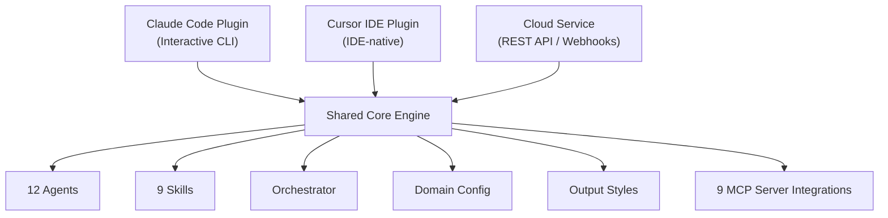
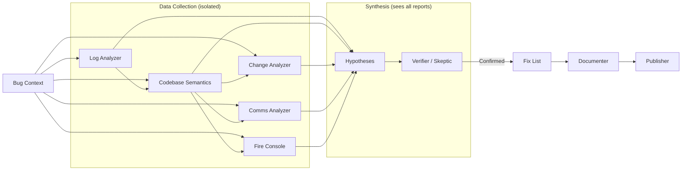

# Architecture

> **Experimental** — This platform is in beta. Architecture and agent behavior may change.

Production Master is a multi-surface investigation platform with a shared core engine. It autonomously investigates production bugs, routes intent to specialized agents, and executes hypothesis loops.

### Platform Architecture



Surfaces:
- **Claude Code** (`adapter-claude/`) — Interactive CLI plugin with slash commands and lifecycle hooks
- **Cursor IDE** (`adapter-cursor/`) — IDE-native plugin with rules, commands, and agents
- **Cloud pipeline** (`adapter-cloud/`) — REST API with webhooks, BullMQ workers, and persistent storage

Each surface connects to the shared core engine in `core/`, which contains all adapter-agnostic logic: agents, skills, orchestrator, domain config, and output styles. Surface-specific wiring (commands, hooks, API routes) lives in the respective `adapter-*/` directory.

## Pipeline Design

12 specialized agents, 9 commands, 9 MCP skill integrations, 2 output styles, 1 link validation hook.

The orchestrator (`/production-master`) is the central coordinator. It:
1. Classifies user intent into 7 modes (full investigation, log query, request trace, metrics, Slack search, code search, toggle check)
2. Loads domain configuration for the current repo
3. Reads all skill files once and distributes them to agents
4. Launches agents sequentially or in parallel as the pipeline progresses
5. Manages the hypothesis-verification loop (up to 5 iterations)

## Agent catalog

`core/agents/` contains 12 specialized agents with strict role boundaries. The canonical agent profiles (inputs, outputs, and quality gates) are documented in the [agent catalog](agents.md).

## Model Tiering

Agents are assigned models based on the complexity of their task:

- **Haiku** — Used for agents that follow structured templates without needing to reason across large bodies of evidence: `bug-context` (structured Jira parsing), `service-resolver` (table lookup + validation), `documenter` (template-driven report compilation), and `publisher` (format conversion + posting).
- **Sonnet** — Used for agents that require reasoning across multiple data sources, writing hypotheses, or evaluating evidence chains: `log-analyzer`, `codebase-semantics`, `change-analyzer`, `comms-analyzer`, `hypotheses`, `verifier`, `skeptic`, and `fix-list`.

## Investigation Flow

The canonical state machine and step-by-step flow live in [investigation-flow.md](investigation-flow.md). This page focuses on system architecture and data boundaries.

## Data Flow



**Key principles:**
- Data agents never see each other's outputs. Only Hypothesis and Verifier/Skeptic synthesize across all data sources, preventing confirmation bias.
- **Always inspect error data payloads** — the `data` column in Grafana logs contains the actual request/entity state, often the most critical evidence.
- **FT rollout vs merge** — FT merge PRs are typically code cleanup. Check when the FT was *rolled out* (behavior change) vs merged (cleanup). The rollout date is usually what matters.
- **Investigate configuration/settings** alongside code changes — site settings, user configs, and pricing plan changes cause production bugs too.
- **Agent directories are created on-write**, not pre-created — the directory structure shows exactly which agents ran.
- **Each run is completely fresh** — never read from previous `debug-*` directories.

## Domain Config

Domain configuration is documented in [domain-configs.md](domain-configs.md), including file locations, schema fields, load order, and update flow. Keep schema-level details there as the canonical source.

## Capability Abstraction

The platform abstracts vendor-specific MCP tools behind capability-level interfaces. Each capability (e.g., `log-system`, `ticket-system`) defines a normalized set of operations in `core/capabilities/interfaces/`. The capability registry (`core/capabilities/registry.yaml`) maps each capability to its active provider and alternatives.

Abstract skill files in `core/skills/` (e.g., `log-system/SKILL.md`) define the normalized tool contract, while vendor-specific skill files (e.g., `grafana-datasource/SKILL.md`) document the concrete MCP tools. The capability router (`core/capabilities/router.md`) resolves which skill file to load at Step 0.5.

Custom MCP servers in `custom-mcps/` expose the abstract tool names and translate to upstream vendor calls. This allows swapping providers (e.g., Grafana → Datadog) without changing agent prompts.

## MCP Server Dependencies

| Server | Tools | Used By |
|--------|-------|---------|
| Grafana Datasource | 11 (SQL/PromQL/LogQL) | log-analyzer, service-resolver |
| Grafana MCP | 33 (dashboards, alerts, incidents) | log-analyzer |
| Slack | 12 (search, threads, post) | comms-analyzer, publisher |
| GitHub | 23 (PRs, commits, code) | change-analyzer |
| Octocode | 7 (semantic code search) | codebase-semantics |
| FT-release | 7 (feature toggles) | change-analyzer, fix-list |
| Fire Console | 12 (gRPC domain objects) | hypothesis, verifier |
| Jira | 16 (issues, comments) | bug-context, publisher |
| Context7 | 2 (library docs) | codebase-semantics |

## Output Directory Structure

For canonical directory layout, naming conventions, and state file semantics, see [investigation-flow.md](investigation-flow.md#output-directory-structure).

## Monorepo Structure

```
production-master/
├── core/                        ← Shared, adapter-agnostic logic
│   ├── agents/                  ← 12 pipeline agents
│   ├── skills/                  ← 9 MCP skill references
│   ├── output-styles/           ← Report & publisher formats
│   ├── orchestrator/            ← Pipeline orchestration logic
│   ├── domain/                  ← Domain config schema & loading
│   └── mcp-servers.json         ← Canonical MCP server definitions
├── adapter-claude/              ← Claude Code surface
│   ├── .claude-plugin/          ← Plugin manifest & marketplace listing
│   ├── commands/                ← Slash commands
│   ├── hooks/                   ← Lifecycle hooks
│   └── scripts/                 ← Install, validate, sync scripts
├── adapter-cursor/              ← Cursor IDE surface
│   ├── .cursor-plugin/          ← Cursor plugin manifest
│   ├── rules/                   ← Cursor-specific rules
│   ├── commands/                ← Cursor commands
│   └── agents/                  ← Cursor agent configurations
├── adapter-cloud/               ← Cloud surface
│   ├── src/                     ← API routes, workers, MCP client
│   ├── helm/                    ← Kubernetes charts
│   └── migrations/              ← Database migrations
├── docs/                        ← User-facing documentation
└── docs/platform-design-docs/   ← Architecture & design documents
```

## Output Format

Investigation reports follow a structured format designed for clarity in the terminal. Reports include status updates at each pipeline stage, structured findings tables, inline code references, and hyperlinks to Grafana dashboards, Jira tickets, and Slack threads.

When publishing to external tools (Jira, Slack, GitHub), the output is automatically adapted to each platform's markup — Jira wiki syntax, Slack mrkdwn, or GitHub-flavored markdown. See the templates in `output-styles/` for details.

## MCP Configuration per Surface

Each surface handles MCP server configuration differently:

- **Claude Code** — `mcp-servers.json` serves as a **template** that `install.sh` processes: it substitutes your real access key and merges only missing servers into `~/.claude.json`, without overwriting existing server configs. We don't use `.mcp.json` auto-start because MCP servers require personal access keys.
- **Cursor IDE** — `.mcp.json` in the adapter root is picked up automatically by Cursor. Credentials are read from the `PRODUCTION_MASTER_ACCESS_KEY` environment variable.
- **Cloud** — MCP connections are configured via environment variables (`.env`). The cloud adapter initializes MCP clients programmatically at startup.
