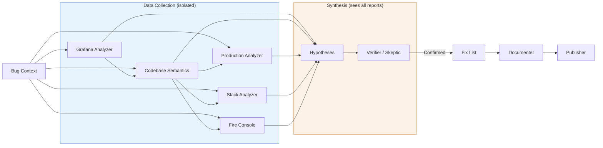

# Architecture

> **Experimental** — This plugin is in beta. Architecture and agent behavior may change.

Production Master is a multi-agent pipeline that autonomously investigates production bugs. It classifies user intent, routes to specialized agents, and executes investigations with hypothesis loops.

## Pipeline Design

12 specialized agents, 8 commands, 9 MCP skill integrations, 2 output styles, 1 link validation hook.

The orchestrator (`/production-master`) is the central coordinator. It:
1. Classifies user intent into 7 modes (full investigation, log query, request trace, metrics, Slack search, code search, toggle check)
2. Loads domain configuration for the current repo
3. Reads all skill files once and distributes them to agents
4. Launches agents sequentially or in parallel as the pipeline progresses
5. Manages the hypothesis-verification loop (up to 5 iterations)

## Agent Table

| Agent | Role | Inputs | MCP Skills |
|-------|------|--------|------------|
| `bug-context` | Parses Jira tickets into structured briefs | Jira data, user input | — |
| `artifact-resolver` | Validates service names against Grafana | Bug context, Grafana | grafana-datasource |
| `grafana-analyzer` | Queries production logs, reports raw findings | Bug context, enriched context | grafana-datasource |
| `codebase-semantics` | Maps code flows, error propagation, service boundaries | Bug context, Grafana report | octocode |
| `production-analyzer` | Finds PRs, commits, feature toggle changes | Bug context, codebase report | github, ft-release |
| `slack-analyzer` | Searches Slack for related discussions | Bug context, codebase report | slack |
| `hypotheses` | Generates testable root cause theories | All reports, findings summary | fire-console |
| `verifier` | Quality gate — evaluates hypothesis proof | Hypothesis, all reports | fire-console |
| `skeptic` | Cross-examines competing hypotheses (agent teams) | Two hypothesis reports | — |
| `fix-list` | Creates actionable fix plans with rollback options | Confirmed hypothesis, codebase report | ft-release |
| `documenter` | Compiles pipeline output into investigation reports | All reports, all hypotheses | — |
| `publisher` | Publishes findings to Jira and/or Slack | Report, bug context | jira, slack |

## Data Flow



**Key principle:** Data agents never see each other's outputs. Only Hypothesis and Verifier/Skeptic synthesize across all data sources, preventing confirmation bias.

## Domain Config

Each repository gets a domain directory at `~/.claude/production-master/domains/<repo>/` containing:

- **`domain.json`** — Machine-readable config: artifact IDs, Jira project, GitHub org, Slack channels, toggle prefix
- **`CLAUDE.md`** — Repo-specific Claude instructions: service descriptions, debugging tips
- **`memory/MEMORY.md`** — Accumulated investigation knowledge

Domain configs are created interactively via `/update-context` and contributed back to the repo via PR into `Domain/<Division>/<Side>/<repo>/`.

### domain.json Fields

| Field | Description | Example |
|-------|-------------|---------|
| `company` | Company name | `"Wix"` |
| `division` | Team/division | `"Bookings"` |
| `side` | Server/Client | `"Server"` |
| `repo` | Repository name | `"scheduler"` |
| `github_org` | GitHub organization | `"wix-private"` |
| `github_repo` | Full repo path | `"wix-private/scheduler"` |
| `jira_project` | Jira project key | `"SCHED"` |
| `artifact_prefix` | Common artifact ID prefix | `"com.wixpress.bookings"` |
| `primary_services` | Array of `{name, artifact_id}` | See example below |
| `slack_channels` | Object with `alerts`, `dev`, `incidents` | `{"alerts": "#bookings-alerts"}` |
| `toggle_prefix` | Feature toggle prefix | `"specs.bookings"` |
| `grafana_url` | Grafana base URL | `"https://grafana.wixpress.com"` |
| `grafana_app_analytics_dashboard` | Dashboard UID | `"olcdJbinz"` |
| `request_id_format` | Request ID format description | `"<unix_timestamp>.<random>"` |
| `language` | Primary language | `"scala"` |
| `build_system` | Build system | `"bazel"` |
| `monorepo` | Whether it's a monorepo | `true` |

## MCP Server Dependencies

| Server | Tools | Used By |
|--------|-------|---------|
| Grafana Datasource | 11 (SQL/PromQL/LogQL) | grafana-analyzer, artifact-resolver |
| Grafana MCP | 33 (dashboards, alerts, incidents) | grafana-analyzer |
| Slack | 12 (search, threads, post) | slack-analyzer, publisher |
| GitHub | 23 (PRs, commits, code) | production-analyzer |
| Octocode | 7 (semantic code search) | codebase-semantics |
| FT-release | 7 (feature toggles) | production-analyzer, fix-list |
| Fire Console | 12 (gRPC domain objects) | hypothesis, verifier |
| Jira | 16 (issues, comments) | bug-context, publisher |
| Context7 | 2 (library docs) | codebase-semantics |

## Plugin Structure

```
production-master/
├── .claude-plugin/
│   ├── plugin.json              ← Plugin metadata
│   └── marketplace.json         ← Marketplace listing
├── agents/                      ← 12 pipeline agents
├── commands/                    ← 8 commands
├── skills/                      ← 9 MCP skill references
├── hooks/
│   └── hooks.json               ← Notification + link validation hooks
├── scripts/
│   └── validate-report-links.sh ← Report link validator
├── output-styles/               ← Investigation report + publisher formatting
├── docs/                        ← Documentation
├── Domain/                      ← Company/team/repo domain configs
└── README.md
```
