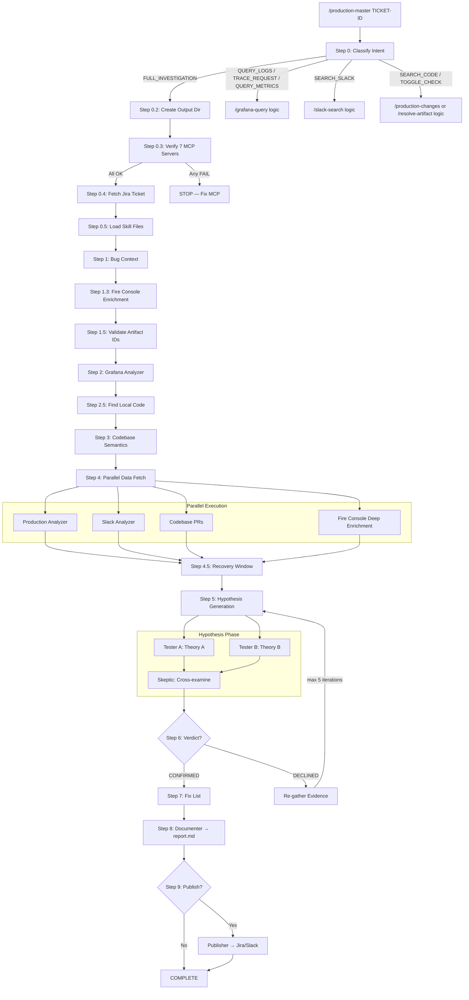
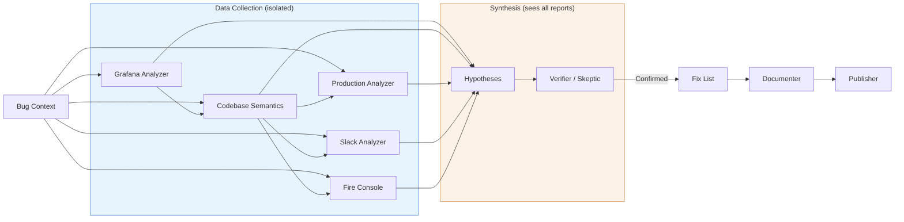

# Architecture

> **Experimental** — This plugin is in beta. Architecture and agent behavior may change.

Production Master is a multi-agent pipeline that autonomously investigates production bugs. It classifies user intent, routes to specialized agents, and executes investigations with hypothesis loops.

## Pipeline Design

12 specialized agents, 9 commands, 9 MCP skill integrations, 2 output styles, 1 link validation hook.

The orchestrator (`/production-master`) is the central coordinator. It:
1. Classifies user intent into 7 modes (full investigation, log query, request trace, metrics, Slack search, code search, toggle check)
2. Loads domain configuration for the current repo
3. Reads all skill files once and distributes them to agents
4. Launches agents sequentially or in parallel as the pipeline progresses
5. Manages the hypothesis-verification loop (up to 5 iterations)

## Agent Table

| Agent | Model | Role | Inputs | MCP Skills |
|-------|-------|------|--------|------------|
| `bug-context` | haiku | Parses Jira tickets into structured briefs | Jira data, user input | — |
| `artifact-resolver` | haiku | Validates service names against Grafana | Bug context, Grafana | grafana-datasource |
| `grafana-analyzer` | sonnet | Queries production logs, reports raw findings | Bug context, enriched context | grafana-datasource |
| `codebase-semantics` | sonnet | Maps code flows, error propagation, service boundaries | Bug context, Grafana report | octocode |
| `production-analyzer` | sonnet | Finds PRs, commits, feature toggle changes | Bug context, codebase report | github, ft-release |
| `slack-analyzer` | sonnet | Searches Slack for related discussions | Bug context, codebase report | slack |
| `hypotheses` | sonnet | Generates testable root cause theories | All reports, findings summary | fire-console |
| `verifier` | sonnet | Quality gate — evaluates hypothesis proof | Hypothesis, all reports | fire-console |
| `skeptic` | sonnet | Cross-examines competing hypotheses (agent teams) | Two hypothesis reports | — |
| `fix-list` | sonnet | Creates actionable fix plans with rollback options | Confirmed hypothesis, codebase report | ft-release |
| `documenter` | haiku | Compiles pipeline output into investigation reports | All reports, all hypotheses | — |
| `publisher` | haiku | Publishes findings to Jira and/or Slack | Report, bug context | jira, slack |

## Model Tiering

Agents are assigned models based on the complexity of their task:

- **Haiku** — Used for agents that follow structured templates without needing to reason across large bodies of evidence: `bug-context` (structured Jira parsing), `artifact-resolver` (table lookup + validation), `documenter` (template-driven report compilation), and `publisher` (format conversion + posting).
- **Sonnet** — Used for agents that require reasoning across multiple data sources, writing hypotheses, or evaluating evidence chains: `grafana-analyzer`, `codebase-semantics`, `production-analyzer`, `slack-analyzer`, `hypotheses`, `verifier`, `skeptic`, and `fix-list`.

## Investigation Flow



## Data Flow



**Key principles:**
- Data agents never see each other's outputs. Only Hypothesis and Verifier/Skeptic synthesize across all data sources, preventing confirmation bias.
- **Always inspect error data payloads** — the `data` column in Grafana logs contains the actual request/entity state, often the most critical evidence.
- **FT rollout vs merge** — FT merge PRs are typically code cleanup. Check when the FT was *rolled out* (behavior change) vs merged (cleanup). The rollout date is usually what matters.
- **Investigate configuration/settings** alongside code changes — site settings, user configs, and pricing plan changes cause production bugs too.
- **Agent directories are created on-write**, not pre-created — the directory structure shows exactly which agents ran.
- **Each run is completely fresh** — never read from previous `debug-*` directories.

## Domain Config

Each repository gets a domain directory at `~/.claude/production-master/domains/<repo>/` containing:

- **`domain.json`** — Machine-readable config: artifact IDs, Jira project, GitHub org, Slack channels, toggle prefix
- **`CLAUDE.md`** — Repo-specific Claude instructions: service descriptions, debugging tips
- **`memory/MEMORY.md`** — Accumulated investigation knowledge

Domain configs are created interactively via `/update-context` and contributed back to the repo via PR into `Domain/<Division>/<Side>/<repo>/`.

### domain.json Fields

| Field | Description | Example |
|-------|-------------|---------|
| `company` | Company name | `"Wix"` |
| `division` | Team/division | `"Bookings"` |
| `side` | Server/Client | `"Server"` |
| `repo` | Repository name | `"scheduler"` |
| `github_org` | GitHub organization | `"wix-private"` |
| `github_repo` | Full repo path | `"wix-private/scheduler"` |
| `jira_project` | Jira project key | `"SCHED"` |
| `artifact_prefix` | Common artifact ID prefix | `"com.wixpress.bookings"` |
| `primary_services` | Array of `{name, artifact_id}` | See example below |
| `slack_channels` | Object with `alerts`, `dev`, `incidents` | `{"alerts": "#bookings-alerts"}` |
| `toggle_prefix` | Feature toggle prefix | `"specs.bookings"` |
| `grafana_url` | Grafana base URL | `"https://grafana.wixpress.com"` |
| `grafana_app_analytics_dashboard` | Dashboard UID | `"olcdJbinz"` |
| `request_id_format` | Request ID format description | `"<unix_timestamp>.<random>"` |
| `language` | Primary language | `"scala"` |
| `build_system` | Build system | `"bazel"` |
| `monorepo` | Whether it's a monorepo | `true` |

## MCP Server Dependencies

| Server | Tools | Used By |
|--------|-------|---------|
| Grafana Datasource | 11 (SQL/PromQL/LogQL) | grafana-analyzer, artifact-resolver |
| Grafana MCP | 33 (dashboards, alerts, incidents) | grafana-analyzer |
| Slack | 12 (search, threads, post) | slack-analyzer, publisher |
| GitHub | 23 (PRs, commits, code) | production-analyzer |
| Octocode | 7 (semantic code search) | codebase-semantics |
| FT-release | 7 (feature toggles) | production-analyzer, fix-list |
| Fire Console | 12 (gRPC domain objects) | hypothesis, verifier |
| Jira | 16 (issues, comments) | bug-context, publisher |
| Context7 | 2 (library docs) | codebase-semantics |

## Output Directory Structure

Each investigation creates a timestamped output directory. Agent subdirectories are created by agents when they write output (NOT pre-created), so only directories of agents that actually ran will exist:

```
.claude/debug/debug-SCHED-45895-2026-02-14-143000/
├── findings-summary.md              ← Persistent state file (updated after every step)
├── report.md                        ← Final investigation report (Step 8)
│
├── bug-context/
│   ├── bug-context-output-V1.md
│   └── bug-context-trace-V1.md      ← Action log (human debugging only)
├── grafana-analyzer/
│   ├── grafana-analyzer-output-V1.md
│   └── grafana-analyzer-output-V2.md ← Re-run after Declined
├── codebase-semantics/
│   ├── codebase-semantics-output-V1.md
│   └── codebase-semantics-prs-output-V1.md
├── production-analyzer/
│   └── production-analyzer-output-V1.md
├── slack-analyzer/
│   └── slack-analyzer-output-V1.md
├── fire-console/
│   └── fire-console-output-V1.md
├── hypotheses/
│   ├── hypotheses-tester-A-output-V1.md
│   └── hypotheses-tester-B-output-V1.md
├── skeptic/
│   └── skeptic-output-V1.md
├── fix-list/
│   └── fix-list-output-V1.md
├── documenter/
│   └── documenter-output-V1.md
└── publisher/
    └── publisher-output-V1.md
```

**Naming:** `{agent}-output-V{N}.md` where N increments per re-invocation. Trace files (`-trace-`) are for human debugging only — never passed between agents.

**Location:** Inside a git repo: `.claude/debug/`. Outside: `./debug/`.

## Plugin Structure

```
production-master/
├── .claude-plugin/
│   ├── plugin.json              ← Plugin metadata
│   └── marketplace.json         ← Marketplace listing
├── agents/                      ← 12 pipeline agents
├── commands/                    ← 9 commands
├── skills/                      ← 9 MCP skill references
├── hooks/
│   └── hooks.json               ← Notification + link validation hooks
├── scripts/
│   ├── install.sh               ← Plugin installer
│   ├── install-cursor.sh        ← Cursor IDE installer (cursor-support branch)
│   ├── validate-install.sh      ← Installation diagnostics
│   ├── validate-report-links.sh ← Report link validator
│   ├── bump-version.sh          ← Version bump, tag, and release
│   ├── sync-cursor.sh           ← Sync cursor-support branch from main
│   └── statusline.sh            ← Claude Code status bar with pipeline phase
├── output-styles/               ← Investigation report + publisher formatting
├── docs/                        ← Documentation
├── Domain/                      ← Company/team/repo domain configs
└── README.md
```

## Output Format

Investigation reports follow a structured format designed for clarity in the terminal. Reports include status updates at each pipeline stage, structured findings tables, inline code references, and hyperlinks to Grafana dashboards, Jira tickets, and Slack threads.

When publishing to external tools (Jira, Slack, GitHub), the output is automatically adapted to each platform's markup — Jira wiki syntax, Slack mrkdwn, or GitHub-flavored markdown. See the templates in `output-styles/` for details.

## Why `mcp-servers.json` instead of `.mcp.json`?

Claude Code plugins can declare MCP servers via a `.mcp.json` file at the plugin root, which auto-starts servers when the plugin loads. However, our 9 MCP servers require **personal access keys** — auto-starting them with placeholder keys would fail. Instead, `mcp-servers.json` serves as a **template** that `install.sh` processes: it substitutes your real access key and merges only missing servers into `~/.claude.json`, without overwriting any existing server configs.
