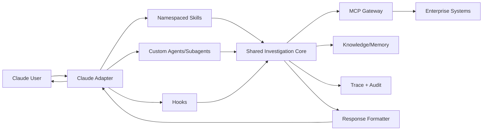
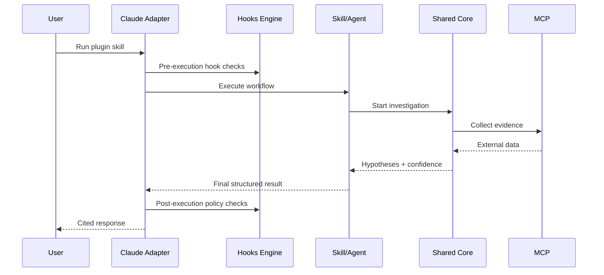
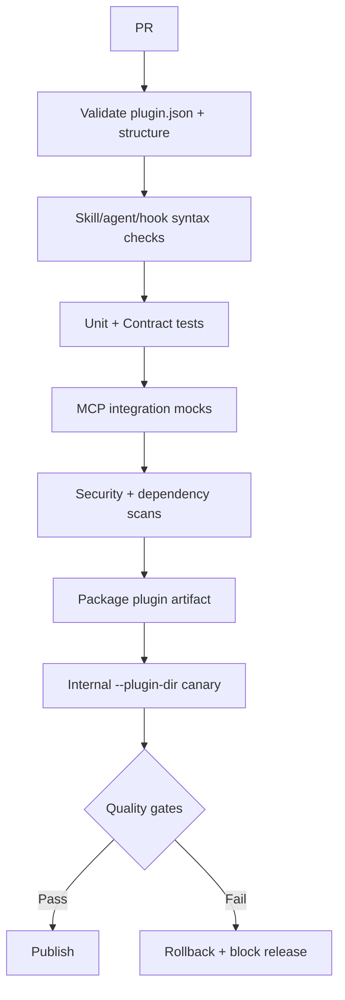

# Claude Code Plugin Design and Implementation (Zero-to-Hero)

## Product Objective
Build the Claude Code plugin surface for `production-master` with namespaced reusable skills, deterministic hooks, and optional agent teamwork patterns, all backed by one shared core. [SRC-CLAUDE] [SRC-PLUG] [SRC-WIX]

## Research Extracts Applied
> “Plugins are namespaced and versioned via `.claude-plugin/plugin.json`.” [SRC-CLAUDE]

> “Hooks are deterministic lifecycle commands… ensuring actions happen rather than relying only on LLM behavior.” [SRC-CLAUDE]

> “Subagents are focused workers; agent teams coordinate through shared task flow with independent contexts.” [SRC-PLUG]

These are encoded as first-class design rules below.

## Architecture
### Top-Level Architecture


### Runtime Flow


## Claude Plugin Feature Set
### Core Features
- Investigation triage from free text
- MCP-driven evidence collection
- Multi-step hypothesis generation/verification
- Confidence-based recommendations
- Structured report generation with trace references [SRC-WIX] [SRC-GEN]

### Claude-Specific Features
- Namespaced plugin skills (`/plugin-name:skill`) [SRC-CLAUDE]
- Optional custom agents/subagents for specialist responsibilities [SRC-PLUG]
- Hook-based lifecycle guardrails and automation [SRC-CLAUDE]
- Marketplace-ready plugin manifest and versioning [SRC-CLAUDE]

### Capability-First Agent Tasks (Claude)
Claude skills/agents should receive capability tasks such as:
- `provide_bug_context`
- `summarize_customer_impact`
- `map_recent_changes`
- `verify_root_cause`

They should not be written as source-specific instructions (for example “pull Jira tickets”).  
Capability router selects source interfaces/tools dynamically using policy, health, and fallback rules. [SRC-WIX] [SRC-GEN]

## Implementation from Scratch
### Proposed Adapter Repository Structure
```text
claude-adapter/
├── .claude-plugin/
│   └── plugin.json
├── skills/
│   ├── triage/SKILL.md
│   ├── gather-evidence/SKILL.md
│   ├── hypothesis/SKILL.md
│   ├── verify/SKILL.md
│   └── report/SKILL.md
├── agents/
│   ├── triage-agent.md
│   ├── verifier-agent.md
│   └── reporter-agent.md
├── hooks/
│   └── hooks.json
├── .mcp.json
├── tests/
│   ├── contract/
│   ├── integration/
│   └── prompt-golden/
└── src/
    ├── adapter.ts
    ├── skill-router.ts
    └── telemetry.ts
```

### Hook Policy Plan
- `PreToolUse`: block unsafe write actions unless escalation token exists
- `PostToolUse`: attach trace event and provenance
- `PostEdit`: enforce formatting/lint
- `Stop`: ensure response includes evidence and confidence fields

## MCP Inventory for Claude Adapter
From repository MCP configuration and Wix MCP references: [SRC-MCP-CONFIG] [SRC-WIX-MCP-PRIVATE] [SRC-WIX-MCP-PORTAL]
- `octocode`
- `Slack`
- `jira`
- `grafana-datasource`
- `FT-release`
- `github`
- `context-7`
- `grafana-mcp`
- `fire-console`

### MCP Usage Policy (Claude)
- Default mode: read-only investigations
- Controlled mode: limited write operations via explicit workflow and approval
- Mandatory trace tag for every MCP call

### Source-Change Resilience (Claude)
- Keep capability contracts stable across provider changes.
- Swap providers via config flags (`external` -> `internal`).
- Require capability-level parity tests before promotion.

### MCP Interface-First Provider Model (Claude)
Claude adapter consumes domain contracts (`jira`, `github`, `grafana`, etc.) with a provider abstraction:
- `provider=external` for current MCP servers
- `provider=internal` for custom MCP servers

The plugin’s skills/hooks/agents remain stable while backend providers evolve. [SRC-CLAUDE] [SRC-PLUG] [SRC-WIX]

### Claude Migration Path for Custom MCPs
1. Launch with existing external MCP providers.
2. Build internal MCP for one domain.
3. Run dual-provider validation in staging.
4. Shift canary traffic by config flag.
5. Roll forward or rollback based on parity and reliability gates.

## CI/CD Pipeline (Claude Adapter)


## Roadmap (Claude)
### Phase 0 - Baseline
- Plugin skeleton
- Core contract integration
- Base triage/report skill

### Phase 1 - Functional MVP
- Full workflow skill chain
- Deterministic hooks
- MCP read-only integrations

### Phase 2 - Reliability and Security
- Contract test matrix
- Trace replay test suite
- Security hardening and least-privilege validation
- MCP provider parity tests for migrated domains

### Phase 3 - Scale
- Expanded agent library
- Advanced quality scoring
- Marketplace-scale release governance

## Success Metrics
- P95 response time by mode
- Evidence-backed completion rate
- False positive / false negative trends
- Hook policy block-rate (safety effectiveness)
- Cost per completed case

## Citations
- [SRC-CLAUDE] Claude plugin docs: https://code.claude.com/docs/en/plugins
- [SRC-PLUG] Plugins deep research: file:///Users/tamirc/Downloads/Plugin/Plugins%20-%20deep-research-report.md
- [SRC-WIX] Wix deep research: file:///Users/tamirc/Downloads/Plugin/WIX%20-%20deep-research-report.md
- [SRC-GEN] General deep research: file:///Users/tamirc/Downloads/Plugin/General%20-%20deep-research-report.md
- [SRC-MCP-CONFIG] Repo MCP config: file:///Users/tamirc/Projects/production-master/mcp-servers.json
- [SRC-WIX-MCP-PRIVATE] Wix MCP servers (private): https://github.com/wix-private/mcp-servers
- [SRC-WIX-MCP-PORTAL] Wix MCP portal: https://mcp-s-connect.wewix.net/mcp-servers
