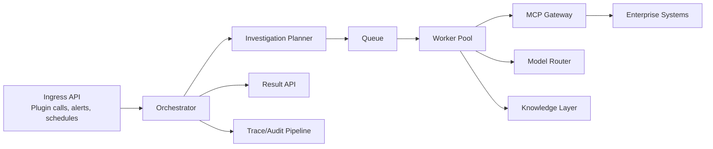
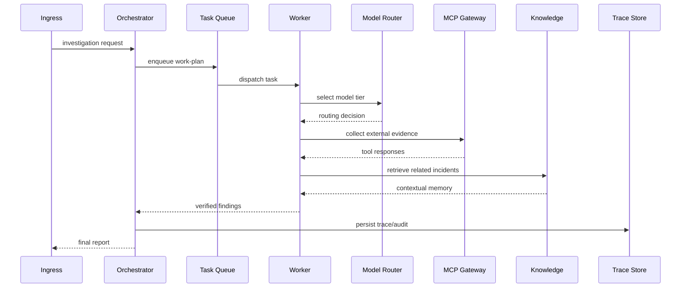
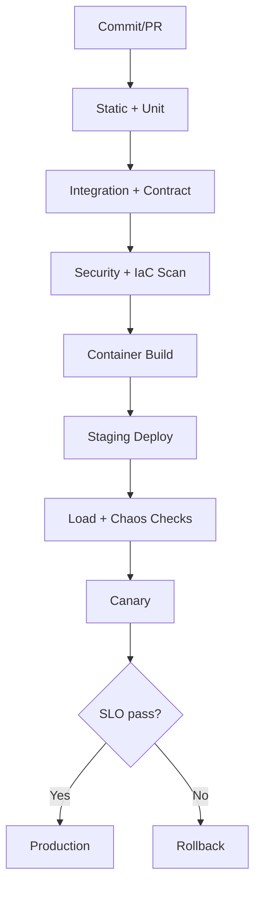

# Cloud Pipeline Design and Implementation (Zero-to-Hero)

## Product Objective
Create the standalone cloud platform for `production-master` that powers autonomous investigations, serves plugin adapters, and provides enterprise reliability, governance, and observability. [SRC-WIX] [SRC-GEN]

## Research Extracts Applied
> “Containerized microservices with Kubernetes, queue-based tasking, and gateway-mediated integrations are recommended for scale and isolation.” [SRC-WIX]

> “Dynamic model routing and confidence-aware execution are critical for quality/cost tradeoff.” [SRC-WIX] [SRC-GEN]

> “Full traceability, OpenTelemetry-style observability, and replayable audit bundles are non-negotiable.” [SRC-WIX] [SRC-GEN]

## Cloud Architecture
### Top-Level Architecture


### Deep Runtime Flow


## Cloud Service Components
### 1) Ingress Layer
- REST/gRPC endpoints for plugin and system requests
- webhook receivers for alert/ticket pipelines
- scheduled job trigger endpoints

### 2) Orchestrator
- request classification and priority policy
- plan decomposition and worker dispatch
- aggregation and final decision synthesis
- escalation logic when confidence is low

### 3) Worker Pool
- telemetry collector
- code/release analyzer
- dependency mapper
- hypothesis generator
- verifier
- report builder

### 3.1) Capability-Driven Work Assignment
Workers are assigned capability tasks, not source actions.

Examples:
- `provide_bug_context`
- `provide_runtime_context`
- `provide_release_context`
- `verify_root_cause`

Each capability uses one or more interfaces (ticketing/chatops/code/metrics) and provider routing selects concrete data sources at runtime. [SRC-WIX] [SRC-GEN]

### 4) Model Router
- model tier policy (`fast`, `balanced`, `deep`)
- confidence thresholds and escalation
- budget-aware routing
- audit of model choices

### 5) MCP Gateway
- centralized access to enterprise tools
- auth and policy enforcement
- retry/rate-limit/circuit-breaker controls

### 5.1) MCP Interface-First Provider Routing
Cloud runtime treats each MCP domain as a contract with pluggable providers:
- domain contract examples: `jira`, `github`, `grafana`, `slack`
- provider modes: `external` (existing servers), `internal` (custom MCP services)
- route decisions configured per environment and tenant

This allows incremental migration to internal MCP implementations without core workflow rewrites. [SRC-WIX] [SRC-MCP-CONFIG]

### 5.2) Data Source Change Strategy
When a source changes (API/schema/vendor):
- keep capability contract unchanged,
- update provider adapter and normalization mapping,
- run capability parity and regression tests,
- release via canary with fallback enabled.

### 6) Knowledge + Memory
- vector retrieval for incident similarity
- optional graph context for dependencies
- governed feedback ingestion

### 7) Trace and Audit
- immutable span/event records
- evidence lineage links
- replay support for postmortem

## MCP Inventory (Cloud Runtime)
From current repo MCP configuration and Wix sources: [SRC-MCP-CONFIG] [SRC-WIX-MCP-PRIVATE] [SRC-WIX-MCP-PORTAL]
- `octocode`
- `Slack`
- `jira`
- `grafana-datasource`
- `FT-release`
- `github`
- `context-7`
- `grafana-mcp`
- `fire-console`

### MCP Provider Routing Table (Cloud)
For each domain, maintain:
- active provider (`external|internal`)
- fallback provider
- timeout/retry policy
- parity test status

## Implementation from Scratch
### Proposed Cloud Repository Layout
```text
cloud-pipeline/
├── services/
│   ├── ingress-api/
│   ├── orchestrator/
│   ├── worker-runtime/
│   ├── model-router/
│   ├── mcp-gateway/
│   ├── knowledge-service/
│   └── trace-service/
├── contracts/
│   ├── request.schema.json
│   ├── evidence.schema.json
│   └── decision.schema.json
├── deployments/
│   ├── helm/
│   ├── k8s/
│   └── terraform/
├── tests/
│   ├── contract/
│   ├── integration/
│   ├── load/
│   └── chaos/
└── docs/
    ├── runbooks/
    └── adr/
```

## CI/CD and Release Model


### Release Gates
- API contract compatibility
- model-routing policy tests
- MCP failure simulation tests
- trace completeness checks
- security benchmark pass
- MCP provider parity gates for migrated domains
- capability-level parity gates (source-agnostic behavior)

## Operations Blueprint
### Reliability
- queue-based backpressure
- worker autoscaling by queue depth
- retries + dead-letter queues
- regional failover plan

### Security
- mTLS between internal services
- secret retrieval from vault only
- least-privilege service identities
- strict egress policies

### Governance
- human approval on high-impact action proposals
- model change review board
- evidence-linked audit reports for compliance

## Roadmap (Cloud)
### Phase 0 - Bootstrap
- ingress/orchestrator/queue skeleton
- baseline observability
- MCP gateway wiring

### Phase 1 - MVP
- 3 worker classes + vector knowledge
- model router v1
- plugin adapter API support

### Phase 2 - Production Hardening
- full worker catalog
- canary + rollback automation
- SLO dashboards and alerting
- first internal MCP domain migration (external -> internal)

### Phase 3 - Enterprise Expansion
- multi-region resilience
- graph-augmented retrieval
- replay-based regression pipeline

## Success Metrics
- P95 queue wait time
- P95 standard/deep investigation completion
- incident-resolution assist rate
- rollback frequency and MTTR
- cost per investigation

## Citations
- [SRC-WIX] Wix deep research: file:///Users/tamirc/Downloads/Plugin/WIX%20-%20deep-research-report.md
- [SRC-GEN] General deep research: file:///Users/tamirc/Downloads/Plugin/General%20-%20deep-research-report.md
- [SRC-PLUG] Plugins deep research: file:///Users/tamirc/Downloads/Plugin/Plugins%20-%20deep-research-report.md
- [SRC-MCP-CONFIG] Repo MCP config: file:///Users/tamirc/Projects/production-master/mcp-servers.json
- [SRC-WIX-MCP-PRIVATE] Wix MCP servers (private): https://github.com/wix-private/mcp-servers
- [SRC-WIX-MCP-PORTAL] Wix MCP portal: https://mcp-s-connect.wewix.net/mcp-servers
