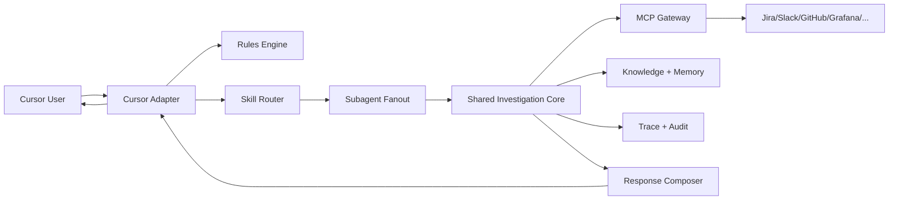
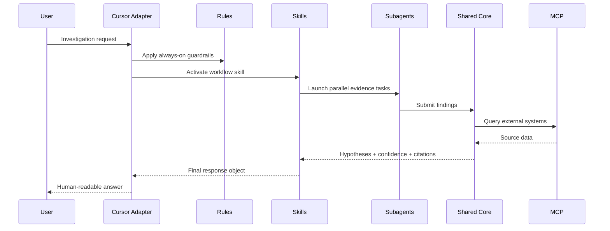
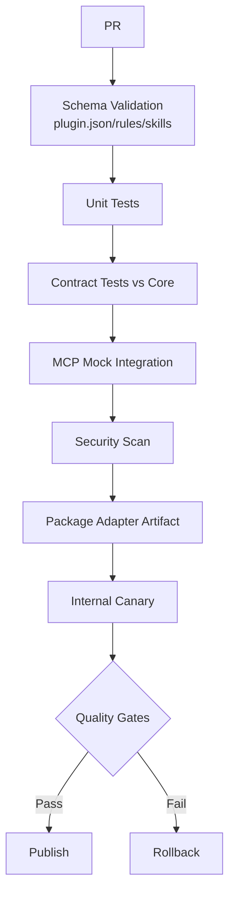

# Cursor Plugin Design and Implementation (Zero-to-Hero)

## Product Objective
Build the Cursor-facing product surface for `production-master` as a high-confidence incident investigation assistant, backed by the shared core and enterprise MCP integrations. [SRC-CURSOR] [SRC-PLUG] [SRC-WIX]

## Research Extracts Applied
> “Cursor distinguishes rules (always-on context) and skills (dynamically loaded workflows).” [SRC-PLUG]

> “Subagents handle discrete tasks in parallel with their own context/configuration.” [SRC-PLUG]

> “Core + adapter architecture with independent pipelines is recommended for Cursor/Claude/cloud.” [SRC-WIX] [SRC-PLUG]

These excerpts are implemented directly in this design.

## Architecture
### Top-Level Architecture


### Investigation Flow


## Cursor Plugin Feature Set
### Core Features
- Intelligent incident triage from natural language
- Evidence collection from MCP-connected systems
- Hypothesis ranking with confidence bands
- Verification-first recommendations
- Citation-rich output format
- Optional “deep mode” with expanded checks [SRC-GEN] [SRC-WIX]

### Cursor-Specific Features
- Rules for always-on policy/safety context [SRC-PLUG]
- Skills for explicit investigation workflows [SRC-PLUG]
- Subagents for parallel evidence-gathering [SRC-PLUG]
- Workspace-aware code and config inspection
- Hook integration points for formatting, checks, and policy gates [SRC-PLUG]

### Capability-First Agent Tasks (Cursor)
In Cursor flows, skills/subagents are defined by **capability**, not source:
- `provide_bug_context`
- `provide_release_context`
- `provide_runtime_context`
- `verify_hypothesis`

Each capability can use multiple interfaces (`jira`, `slack`, `github`, `grafana`) via routing policy.  
If one source changes tomorrow, only the provider adapter changes; capability workflow stays unchanged. [SRC-WIX] [SRC-GEN]

## Implementation from Scratch
### Proposed Adapter Repository Structure
```text
cursor-adapter/
├── .cursor-plugin/
│   └── plugin.json
├── rules/
│   ├── safety.mdc
│   ├── citations.mdc
│   └── escalation.mdc
├── skills/
│   ├── triage/SKILL.md
│   ├── evidence-collection/SKILL.md
│   ├── hypothesis-ranking/SKILL.md
│   ├── verification/SKILL.md
│   └── incident-report/SKILL.md
├── agents/
│   ├── logs-investigator.mdc
│   ├── code-change-investigator.mdc
│   └── metrics-correlator.mdc
├── mcp.json
├── tests/
│   ├── contract/
│   ├── integration/
│   └── golden/
└── src/
    ├── adapter.ts
    ├── contracts.ts
    └── telemetry.ts
```

### Rules/Skills Contract
- Rules only for immutable governance (safety, citation policy, escalation triggers).
- Skills only for executable workflows and decision logic.
- Subagents only for independent branches (never for sequential dependencies).

## MCP Inventory for Cursor Adapter
From current repo MCP config + requested Wix endpoints: [SRC-MCP-CONFIG] [SRC-WIX-MCP-PRIVATE] [SRC-WIX-MCP-PORTAL]
- `octocode`
- `Slack`
- `jira`
- `grafana-datasource`
- `FT-release`
- `github`
- `context-7`
- `grafana-mcp`
- `fire-console`

### MCP Policy Mapping (Cursor)
- Read-only data fetch by default
- Write/act APIs allowed only in explicit escalation workflows
- Per-MCP timeout/retry policy with fallback and trace tags

### Source-Change Resilience (Cursor)
- Capability contract tests run independent of provider.
- Per-interface health probes drive runtime fallback.
- Degraded-mode responses explicitly state missing source coverage.

### MCP Interface-First Provider Model (Cursor)
Cursor adapter calls MCP **domain contracts**, not hardcoded server implementations:
- `jira`, `github`, `grafana`, etc. are logical interfaces.
- each domain supports `provider=external|internal`.
- provider selection is environment/config driven.

This allows starting with current MCP servers and migrating selected domains to custom internal MCPs without changing skill logic. [SRC-PLUG] [SRC-WIX] [SRC-MCP-CONFIG]

### Cursor Migration Path for Custom MCPs
1. Keep all domains on `external` in MVP.
2. Implement one internal provider (recommended: `github` or `jira`).
3. Add domain parity tests (`external` vs `internal`).
4. Canary internal provider behind flag.
5. Promote when quality and cost gates pass.

## CI/CD Pipeline (Cursor Adapter)


### Quality Gates
- Citation compliance in generated responses
- Trace completeness (all tool/model calls logged)
- Hallucination guard regression tests
- Cost envelope per scenario (fast/balanced/deep)
- MCP provider parity for migrated domains

## Rollout Roadmap (Cursor)
### Phase 0 - Foundations (Week 1-2)
- Plugin skeleton, manifest, base rules, base skills
- Core contract integration

### Phase 1 - MVP (Week 3-5)
- Triage/evidence/hypothesis/verification/reporting skills
- 3 subagents (logs/code/metrics)
- MCP read-only integrations

### Phase 2 - Hardening (Week 6-8)
- Full CI/CD gates
- Canary rollout and observability dashboards
- Security pen-test and fail-safe paths

### Phase 3 - Enterprise Scale (Week 9+)
- Expanded MCP catalog
- Automated regression suite from production traces
- Cross-team adoption and governance board

## Success Metrics
- P95 response latency by mode
- Hypothesis precision@1 and precision@3
- Human override percentage
- Investigation completion rate
- Cost per resolved investigation

## Citations
- [SRC-CURSOR] Cursor Plugin docs: https://cursor.com/docs/plugins/building
- [SRC-PLUG] Plugins deep research: file:///Users/tamirc/Downloads/Plugin/Plugins%20-%20deep-research-report.md
- [SRC-WIX] Wix deep research: file:///Users/tamirc/Downloads/Plugin/WIX%20-%20deep-research-report.md
- [SRC-GEN] General deep research: file:///Users/tamirc/Downloads/Plugin/General%20-%20deep-research-report.md
- [SRC-MCP-CONFIG] Repo MCP config: file:///Users/tamirc/Projects/production-master/mcp-servers.json
- [SRC-WIX-MCP-PRIVATE] Wix MCP servers (private): https://github.com/wix-private/mcp-servers
- [SRC-WIX-MCP-PORTAL] Wix MCP portal: https://mcp-s-connect.wewix.net/mcp-servers
