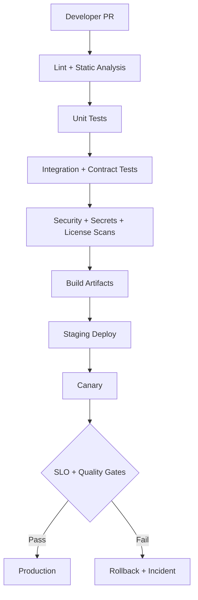

# Production-Master Master Implementation Plan (From Scratch)

## Mission
Deliver the most important product version of `production-master`: one shared investigation brain, three production interfaces (Cursor plugin, Claude plugin, Cloud pipeline), and enterprise-grade operations from day one. [SRC-WIX] [SRC-PLUG] [SRC-GEN]

## Program Deliverables
1. Cursor plugin (developer-native interface) [SRC-CURSOR] [SRC-PLUG]
2. Claude Code plugin (namespaced automation interface) [SRC-CLAUDE] [SRC-PLUG]
3. Cloud pipeline (standalone autonomous investigation service) [SRC-WIX] [SRC-GEN]
4. Shared architecture standards + contracts [SRC-WIX] [SRC-PLUG]
5. PR execution breakdown and delivery checklist (`pr-execution-plan.md`)
6. Strategic requirements coverage matrix (`requirements-coverage-matrix.md`)

## Research Extracts Used as Requirements
> “Shared core library + platform-specific adapters + semantic versioning + independent pipelines.” [SRC-WIX]

> “Rules are always-on context; skills are dynamic workflows.” [SRC-PLUG]

> “Hooks are deterministic lifecycle controls.” [SRC-CLAUDE]

> “MCP gateway solves tool-integration sprawl and centralizes governance.” [SRC-WIX]

> “Traceability, replay, and confidence-aware routing are mandatory at scale.” [SRC-WIX] [SRC-GEN]

## End-State Repository Structure
```text
production-master/
├── core/
│   ├── orchestrator/
│   ├── planner/
│   ├── worker-runtime/
│   ├── model-router/
│   ├── policy-engine/
│   ├── contracts/
│   └── telemetry/
├── adapters/
│   ├── cursor/
│   │   ├── .cursor-plugin/
│   │   ├── rules/
│   │   ├── skills/
│   │   ├── agents/
│   │   └── mcp.json
│   ├── claude/
│   │   ├── .claude-plugin/
│   │   ├── skills/
│   │   ├── agents/
│   │   ├── hooks/
│   │   └── .mcp.json
│   └── cloud/
│       ├── services/
│       ├── deployments/
│       └── runbooks/
├── shared/
│   ├── schemas/
│   ├── prompts/
│   ├── evaluation/
│   └── fixtures/
├── ci/
│   ├── workflows/
│   ├── quality-gates/
│   └── release/
└── docs/
    └── architecture/plugin-platform/
```

## Target Feature Catalog
### A) Shared Core Features
- Request normalization and prioritization
- Planner-executor orchestration
- Worker specialization framework
- Evidence provenance model
- Confidence scoring and escalation
- Model routing policy engine
- Trace + replay generation
- Governance policy checkpoints

### B) Cursor Plugin Features
- Rules-based always-on guardrails
- Skills-based investigation workflows
- Subagent fan-out for evidence collection
- Local code/workspace-aware analysis
- Cited, confidence-tagged response output

### C) Claude Plugin Features
- Namespaced skills and manifest packaging
- Hook-driven deterministic controls
- Custom agents/subagents for specialization
- Plugin-dir local test/development loop
- Compliance-ready response and trace export

### D) Cloud Pipeline Features
- API + webhook ingestion
- Queue-driven distributed workers
- MCP gateway and policy enforcement
- Knowledge retrieval (vector + optional graph)
- SLO dashboards and auto rollback

## Strategic Principle Coverage Additions
### Mission-First, Ecosystem-Agnostic, Platform-Strong
- Architecture is defined from investigation capabilities first, then mapped to tools.
- No lock to Wix-only assumptions; interfaces are enterprise-generic and provider-pluggable.
- Cursor and Claude each use native strengths (rules/skills/subagents/hooks vs skills/hooks/subagents/agent-teams) with parity of investment.
- Cloud is first-class, autonomous, and UI-independent.

### Configurability and Runtime Controls
Required controls (global defaults + per-run override):
- token budgets per run and per capability
- byte limits for tool payloads
- API call caps per interface/provider
- runtime duration caps
- mode profiles: `fast`, `balanced`, `deep`, custom profile
- persisted user defaults with run-level override

### Cross-Repo / Cross-Service Awareness
- Capability resolver must support ecosystem scope (multiple repos/services), not single-repo only.
- Evidence model includes service/repo lineage metadata.
- Impact analysis supports downstream/upstream propagation checks.

### Transparency and Debuggability
- Every run produces a trace artifact.
- Debug bundle export includes:
  - execution trace,
  - selected tools/providers,
  - model routing decisions,
  - evidence scoring,
  - degraded-mode events.
- Bundle is downloadable and attachable to issues/support channels.

### Learning and Knowledge Evolution
- Domain-specific knowledge slices per service/repo.
- Safe feedback ingestion pipeline with validation gates.
- Local domain adjustments allowed in controlled scope.
- Self-improvement agent operates in suggestion mode first, optional autonomous tuning only behind governance gates.

### Future Endpoint Expandability
- Endpoint adapter contract is generic: new endpoints can be added without core redesign.
- Add explicit SDK/adapter template for future surfaces.

### Industry Research Cadence
- MCP inventory is re-evaluated quarterly:
  - keep/replace decisions,
  - benchmark against industry alternatives,
  - migration recommendations with ROI/risk.
- Research and unknown-unknowns review is a recurring governance item.

## MCP Catalog and Ownership
From current repo config and Wix MCP references: [SRC-MCP-CONFIG] [SRC-WIX-MCP-PRIVATE] [SRC-WIX-MCP-PORTAL]

| MCP | Primary Usage | Owner | Access Mode |
|---|---|---|---|
| `octocode` | Codebase semantic analysis | Core AI platform | Read-heavy |
| `Slack` | Incident/chat context | Incident automation | Read/limited write |
| `jira` | Ticket intake + updates | Incident automation | Read/limited write |
| `grafana-datasource` | Metrics and logs | Observability team | Read |
| `FT-release` | Feature toggle state/rollout | Release engineering | Read/controlled write |
| `github` | Commit/PR/change correlation | Dev platform | Read/limited write |
| `context-7` | Documentation lookup | AI enablement | Read |
| `grafana-mcp` | Observability workflows | Observability team | Read |
| `fire-console` | Domain object queries | Domain platform | Read |

## MCP Interface-First Strategy (External Today, Internal Tomorrow)
### Why This Is a Core Product Decision
We intentionally treat MCPs as **stable interfaces**, not fixed providers. This allows us to:
- start with existing MCP servers immediately,
- replace selected domains with internal/custom MCP implementations later,
- avoid coupling core logic to one vendor/server implementation. [SRC-WIX] [SRC-PLUG] [SRC-MCP-CONFIG]

### Contract Model
For each MCP domain, define:
- tool names and request schemas,
- normalized response schemas,
- error semantics (retryable/non-retryable),
- auth expectations and policy constraints.

Core and adapters call only these contracts.

### Provider Switching Model
Per domain (`jira`, `github`, `grafana`, etc.) support:
- `provider=external` (current)
- `provider=internal` (custom MCP server)

Switching is config/flag driven, not code rewrites.

### Compatibility Test Requirements
- Contract tests for every MCP domain/provider pair
- Golden-response diff tests (`external` vs `internal`) in staging
- Failure-mode tests (timeouts, auth, malformed payloads)
- Rollback test: revert domain provider in under 10 minutes

### Migration Plan by Domain
1. Pick one high-value domain (recommended: `jira` or `github`)
2. Implement internal MCP server matching contract
3. Run dual-read compare in staging
4. Enable canary traffic to internal provider
5. Promote after quality gates pass
6. Repeat per domain

## Capability-First Agent Design (Data Source Agnostic)
### Core Rule
Agents are assigned **business capabilities**, not source-specific actions.

Examples:
- `provide_bug_context`
- `summarize_customer_impact`
- `collect_release_risk_signals`
- `verify_root_cause`

Non-example:
- “pull Jira tickets”
- “search Slack channel”

The agent decides which interfaces to use via a capability-to-tool planner, based on availability, policy, and confidence. [SRC-WIX] [SRC-GEN]

### Capability Resolution Layer
Implement a resolver that maps capability -> candidate tool interfaces:
- `provide_bug_context` -> `jira-interface`, `slack-interface`, `github-interface`
- `collect_runtime_impact` -> `grafana-interface`, `logs-interface`

Resolution policy:
1. choose highest-priority healthy provider,
2. execute with timeout/retry policy,
3. fallback to secondary providers,
4. emit degraded-mode warning if coverage drops.

### Handling Data Source Change (Tomorrow-Proofing)
If source/tool changes (API, vendor, schema, ownership):
- update only the interface adapter/provider implementation,
- keep capability contract unchanged,
- validate with capability-level contract tests,
- canary before global rollout.

This keeps agent prompts/workflows stable while source integrations evolve.

### Required New Contracts
- `CapabilityTaskContract`:
  - `capability_id`
  - `required_outputs`
  - `quality_threshold`
  - `max_latency_ms`
- `DataSourceInterfaceContract`:
  - `interface_id`
  - `provider`
  - `input_schema`
  - `output_schema`
  - `health_probe`
  - `fallback_priority`

### New Test Layer (Mandatory)
- capability-level golden tests (independent of specific data source)
- provider substitution tests (`provider_a` -> `provider_b`)
- schema drift detection tests
- degraded-mode behavior tests

## CI/CD Master Strategy


### Pipeline Segmentation
- `core-ci`: core-only checks and package publishing
- `cursor-adapter-ci`: Cursor packaging and adapter contract tests
- `claude-adapter-ci`: Claude packaging and hook/skill checks
- `cloud-ci`: service build/deploy/load tests
- `e2e-ci`: cross-platform scenario tests against one core version

### Required Quality Gates
- Contract compatibility
- Trace completeness
- Citation and evidence coverage
- Model routing policy compliance
- Security policy pass
- MCP provider parity (for migrated domains)

## Environment Model
### Environments
- `dev`: rapid iteration
- `staging`: full integration and canary rehearsal
- `prod`: guarded rollout only

### Promotion Rules
- No direct `dev -> prod`
- Mandatory canary in staging and prod
- Rollback artifact always pre-generated

## Implementation Roadmap (Program-Level)
### Milestone 1 - Platform Foundation (Weeks 1-3)
- Shared core contracts and orchestrator
- Baseline telemetry and audit event model
- MCP gateway abstraction

### Milestone 2 - Interface MVPs (Weeks 4-7)
- Cursor adapter MVP
- Claude adapter MVP
- Cloud pipeline MVP

### Milestone 3 - Reliability and Governance (Weeks 8-10)
- Full CI/CD quality gates
- Security hardening and IAM least-privilege verification
- Replay and audit workflows

### Milestone 4 - Production Launch (Weeks 11-12)
- Canary rollout
- SLO tracking and post-launch tuning
- Program go/no-go checklist

## Go-Live Checklist
- All critical paths traced and replayable
- MCP access approved by owners
- Rollback tested in staging
- Incident runbooks complete
- Security sign-off complete
- Executive product readiness review complete

## Risks and Countermeasures
- **Model hallucination:** verifier and confidence thresholds [SRC-GEN] [SRC-WIX]
- **Tool misuse:** strict MCP policy and hook guardrails [SRC-WIX] [SRC-CLAUDE]
- **Cost overruns:** routing budgets and per-mode controls [SRC-GEN] [SRC-PLUG]
- **Cross-platform drift:** shared contract tests and release gates [SRC-WIX]
- **Compliance gaps:** immutable audit logs and replay evidence [SRC-WIX] [SRC-GEN]

## Program KPIs
- Investigation completion rate
- Mean time to credible hypothesis
- P95 latency by mode (`fast`, `balanced`, `deep`)
- Human override rate
- Cost per investigation
- Production incident reduction trend

## Citations
- [SRC-CURSOR] Cursor plugin docs: https://cursor.com/docs/plugins/building
- [SRC-CLAUDE] Claude plugin docs: https://code.claude.com/docs/en/plugins
- [SRC-WIX-MCP-PRIVATE] Wix MCP servers (private): https://github.com/wix-private/mcp-servers
- [SRC-WIX-MCP-PORTAL] Wix MCP portal: https://mcp-s-connect.wewix.net/mcp-servers
- [SRC-GEN] General deep research: file:///Users/tamirc/Downloads/Plugin/General%20-%20deep-research-report.md
- [SRC-PLUG] Plugins deep research: file:///Users/tamirc/Downloads/Plugin/Plugins%20-%20deep-research-report.md
- [SRC-WIX] Wix deep research: file:///Users/tamirc/Downloads/Plugin/WIX%20-%20deep-research-report.md
- [SRC-MCP-CONFIG] Repo MCP config: file:///Users/tamirc/Projects/production-master/mcp-servers.json
