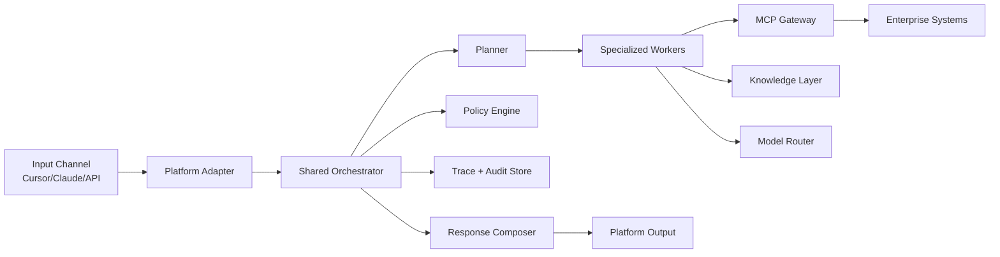
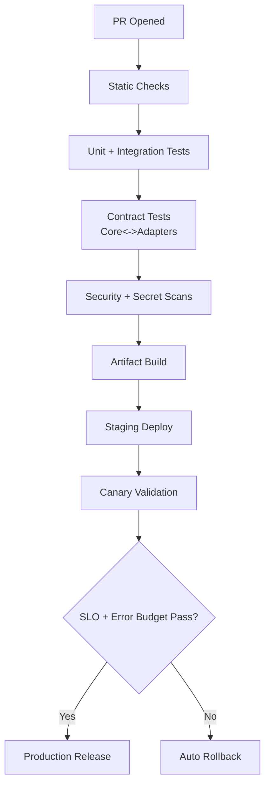

# Production-Master Shared Architecture Overview (Zero-to-Hero)

## Executive Intent
This is the shared architecture contract for the three deliverables:
- Cursor plugin
- Claude Code plugin
- Cloud investigation pipeline

The target state is a mission-critical, enterprise-grade investigation product with unified reasoning, strict governance, and platform-specific adapters. This document defines the common foundation those three systems must share. [SRC-PLUG] [SRC-WIX] [SRC-GEN]

## Research Extracts Driving the Design
The following excerpts are copied from your research and directly drive architectural decisions:

> “CI/CD is managed with a shared core library and platform-specific adapters (for Cursor, Claude, and a cloud service), each in its own pipeline but versioned semantically.” [SRC-WIX]

> “The system uses a central orchestration layer… delegates tasks to specialized agents… MCP gateway mediates access to internal/external systems.” [SRC-WIX]

> “Rules provide persistent instructions… always-on context.” and “Skills are loaded dynamically when relevant.” [SRC-PLUG]

> “Dynamic model selection… small/fast models for easy tasks and larger models for deep reasoning.” [SRC-WIX] [SRC-GEN]

> “Every step in the LLM pipeline should be logged and correlated… replay and audit are first-class.” [SRC-PLUG] [SRC-GEN]

These are treated as mandatory product requirements, not optional ideas.

## Shared Product Principles
1. **One reasoning core, three delivery adapters**  
   Cursor/Claude/Cloud must call one shared investigation core API and avoid duplicated business logic. [SRC-PLUG] [SRC-WIX]
2. **Supervisor-led multi-agent execution**  
   Use lead-orchestrator + specialist workers (triage, evidence, hypothesis, verifier, report). [SRC-WIX] [SRC-GEN]
3. **MCP-first external integration**  
   Integrations are via MCP gateways and policy controls, not direct unmanaged calls from agents. [SRC-WIX] [SRC-MCP-CONFIG]
4. **MCP interface-first ownership**  
   MCP domains are treated as stable contracts so providers can move from external servers to internal/custom implementations without rewriting adapters/core. [SRC-WIX] [SRC-PLUG]
5. **Auditable by default**  
   Every model/tool decision must be traceable with provenance and replay support. [SRC-GEN] [SRC-WIX]
6. **Cost-aware intelligence**  
   Route tasks across model tiers with explicit confidence and escalation policy. [SRC-GEN] [SRC-PLUG]
7. **Capability-first agents**  
   Agents are assigned domain tasks (for example `provide_bug_context`) and select data-source interfaces dynamically; they are never hardcoded to one source like Jira or Slack. [SRC-WIX] [SRC-GEN]

## Shared Functional Architecture
### Core Capabilities
- Intake normalization (`ticket`, `alert`, `chat`, `API`)
- Investigation planning and decomposition
- Evidence collection and source normalization
- Hypothesis generation and verification
- Confidence scoring and escalation
- Structured response rendering (human + machine)
- Trace/audit bundle generation

### Shared Runtime Components
- `orchestrator`
- `agent-workers`
- `model-router`
- `mcp-gateway`
- `knowledge-store` (vector + optional graph)
- `trace-store`
- `policy-engine`

## Top-Level Shared Architecture

## Shared Data and Control Contracts
### Investigation Request Contract (common envelope)
- `request_id`
- `origin` (`cursor|claude|cloud-api`)
- `intent`
- `priority`
- `input_payload`
- `requested_mode` (`fast|balanced|deep`)
- `tenant/project`

### Evidence Contract
- `source_system`
- `source_query`
- `raw_payload_ref`
- `normalized_fact`
- `confidence`
- `timestamp`

### Decision Contract
- `decision_type`
- `model_used`
- `inputs_refs`
- `confidence`
- `escalation_required`

### MCP Domain Contract (new shared contract)
- `domain` (`jira|github|grafana|...`)
- `provider` (`external|internal`)
- `tool_contract_version`
- `request_schema_ref`
- `response_schema_ref`
- `error_policy`
- `auth_policy_ref`

### Capability Task Contract (new shared contract)
- `capability_id` (for example `provide_bug_context`)
- `required_evidence_types`
- `minimum_source_coverage`
- `quality_threshold`
- `time_budget_ms`

### Data Source Interface Contract (new shared contract)
- `interface_id` (for example `ticketing`, `chatops`, `code_changes`)
- `provider` (`jira|slack|github|custom-*`)
- `normalized_output_schema`
- `health_status`
- `fallback_priority`

## Shared CI/CD and Release Governance
### Release Model
- Core and adapters release independently.
- Adapters declare compatible core range.
- Contract tests gate every release.
- Canary deployment required for all production promotions. [SRC-WIX] [SRC-PLUG]

### CI/CD Flow

## Shared Security, Compliance, and Audit
- Least privilege for every worker and every MCP integration. [SRC-GEN] [SRC-WIX]
- Vault-based secret retrieval; no secrets in source control. [SRC-WIX] [SRC-MCP-CONFIG]
- Prompt/tool guardrails with escalation to human when confidence is below threshold. [SRC-GEN]
- Immutable audit ledger with replay references for postmortems and compliance audits. [SRC-WIX] [SRC-GEN]

## Shared SLO Baseline
- P95 fast-mode response < 30s
- P95 deep-mode response < 10m
- Trace coverage = 100% of model + tool calls
- Mean rollback time < 10m
- Contract-test pass rate before release = 100%

## Decision Log (Shared)
- **Chosen:** hybrid supervisor + workers architecture  
  **Why:** best balance of auditability and scale. [SRC-WIX] [SRC-GEN]
- **Chosen:** core + adapters deployment model  
  **Why:** avoids duplication and platform lock. [SRC-PLUG] [SRC-WIX]
- **Chosen:** MCP gateway pattern  
  **Why:** central auth, policy, observability. [SRC-WIX] [SRC-MCP-CONFIG]
- **Chosen:** MCP interface-first with provider switching  
  **Why:** start fast with existing MCPs and safely migrate domains to custom MCP servers over time. [SRC-WIX] [SRC-PLUG]
- **Chosen:** dynamic model routing  
  **Why:** quality/cost balance at scale. [SRC-GEN] [SRC-PLUG]
- **Chosen:** capability-first agent tasking  
  **Why:** protects agent behavior from underlying source/tool changes and simplifies provider migration. [SRC-WIX] [SRC-GEN]

## Citations
- [SRC-CURSOR] Cursor Plugin docs: https://cursor.com/docs/plugins/building
- [SRC-CLAUDE] Claude Code plugin docs: https://code.claude.com/docs/en/plugins
- [SRC-WIX-MCP-PRIVATE] Wix MCP servers (private): https://github.com/wix-private/mcp-servers
- [SRC-WIX-MCP-PORTAL] Wix MCP portal: https://mcp-s-connect.wewix.net/mcp-servers
- [SRC-GEN] General deep research: file:///Users/tamirc/Downloads/Plugin/General%20-%20deep-research-report.md
- [SRC-PLUG] Plugins deep research: file:///Users/tamirc/Downloads/Plugin/Plugins%20-%20deep-research-report.md
- [SRC-WIX] Wix deep research: file:///Users/tamirc/Downloads/Plugin/WIX%20-%20deep-research-report.md
- [SRC-MCP-CONFIG] Repo MCP config: file:///Users/tamirc/Projects/production-master/mcp-servers.json
