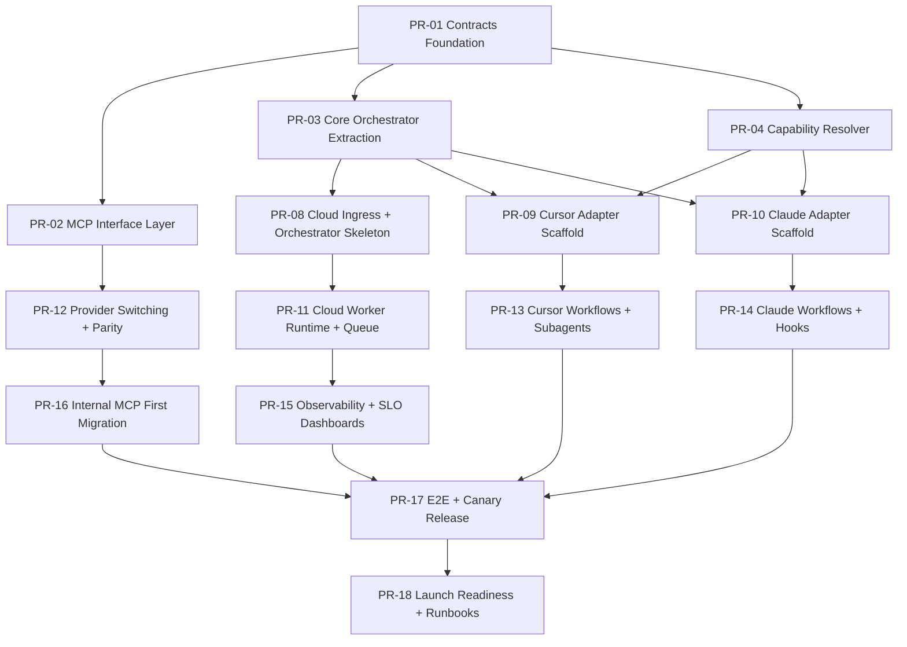

# Production-Master PR Execution Plan

## Purpose
This file translates the implementation strategy into executable pull requests with:
- explicit ordering,
- parallelization lanes,
- dependencies,
- checklist/todos per PR.

Use this as the delivery control plane for execution.

## General Order and Parallelization
### Dependency Graph

### Parallel Lanes
- **Lane A (Core):** PR-01, PR-02, PR-03, PR-04
- **Lane B (Adapters):** PR-09, PR-10, PR-13, PR-14
- **Lane C (Cloud):** PR-08, PR-11, PR-15
- **Lane D (Platform/Reliability):** PR-12, PR-16, PR-17, PR-18

## PR Matrix
| PR | Title | Depends On | Parallel? | Owner Suggestion |
|---|---|---|---|---|
| PR-01 | Shared Contracts Foundation | - | No (first) | Core team |
| PR-02 | MCP Interface Abstraction Layer | PR-01 | Yes (w/ PR-03, PR-04) | Integration team |
| PR-03 | Core Orchestrator Extraction | PR-01 | Yes (w/ PR-02, PR-04) | Core team |
| PR-04 | Capability Resolver + Planner Contracts | PR-01 | Yes (w/ PR-02, PR-03) | Core team |
| PR-08 | Cloud Ingress + Orchestrator Skeleton | PR-03 | Yes (w/ PR-09, PR-10) | Cloud team |
| PR-09 | Cursor Adapter Scaffold | PR-03, PR-04 | Yes (w/ PR-08, PR-10) | Cursor team |
| PR-10 | Claude Adapter Scaffold | PR-03, PR-04 | Yes (w/ PR-08, PR-09) | Claude team |
| PR-11 | Cloud Worker Runtime + Queue | PR-08 | Yes (w/ PR-13, PR-14) | Cloud team |
| PR-12 | Provider Switching + Parity Test Framework | PR-02 | Yes (w/ PR-11) | Platform team |
| PR-13 | Cursor Workflows + Subagents | PR-09 | Yes (w/ PR-11, PR-14) | Cursor team |
| PR-14 | Claude Workflows + Hooks | PR-10 | Yes (w/ PR-11, PR-13) | Claude team |
| PR-15 | Observability + SLO Dashboards | PR-11 | Yes (w/ PR-12, PR-13, PR-14) | SRE/Platform |
| PR-16 | First Internal MCP Migration (one domain) | PR-12 | Yes (w/ PR-15) | Integration team |
| PR-17 | E2E + Canary Release Gates | PR-13, PR-14, PR-15, PR-16 | No (synthesis PR) | Platform team |
| PR-18 | Launch Readiness + Runbooks + Go/No-Go | PR-17 | No (last) | Program owner |

## Detailed PR Checklists and Todos

## PR-01 Shared Contracts Foundation
**Goal:** Create shared contracts for capability tasks, data source interfaces, evidence, and decision outputs.

Checklist:
- [ ] Add `CapabilityTaskContract` schema
- [ ] Add `DataSourceInterfaceContract` schema
- [ ] Add evidence/decision/request schema versions
- [ ] Add schema validation tests
- [ ] Document versioning policy

Todos:
- [ ] Create `shared/schemas/*.json`
- [ ] Add contract compatibility checker
- [ ] Add ADR for contract evolution

## PR-02 MCP Interface Abstraction Layer
**Goal:** Abstract MCP domains behind interfaces (`ticketing`, `chatops`, `code_changes`, `metrics`).

Checklist:
- [ ] Introduce provider interface definitions
- [ ] Implement external provider adapters
- [ ] Add provider registry and health probes
- [ ] Add retries/timeouts policy
- [ ] Add fallback strategy hooks

Todos:
- [ ] Implement provider router
- [ ] Add integration tests for each domain
- [ ] Add trace tags per interface call

## PR-03 Core Orchestrator Extraction
**Goal:** Extract shared orchestrator from existing implementation into `core`.

Checklist:
- [ ] Define orchestrator module boundaries
- [ ] Extract planning and execution loop
- [ ] Preserve current behavior with compatibility shim
- [ ] Add unit tests and golden behavior tests

Todos:
- [ ] Move/port orchestrator logic
- [ ] Add adapter-facing core API
- [ ] Add migration notes

## PR-04 Capability Resolver + Planner Contracts
**Goal:** Capability-first assignment (agents get task intent, not source-specific commands).

Checklist:
- [ ] Add capability registry
- [ ] Add capability->interface mapping table
- [ ] Add resolution policy (priority/health/fallback)
- [ ] Add degraded-mode output format

Todos:
- [ ] Implement resolver service
- [ ] Add fallback simulation tests
- [ ] Add capability parity tests

## PR-08 Cloud Ingress + Orchestrator Skeleton
**Goal:** Bring up cloud surface with ingestion API and core orchestration wiring.

Checklist:
- [ ] Implement ingestion endpoints
- [ ] Wire request normalization
- [ ] Connect to orchestrator
- [ ] Add health checks and readiness probes

Todos:
- [ ] Add service scaffolds
- [ ] Add deployment manifests
- [ ] Add smoke tests

## PR-09 Cursor Adapter Scaffold
**Goal:** Create adapter shell with plugin manifest, rules, skills folders, and core integration.

Checklist:
- [ ] Add `.cursor-plugin/plugin.json`
- [ ] Add baseline rules/skills structure
- [ ] Connect adapter to core API
- [ ] Add adapter contract tests

Todos:
- [ ] Add package/build scripts
- [ ] Add local dev instructions
- [ ] Add fixture-based tests

## PR-10 Claude Adapter Scaffold
**Goal:** Create adapter shell with plugin manifest, namespaced skills, hooks, and core integration.

Checklist:
- [ ] Add `.claude-plugin/plugin.json`
- [ ] Add `skills/`, `hooks/`, `agents/` skeleton
- [ ] Connect adapter to core API
- [ ] Add adapter contract tests

Todos:
- [ ] Add plugin-dir run instructions
- [ ] Add hook execution tests
- [ ] Add fixture-based tests

## PR-11 Cloud Worker Runtime + Queue
**Goal:** Implement worker runtime with queue-based execution.

Checklist:
- [ ] Add queue integration
- [ ] Add worker lifecycle management
- [ ] Add retry + DLQ handling
- [ ] Add worker contract tests

Todos:
- [ ] Implement worker types (initial 3)
- [ ] Add performance baseline tests
- [ ] Add failure replay fixtures

## PR-12 Provider Switching + Parity Test Framework
**Goal:** Enable provider switch (`external|internal`) per domain with parity gates.

Checklist:
- [ ] Config-driven provider selection
- [ ] Parity golden tests
- [ ] Drift detection tests
- [ ] Rollback switch validation

Todos:
- [ ] Add environment flags
- [ ] Add staged dual-read mode
- [ ] Add provider comparison report

## PR-13 Cursor Workflows + Subagents
**Goal:** Implement capability-first Cursor workflows and subagent orchestration.

Checklist:
- [ ] Add core capabilities as skills
- [ ] Add subagent fan-out for independent tasks
- [ ] Add citation and confidence policy enforcement
- [ ] Add workflow integration tests

Todos:
- [ ] Implement `provide_bug_context` flow
- [ ] Implement `verify_root_cause` flow
- [ ] Add regression fixtures

## PR-14 Claude Workflows + Hooks
**Goal:** Implement capability-first Claude workflows with deterministic hooks.

Checklist:
- [ ] Add capability skills
- [ ] Add pre/post tool hooks
- [ ] Add policy checks in hook flow
- [ ] Add workflow integration tests

Todos:
- [ ] Implement `provide_bug_context` flow
- [ ] Implement degraded-mode hook behavior
- [ ] Add regression fixtures

## PR-15 Observability + SLO Dashboards
**Goal:** Add end-to-end traces, metrics, dashboards, and alerting.

Checklist:
- [ ] Add trace schema coverage for model/tool calls
- [ ] Add per-capability metrics
- [ ] Add SLO dashboards
- [ ] Add alert policies

Todos:
- [ ] Instrument adapters/core/cloud
- [ ] Add dashboard templates
- [ ] Add trace completeness gate

## PR-16 First Internal MCP Migration (one domain)
**Goal:** Migrate one domain from external provider to internal MCP implementation.

Checklist:
- [ ] Pick first domain (recommended `jira` or `github`)
- [ ] Implement internal provider
- [ ] Run dual-read validation in staging
- [ ] Run canary + fallback drills
- [ ] Sign off parity report

Todos:
- [ ] Add internal provider deployment
- [ ] Add comparison telemetry
- [ ] Add rollback playbook

## PR-17 E2E + Canary Release Gates
**Goal:** Final cross-surface integration and release readiness gates.

Checklist:
- [ ] End-to-end tests across all three surfaces
- [ ] Canary release policy enabled
- [ ] Auto rollback gates enabled
- [ ] Security and compliance checks passed

Todos:
- [ ] Run load + resilience suite
- [ ] Validate degraded-mode behavior
- [ ] Produce readiness report

## PR-18 Launch Readiness + Runbooks + Go/No-Go
**Goal:** Complete launch artifacts and execute final review.

Checklist:
- [ ] Incident runbooks complete
- [ ] On-call ownership confirmed
- [ ] Release command checklist approved
- [ ] Executive go/no-go recorded

Todos:
- [ ] Final docs freeze
- [ ] Launch communications
- [ ] Post-launch monitoring cadence

## Execution Checklist (Program)
- [ ] PR-01 merged
- [ ] PR-02/03/04 merged
- [ ] PR-08/09/10 merged
- [ ] PR-11/12/13/14 merged
- [ ] PR-15/16 merged
- [ ] PR-17 merged
- [ ] PR-18 merged

## Notes
- Parallelization is encouraged where dependencies allow.
- No PR should bypass contract tests or quality gates.
- Provider migration PRs must always include rollback proof.
