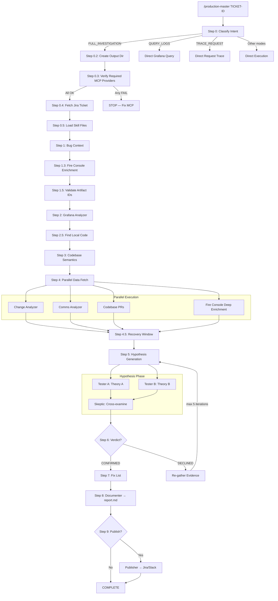

# Investigation Flow

## Pipeline State Machine

```
INITIALIZING → CONTEXT_GATHERING → LOG_ANALYSIS → CODE_ANALYSIS →
PARALLEL_DATA_FETCH → HYPOTHESIS_GENERATION (includes verification) →
  ├── CONFIRMED → FIX_PLANNING → DOCUMENTING → COMPLETE
  └── DECLINED → [re-gather data] → HYPOTHESIS_GENERATION (loop, max 5)
```

The flow is shared across all product surfaces (Claude, Cursor, Cloud). Surface adapters can change entrypoint UX, but evidence, hypothesis, verification, and reporting stages remain aligned.

When agent teams are enabled (`CLAUDE_CODE_EXPERIMENTAL_AGENT_TEAMS=1`), HYPOTHESIS_GENERATION uses parallel competing hypotheses + skeptic cross-examination. Otherwise, sequential hypothesis → verifier loop.

Current state is tracked in `findings-summary.md`.

## Flow Diagram



## Critical Investigation Principles

### 1. Always Inspect Error Data Payloads
The `data` column in Grafana app_logs contains structured JSON with the actual request/entity state that caused the error. The Grafana analyzer MUST query and parse this for every error type. Common findings: empty fields, contradictory combinations (e.g., `resource: empty` with `selection_method: SPECIFIC_RESOURCE`).

### 2. FT Rollout vs FT Merge — Know the Difference
Feature toggle merge PRs typically happen after the FT has been at 100% for a long time — they clean up dead code. When investigating FTs, check the *rollout date* (when behavior changed for users) not just the merge date. The rollout can be a root cause; the merge usually isn't, though cleanup bugs are possible.

### 3. Investigate Configuration, Not Just Code
Site settings, user configurations, pricing plans, and resource settings can all cause production bugs. Always check for configuration changes alongside code changes.

### 4. Agent Directories Are Created On-Write
Agent subdirectories are NOT pre-created. Each agent creates its own when writing output. This shows which agents actually ran.

### 5. Each Run Is Completely Fresh
Never read from previous `debug-*` directories. Never reference previous investigation findings unless the user explicitly provides them.

## Hypothesis Verification Loop

The hypothesis loop is the core quality mechanism:

1. **Generate** — Create a hypothesis from all collected data
2. **Verify** — Apply 5-point checklist (pinpoint explanation, why started, still in code, why stopped, evidence completeness)
3. **Decide** — All 5 pass → Confirmed. Any fail → Declined with specific evidence gaps
4. **Re-gather** — Run targeted queries from the verifier's evidence gaps
5. **Iterate** — Generate new hypothesis with additional data (max 5 iterations)

### Agent Team Mode (Recommended)

When `CLAUDE_CODE_EXPERIMENTAL_AGENT_TEAMS=1` is set:

1. Orchestrator generates 2 candidate theories (A and B)
2. Two hypothesis-tester agents investigate in parallel
3. Skeptic agent cross-examines both and produces a verdict
4. If neither passes, orchestrator re-gathers evidence and iterates

### Sequential Mode (Fallback)

When agent teams are disabled:

1. Single hypothesis agent generates a theory
2. Verifier evaluates against the 5-point checklist
3. If declined, orchestrator re-gathers and iterates

## Output Directory Structure

Each full investigation creates a timestamped output directory. Agent subdirectories are created by agents when they write output (NOT pre-created), so the directory structure shows exactly which agents ran:

```
.claude/debug/debug-SCHED-45895-2026-02-14-143000/
├── findings-summary.md              ← Persistent state file (updated after every step)
├── report.md                        ← Final investigation report (Step 8)
│
├── bug-context/                     ← Created by bug-context agent
│   ├── bug-context-output-V1.md
│   └── bug-context-trace-V1.md      ← Action log (human debugging only)
├── log-analyzer/                    ← Created by log-analyzer agent
│   ├── log-analyzer-output-V1.md
│   └── log-analyzer-output-V2.md    ← Re-run after Declined
├── codebase-semantics/              ← Created by codebase-semantics agent
│   ├── codebase-semantics-output-V1.md
│   └── codebase-semantics-prs-output-V1.md
├── change-analyzer/                 ← Only exists if change-analyzer ran
│   └── change-analyzer-output-V1.md
├── comms-analyzer/                  ← Only exists if comms-analyzer ran
│   └── comms-analyzer-output-V1.md
...
```

### File Naming

- **Output:** `{agent-name}-output-V{N}.md` — clean data passed between agents
- **Trace:** `{agent-name}-trace-V{N}.md` — input + action log for human debugging only
- N increments per re-invocation of the same agent

### Location

- Inside a git repo: `.claude/debug/`
- Outside a git repo: `./debug/`

### Key Files

- **`findings-summary.md`** — Persistent state file updated after every step. Contains: incident window, services, top errors, checklist status, what's proven, what's missing, agent invocation log.
- **`report.md`** — Final investigation report generated by the documenter agent.
