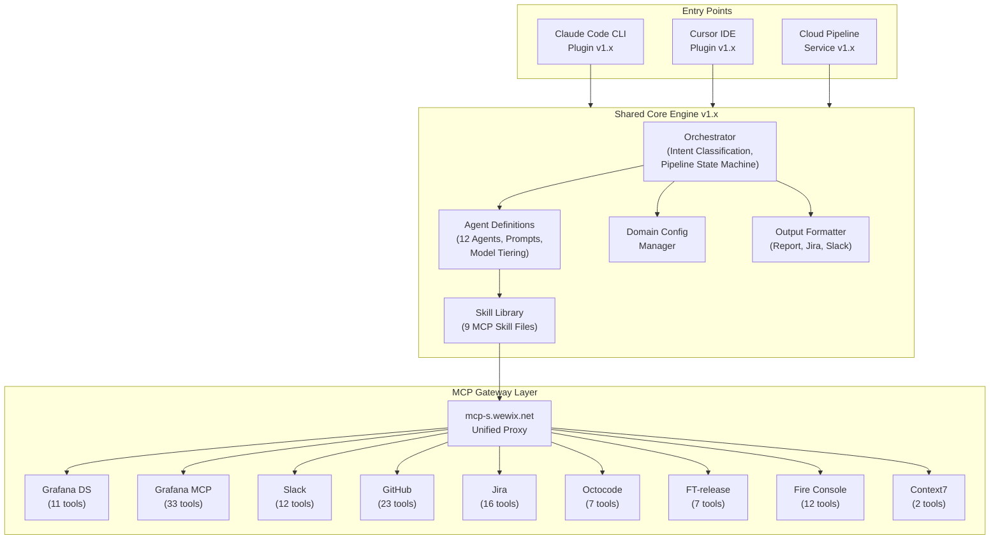
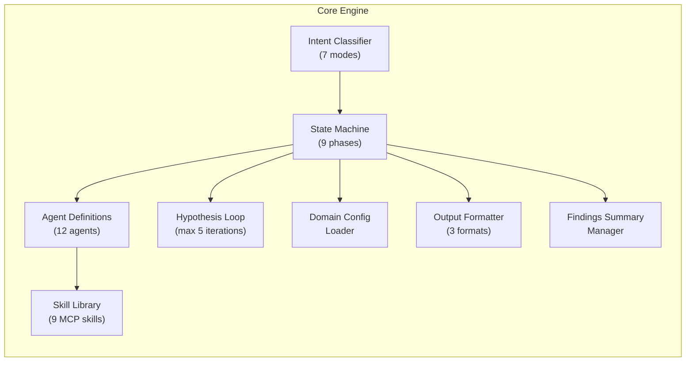
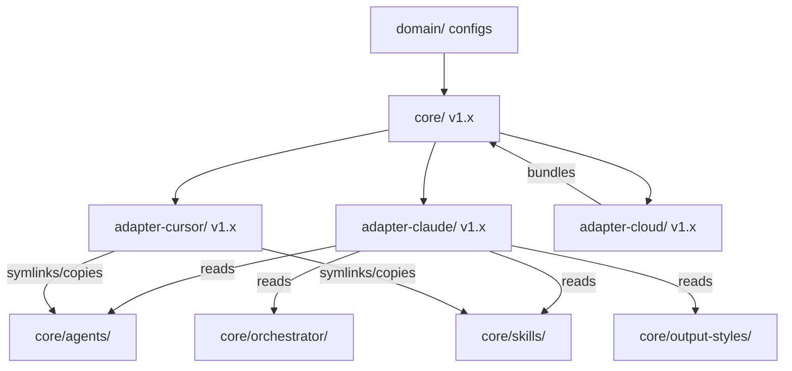
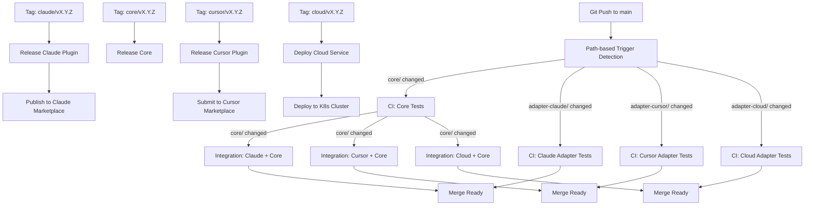
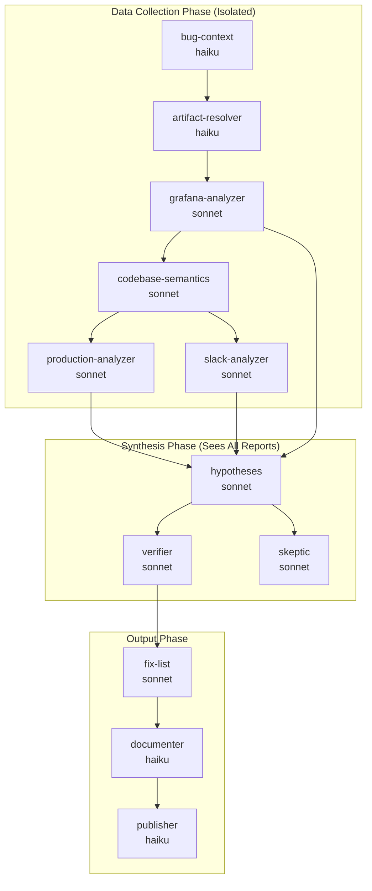
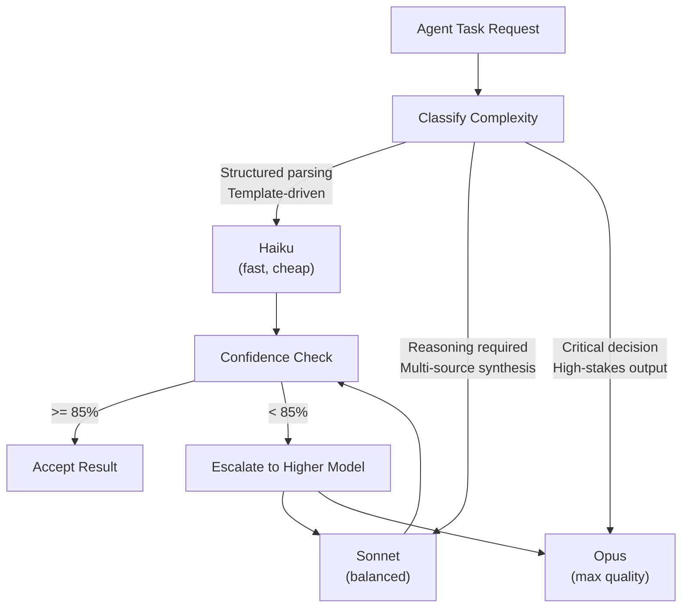
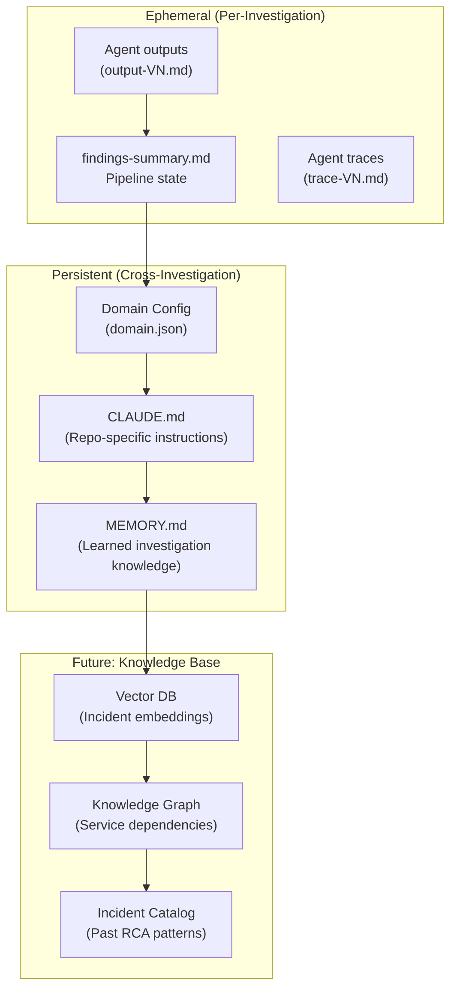
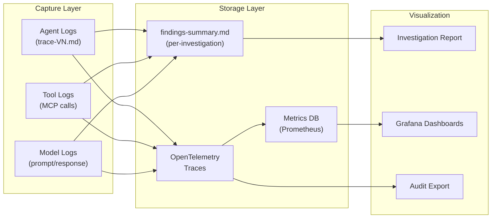
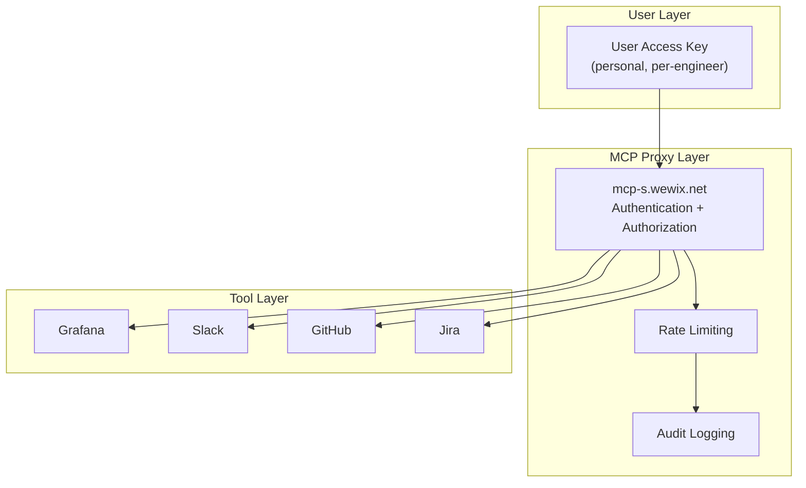

# Production Master: Overview & Shared Architecture

> **Navigation:** [Index](./README.md) | Previous: none | Next: [01 — Claude Code plugin design](./01-claude-code-plugin.md)

> **Document Type:** Overview — Common Platform Design
> **Version:** 1.0
> **Date:** 2026-02-21
> **Author:** Tamir Cohen
> **Status:** Draft

---

## Table of Contents

1. [Executive Summary](#executive-summary)
2. [Vision & Goals](#vision--goals)
3. [Platform Strategy](#platform-strategy)
4. [Shared Core Engine](#shared-core-engine)
5. [Platform Comparison Matrix](#platform-comparison-matrix)
6. [Monorepo Architecture](#monorepo-architecture)
7. [CI/CD Strategy](#cicd-strategy)
8. [MCP Integration Layer](#mcp-integration-layer)
9. [Agent System Design](#agent-system-design)
10. [Model Routing Strategy](#model-routing-strategy)
11. [Knowledge & Memory Architecture](#knowledge--memory-architecture)
12. [Observability Framework](#observability-framework)
13. [Security & Governance](#security--governance)
14. [Versioning Strategy](#versioning-strategy)
15. [Risk Matrix](#risk-matrix)
16. [References & Citations](#references--citations)

---

## Executive Summary

Production Master is an autonomous production investigation pipeline that today runs as a Claude Code plugin. This document describes the architectural strategy for expanding it into **three independent applications** — a **Claude Code plugin**, a **Cursor plugin**, and a **Cloud pipeline service** — all sharing a common core engine.

The current system (v1.0.3-beta) already demonstrates the full investigation pipeline: 12 specialized agents, 9 MCP integrations, hypothesis-verification loops, domain-aware investigation, and multi-format output publishing. The challenge is to extract the platform-agnostic logic into a shared core and build thin adapters for each target platform, while preserving independent release cycles and platform-specific optimizations.

Key architectural decisions:

- **Monorepo with workspace isolation** — single repository, independent CI/CD per adapter
- **Core engine as an internal library** — shared orchestration, agent definitions, investigation logic
- **Platform adapters as thin wrappers** — translate platform-specific I/O to core API calls
- **MCP gateway as the universal integration layer** — all tool access via Wix's `mcp-s.wewix.net` proxy ([mcp-s-connect.wewix.net](https://mcp-s-connect.wewix.net/mcp-servers))
- **Semantic versioning with compatibility matrix** — core and adapters version independently

---

## Vision & Goals

### Vision

Any Wix engineer can trigger an autonomous production investigation from their preferred environment — their IDE (Cursor), their CLI (Claude Code), or a cloud-triggered pipeline (via Jira, Slack, or alerts) — and receive the same quality, traceable investigation regardless of entry point.

### Goals


| Goal                               | Description                                                                                                            |
| ---------------------------------- | ---------------------------------------------------------------------------------------------------------------------- |
| **Unified Investigation Quality**  | Same agents, same hypothesis loop, same evidence standards across all platforms                                        |
| **Platform-Native Experience**     | Each adapter feels native — Cursor uses rules/skills/subagents, Claude Code uses hooks/teams, Cloud uses REST/webhooks |
| **Independent Releases**           | A Cursor plugin fix ships without waiting for Claude Code or Cloud                                                     |
| **Shared Core Evolution**          | Improvements to the investigation engine benefit all platforms simultaneously                                          |
| **Enterprise-Grade Observability** | Every investigation is fully traceable, auditable, and replayable regardless of entry point                            |


---

## Platform Strategy




### Platform Selection Rationale


| Platform           | Use Case                                                           | Why                                                                                                                                             |
| ------------------ | ------------------------------------------------------------------ | ----------------------------------------------------------------------------------------------------------------------------------------------- |
| **Claude Code**    | Engineers debugging in terminal, CI/CD integration                 | Current production system; native agent teams support; CLI-first workflow ([Claude Code Plugins Docs](https://code.claude.com/docs/en/plugins)) |
| **Cursor**         | Engineers debugging in IDE, code-centric investigations            | Native file context, inline code navigation, subagent parallelism ([Cursor Plugin Docs](https://cursor.com/docs/plugins/building))              |
| **Cloud Pipeline** | Automated/scheduled investigations, API-triggered, team dashboards | No human-in-loop required; event-driven; horizontal scaling; REST API access                                                                    |


---

## Shared Core Engine

The core engine contains all platform-agnostic logic. It is the single source of truth for investigation behavior.

### Core Modules




### What Lives in Core


| Module                      | Responsibility                                                    | Current Location                                       |
| --------------------------- | ----------------------------------------------------------------- | ------------------------------------------------------ |
| **Orchestrator Logic**      | Intent classification, pipeline state machine, phase transitions  | `commands/production-master.md` (71 KB)                |
| **Agent Definitions**       | All 12 agent prompts, model assignments, tool restrictions        | `agents/*.md`                                          |
| **Skill Files**             | MCP tool documentation for each integration                       | `skills/*/SKILL.md`                                    |
| **Domain Config Schema**    | `domain.json` field definitions, loading priority, validation     | `commands/update-context.md`, `docs/domain-configs.md` |
| **Output Templates**        | Investigation report format, publisher format (Jira/Slack/GitHub) | `output-styles/*.md`                                   |
| **Hypothesis Loop Logic**   | Generate-verify-decide-regather cycle, 5-point checklist          | Embedded in `commands/production-master.md`            |
| **Findings Summary Schema** | Persistent state file structure and update rules                  | Embedded in `commands/production-master.md`            |


### What Lives in Adapters


| Module                | Claude Code Adapter              | Cursor Adapter              | Cloud Adapter           |
| --------------------- | -------------------------------- | --------------------------- | ----------------------- |
| **Agent Execution**   | `Task` tool (subagents/teams)    | Subagents via `.mdc`        | Container workers       |
| **MCP Configuration** | `~/.claude.json` entries         | `.mcp.json` in plugin root  | Service-level config    |
| **User Interaction**  | CLI prompts, `/commands`         | IDE panels, slash commands  | REST API, webhooks      |
| **File I/O**          | Read/Write tools                 | Cursor file tools           | Cloud storage API       |
| **Authentication**    | User's access key in env         | User's access key in env    | Service account + Vault |
| **Output Delivery**   | Terminal + file write            | IDE panel + file write      | API response + storage  |
| **Hooks/Lifecycle**   | Claude Code hooks (`hooks.json`) | Cursor hooks (`hooks.json`) | Kubernetes lifecycle    |
| **Memory/Context**    | Claude memory scopes             | Cursor rules (always-on)    | Persistent DB           |


---

## Platform Comparison Matrix

This table compares the capabilities of each target platform, drawn from official documentation and the research reports.


| Capability                  | Claude Code                                        | Cursor                                            | Cloud Pipeline                   | Source                                                                                                               |
| --------------------------- | -------------------------------------------------- | ------------------------------------------------- | -------------------------------- | -------------------------------------------------------------------------------------------------------------------- |
| **Plugin Manifest**         | `.claude-plugin/plugin.json`                       | `.cursor-plugin/plugin.json`                      | Dockerfile + Helm chart          | [Claude Code Docs](https://code.claude.com/docs/en/plugins), [Cursor Docs](https://cursor.com/docs/plugins/building) |
| **Rules/Always-On Context** | No native rules; use CLAUDE.md or hooks            | `.mdc` rules in `rules/`, always loaded           | N/A — config-driven              | [Cursor Rules](https://cursor.com/docs/plugins/building)                                                             |
| **Skills**                  | `SKILL.md` with frontmatter, auto-discovery        | `SKILL.md` with frontmatter, on-demand            | REST endpoints                   | [Claude Code Skills](https://code.claude.com/docs/en/skills)                                                         |
| **Commands**                | `commands/*.md`, invoked via `/name`               | `commands/*.md`, invoked via `/name`              | REST API routes                  | [Claude Code Docs](https://code.claude.com/docs/en/plugins)                                                          |
| **Agents/Subagents**        | `.claude/agents/*.md`, own context window          | `agents/*.md`, own context/config                 | Container workers                | [Cursor Subagents](https://cursor.com/docs/plugins/building)                                                         |
| **Agent Teams**             | Native — parallel sessions, shared task list       | Not supported                                     | Native — container orchestration | [Plugins Research](./Plugins%20-%20deep-research-report.md)                                                          |
| **Hooks**                   | Lifecycle hooks (before/after edit, command, etc.) | Lifecycle hooks (session, file, shell, MCP, etc.) | Kubernetes probes, webhooks      | [Claude Code Hooks](https://code.claude.com/docs/en/hooks), [Cursor Hooks](https://cursor.com/docs/plugins/building) |
| **MCP Integration**         | `.mcp.json` or `~/.claude.json`                    | `.mcp.json` at plugin root                        | Direct HTTP calls                | [MCP Proxy](https://mcp-s-connect.wewix.net/mcp-servers)                                                             |
| **Persistent Memory**       | Subagents: user/project/local scope; Teams: none   | No built-in persistent memory                     | Database-backed                  | [Plugins Research](./Plugins%20-%20deep-research-report.md)                                                          |
| **Distribution**            | Marketplace, git repos                             | Cursor Marketplace, git repos                     | Container registry               | [Claude Code Marketplaces](https://code.claude.com/docs/en/plugin-marketplaces)                                      |
| **Runtime**                 | CLI (headless)                                     | IDE (desktop app)                                 | Kubernetes pods                  | —                                                                                                                    |
| **Model Selection**         | Frontmatter: `model: haiku/sonnet`                 | Frontmatter: model field                          | API parameter                    | —                                                                                                                    |
| **Context Window**          | Per-session, auto-compressed                       | Per-session, file-aware                           | Unlimited (chunked)              | —                                                                                                                    |


### Platform Unique Strengths

| Platform | Unique Strength | Best For |
|----------|----------------|----------|
| **Claude Code** | Agent Teams orchestration, CLI/CI-native, scriptable automation | Terminal-first engineers, CI/CD integration, automated batch workflows |
| **Cursor** | 19+ IDE hooks, rich file context, inline navigation and code actions | Code-centric investigations, real-time debugging, IDE-native experience |
| **Cloud** | 24/7 autonomous operation, horizontal scaling, batch investigation processing | Scheduled investigations, alert-triggered pipelines, team dashboards |

---

## Monorepo Architecture

We adopt a **monorepo with workspace isolation**. This maximizes code sharing while enabling independent CI/CD and releases.

### Repository Structure

```
production-master/
├── .github/
│   └── workflows/
│       ├── ci-core.yml                # Core engine tests
│       ├── ci-claude.yml              # Claude Code adapter tests
│       ├── ci-cursor.yml              # Cursor adapter tests
│       ├── ci-cloud.yml               # Cloud pipeline tests
│       ├── release-core.yml           # Core release pipeline
│       ├── release-claude.yml         # Claude Code plugin release
│       ├── release-cursor.yml         # Cursor plugin release
│       └── release-cloud.yml          # Cloud service release
│
├── core/                              # Shared core engine
│   ├── agents/                        # 12 agent definitions
│   │   ├── bug-context.md
│   │   ├── artifact-resolver.md
│   │   ├── grafana-analyzer.md
│   │   ├── codebase-semantics.md
│   │   ├── production-analyzer.md
│   │   ├── slack-analyzer.md
│   │   ├── hypotheses.md
│   │   ├── verifier.md
│   │   ├── skeptic.md
│   │   ├── fix-list.md
│   │   ├── documenter.md
│   │   └── publisher.md
│   ├── skills/                        # 9 MCP skill references
│   │   ├── octocode/SKILL.md
│   │   ├── grafana-datasource/SKILL.md
│   │   ├── grafana-mcp/SKILL.md
│   │   ├── slack/SKILL.md
│   │   ├── github/SKILL.md
│   │   ├── jira/SKILL.md
│   │   ├── fire-console/SKILL.md
│   │   ├── ft-release/SKILL.md
│   │   └── context7/SKILL.md
│   ├── orchestrator/                  # Pipeline logic (extracted from commands/production-master.md)
│   │   ├── intent-classifier.md       # 7-mode classification rules
│   │   ├── state-machine.md           # 9-phase pipeline definition
│   │   ├── hypothesis-loop.md         # Generate-verify-decide-regather
│   │   └── agent-dispatch.md          # Agent sequencing & parallelism rules
│   ├── domain/                        # Domain config schema & loader
│   │   ├── schema.json               # domain.json JSON Schema
│   │   └── loader.md                 # Loading priority rules
│   ├── output-styles/                 # Output format templates
│   │   ├── investigation-report.md
│   │   └── publisher-format.md
│   ├── mcp-servers.json              # MCP server template
│   └── VERSION                        # Core version file
│
├── adapter-claude/                    # Claude Code plugin adapter
│   ├── .claude-plugin/
│   │   ├── plugin.json
│   │   └── marketplace.json
│   ├── commands/                      # Claude Code commands (thin wrappers)
│   ├── hooks/
│   │   └── hooks.json
│   ├── scripts/
│   │   ├── install.sh
│   │   ├── validate-install.sh
│   │   └── statusline.sh
│   ├── docs/
│   └── README.md
│
├── adapter-cursor/                    # Cursor plugin adapter
│   ├── .cursor-plugin/
│   │   └── plugin.json
│   ├── rules/                         # Cursor-specific always-on rules
│   ├── commands/                      # Cursor commands (thin wrappers)
│   ├── agents/                        # Cursor agent configs (.mdc)
│   ├── hooks/
│   │   └── hooks.json
│   ├── .mcp.json
│   ├── scripts/
│   │   └── install.sh
│   └── README.md
│
├── adapter-cloud/                     # Cloud pipeline service
│   ├── src/                           # API server, worker logic
│   ├── Dockerfile
│   ├── helm/                          # Kubernetes Helm charts
│   ├── config/
│   └── README.md
│
├── domain/                            # Company domain configs (shared)
│   └── Bookings/Server/scheduler/
│       ├── domain.json
│       ├── CLAUDE.md
│       └── memory/MEMORY.md
│
├── docs/                              # Shared documentation
│   ├── architecture.md
│   ├── investigation-flow.md
│   ├── commands.md
│   ├── agents.md
│   ├── domain-configs.md
│   ├── contributing.md
│   └── troubleshooting.md
│
├── design-docs/                       # Design documents (this folder)
└── README.md
```

### Dependency Graph




---

## CI/CD Strategy

### Pipeline Architecture




### CI Checks Per Component


| Component          | Lint                       | Unit Tests                                   | Integration Tests          | Plugin Validation      | Security Scan                |
| ------------------ | -------------------------- | -------------------------------------------- | -------------------------- | ---------------------- | ---------------------------- |
| **Core**           | Markdown lint, JSON schema | Agent prompt validation, state machine logic | Cross-agent data flow      | —                      | Secrets detection            |
| **Claude Adapter** | Shell lint, JSON lint      | Install script test                          | Full investigation dry-run | Plugin JSON validation | Secrets detection            |
| **Cursor Adapter** | Shell lint, JSON lint      | Install script test                          | Subagent dispatch test     | Plugin JSON validation | Secrets detection            |
| **Cloud**          | Code lint, Dockerfile lint | API unit tests                               | End-to-end pipeline test   | Helm chart validation  | Container vulnerability scan |


### Release Independence

Each adapter can release independently:

- **Core v1.2.0** ships a new agent → triggers adapter integration tests
- **Claude adapter v1.3.0** ships a hook fix → only Claude CI runs
- **Cursor adapter v1.1.0** ships a new rule → only Cursor CI runs
- **Cloud v1.0.0** initial deploy → only Cloud CI runs

Adapters declare compatible core versions in their manifests (e.g., `"core_version": ">=1.2.0"`).

---

## MCP Integration Layer

All three platforms access the same MCP servers through Wix's unified proxy at `mcp-s.wewix.net` ([MCP Connect Portal](https://mcp-s-connect.wewix.net/mcp-servers)).

### MCP Server Registry


| Server                 | URL Pattern                                       | Auth                  | Tools                      | Primary Consumers                   |
| ---------------------- | ------------------------------------------------- | --------------------- | -------------------------- | ----------------------------------- |
| **Grafana Datasource** | `mcp-s.wewix.net/mcp?mcp=grafana-datasource`      | `x-user-access-key`   | 11 (SQL, PromQL, LogQL)    | grafana-analyzer, artifact-resolver |
| **Grafana MCP**        | `mcp-s.wewix.net/mcp?mcp=grafana-mcp`             | `x-user-access-key`   | 33 (dashboards, alerts)    | grafana-analyzer                    |
| **Slack**              | `mcp-s.wewix.net/mcp?mcp=slack`                   | `x-user-access-key`   | 12 (search, post, threads) | slack-analyzer, publisher           |
| **GitHub**             | `mcp-s.wewix.net/mcp?mcp=github`                  | `x-user-access-key`   | 23 (PRs, commits, code)    | production-analyzer                 |
| **Jira**               | `mcp-s.wewix.net/mcp?mcp=jira`                    | `x-user-access-key`   | 16 (issues, comments)      | bug-context, publisher              |
| **Octocode**           | npx `@mcp-s/mcp` (stdio)                          | `USER_ACCESS_KEY` env | 7 (semantic code search)   | codebase-semantics                  |
| **FT-release**         | `mcp-s.wewix.net/mcp?mcp=gradual-feature-release` | `x-user-access-key`   | 7 (feature toggles)        | production-analyzer, fix-list       |
| **Fire Console**       | `mcp-s.wewix.net/mcp?mcp=fire-console`            | None                  | 12 (gRPC domain objects)   | hypotheses, verifier                |
| **Context7**           | `mcp-s.wewix.net/mcp?mcp=context7`                | `x-user-access-key`   | 2 (library docs)           | codebase-semantics                  |


### Per-Platform MCP Configuration


| Platform        | MCP Config Method                       | Auth Storage                        | Source                                                     |
| --------------- | --------------------------------------- | ----------------------------------- | ---------------------------------------------------------- |
| **Claude Code** | `~/.claude.json` mcpServers entries     | Environment variables / user prompt | [Current `mcp-servers.json](../mcp-servers.json)`          |
| **Cursor**      | `.mcp.json` at plugin root              | Environment variables               | [Cursor Docs](https://cursor.com/docs/plugins/building)    |
| **Cloud**       | Service-level config (env vars / Vault) | HashiCorp Vault / K8s secrets       | [Wix Research Report](./WIX%20-%20deep-research-report.md) |


---

## Agent System Design

### Agent Architecture (Shared Across All Platforms)

All platforms use the same 12 agents with identical prompts and model assignments. The difference is only in how agents are *executed*.




### Agent Execution Per Platform


| Execution Aspect       | Claude Code                             | Cursor                            | Cloud                            |
| ---------------------- | --------------------------------------- | --------------------------------- | -------------------------------- |
| **Agent invocation**   | `Task` tool with subagent_type          | Subagent dispatch via `.mdc`      | Container job spawn              |
| **Parallel execution** | Multiple `Task` calls in single message | Multiple subagent spawns          | Kubernetes parallel jobs         |
| **Agent teams**        | Native (experimental flag)              | Not available — use sequential    | Native (container orchestration) |
| **Model selection**    | Frontmatter `model:` field              | Frontmatter or cursor-models.json | API parameter per request        |
| **Tool restriction**   | Frontmatter `allowed_tools:`            | Frontmatter restrictions          | Service-level RBAC               |
| **Output collection**  | Agent writes to debug dir, main reads   | Subagent returns result string    | Worker writes to shared storage  |


### Model Tiering (Universal)


| Tier            | Model  | Agents                                                                                                             | Rationale                                                       |
| --------------- | ------ | ------------------------------------------------------------------------------------------------------------------ | --------------------------------------------------------------- |
| **Lightweight** | Haiku  | bug-context, artifact-resolver, documenter, publisher                                                              | Structured parsing, template-driven — no reasoning needed       |
| **Reasoning**   | Sonnet | grafana-analyzer, codebase-semantics, production-analyzer, slack-analyzer, hypotheses, verifier, skeptic, fix-list | Evidence analysis, hypothesis generation, cross-examination     |
| **Never**       | Opus   | (none)                                                                                                             | Too expensive for subagent workloads; unnecessary quality delta |


This tiering is informed by cost-aware routing research showing that 40%+ cost savings are achievable by routing simple tasks to smaller models ([Hybrid LLM Research](./General%20-%20deep-research-report.md), [AWS Bedrock Intelligent Routing](https://aws.amazon.com/blogs/machine-learning/intelligent-prompt-routing-bedrock/)).

---

## Model Routing Strategy

### Dynamic Model Selection




### User-Configurable Modes


| Mode                   | Behavior                                                                 | Use Case                      |
| ---------------------- | ------------------------------------------------------------------------ | ----------------------------- |
| **Fast**               | All agents use Haiku where possible, Sonnet only for hypothesis/verifier | Quick triage, cost-sensitive  |
| **Balanced** (default) | Current tiering: Haiku for structured, Sonnet for reasoning              | Standard investigations       |
| **Deep**               | All agents use Sonnet, hypothesis loop uses Opus for verification        | Critical production incidents |


#### Resource Limits

Each mode enforces resource limits to prevent runaway investigations:

| Resource | Default | Fast Mode | Deep Mode | Custom |
|----------|---------|-----------|-----------|--------|
| Token budget per agent | 50K | 20K | 100K | User-defined |
| Max MCP calls per investigation | 25 | 10 | 50 | User-defined |
| Investigation timeout | 5 min | 2 min | 15 min | User-defined |
| Max response bytes per MCP call | 500KB | 200KB | 1MB | User-defined |
| Max concurrent agent threads | 3 | 1 | 5 | User-defined |

The **Custom** profile allows users to define their own resource envelopes via configuration:

```yaml
# .production-master/config.yaml
modes:
  custom:
    name: "memory-constrained"
    token_budget: 30000
    max_mcp_calls: 15
    timeout_seconds: 180
    max_response_bytes: 262144
```

#### Per-Run Overrides

Users can override mode settings on a per-run basis:

- `--mode <name>` — Select a predefined or custom mode
- `--max-tokens <n>` — Override token budget for this run
- `--timeout <seconds>` — Override investigation timeout
- `--max-mcp-calls <n>` — Override MCP call limit

Overrides apply only to the current run and do not persist. To persist preferences, update the configuration file or define a custom profile.

### User Override Protocol

Users can intervene in an active investigation at multiple levels:

#### Pause/Resume
- **Claude Code / Cursor**: Interrupt with `Ctrl+C`, then resume with `/production-master-continue`
- **Cloud**: `POST /api/v1/investigations/:id/pause` and `POST /api/v1/investigations/:id/resume`

#### Phase Skipping
Existing flags `--skip-slack`, `--skip-grafana`, `--skip-code` allow users to exclude specific data sources. Additional skip flags:
- `--skip-publisher` — Run investigation without publishing findings
- `--skip-knowledge` — Do not consult or update the knowledge base
- `--only <phase>` — Run only the specified phase (e.g., `--only metrics`)

#### Focus Redirection
Mid-investigation, users can redirect focus:
- **Claude Code**: Type a message during investigation to inject a hint (e.g., "focus on memory pressure, ignore CPU")
- **Cursor**: Use the inline comment `// @production-master focus: <hint>` in the active file
- **Cloud**: `POST /api/v1/investigations/:id/redirect` with `{ "focus": "memory pressure" }`

#### Per-Surface Override Mechanisms
Each surface provides its own override UX appropriate to the interaction model:

| Surface | Pause | Skip | Redirect | Kill |
|---------|-------|------|----------|------|
| Claude Code | `Ctrl+C` | CLI flags | Inline message | `Ctrl+C` twice |
| Cursor | Command palette | Settings | Inline comment | Command palette |
| Cloud | API endpoint | API parameter | API endpoint | API endpoint |

This follows AWS Bedrock's Intelligent Prompt Routing pattern, which reduces costs by 35-56% by routing easy prompts to cheaper models while maintaining quality ([AWS Bedrock Blog](https://aws.amazon.com/blogs/machine-learning/intelligent-prompt-routing-bedrock/)).

---

## Knowledge & Memory Architecture

### Memory Layers




### Per-Platform Memory


| Memory Type             | Claude Code                            | Cursor                                 | Cloud                   |
| ----------------------- | -------------------------------------- | -------------------------------------- | ----------------------- |
| **Investigation state** | `.claude/debug/` file writes           | `.cursor/debug/` file writes           | Cloud storage (S3/GCS)  |
| **Domain config**       | `~/.claude/production-master/domains/` | `~/.cursor/production-master/domains/` | Database table          |
| **Learned knowledge**   | `memory/MEMORY.md` (file-based)        | `memory/MEMORY.md` (file-based)        | Database + vector index |
| **Cross-session**       | Claude memory scopes (subagent)        | Not supported natively                 | Always persistent       |


---

## Observability Framework

Every investigation, regardless of entry point, produces the same observability artifacts.

### Trace Architecture




### Observability Per Platform


| Artifact                 | Claude Code                 | Cursor                      | Cloud                  |
| ------------------------ | --------------------------- | --------------------------- | ---------------------- |
| **Agent trace files**    | `debug-*/agent/trace-VN.md` | `debug-*/agent/trace-VN.md` | Cloud storage          |
| **Investigation report** | `debug-*/report.md`         | `debug-*/report.md`         | API response + storage |
| **MCP call logs**        | Implicit in agent traces    | Implicit in agent traces    | Structured JSON logs   |
| **OpenTelemetry**        | Future (via hooks)          | Future (via hooks)          | Native integration     |
| **Metrics**              | Token count in traces       | Token count in traces       | Prometheus metrics     |
| **Audit export**         | Manual (read trace files)   | Manual (read trace files)   | API endpoint           |


This follows emerging standards for LLM observability via OpenTelemetry ([OpenTelemetry LLM Guide](https://opentelemetry.io/blog/2024/llm-observability/), [Traceloop Blog](https://www.traceloop.com/blog/opentelemetry-for-llm-observability)).

#### Investigation Debug Bundle

Every investigation produces a debug bundle — a self-contained archive for post-mortem analysis, sharing, and CI artifact storage.

**Bundle Contents:**
- Full investigation trace (all agent interactions, MCP calls, timings)
- Findings summary (structured JSON + human-readable markdown)
- Agent outputs (per-phase raw responses)
- Resource usage report (tokens consumed, MCP calls made, wall-clock time)
- Configuration snapshot (mode, overrides, active adapters)

**Access Methods:**
- **Plugin (Claude Code / Cursor)**: `/production-master-report` generates a GitHub issue and attaches the bundle as a downloadable artifact
- **Cloud**: `GET /api/v1/investigations/:id/bundle` returns the bundle as a `.zip`
- **CI/CD**: Bundle is automatically saved as a pipeline artifact when running in CI mode

**Self-Diagnostics:**
The bundle includes a self-diagnostics section with:
- Per-agent timing breakdown (investigation phase → wall-clock time)
- MCP call latency distribution (p50, p95, p99 per provider)
- Model usage breakdown (tokens in/out per agent, per phase)
- Error and retry log (failed MCP calls, rate limits hit, fallback actions taken)

---

## Security & Governance

### Security Architecture




### Security Controls


| Control                | Implementation                                                       | Source                                                                                          |
| ---------------------- | -------------------------------------------------------------------- | ----------------------------------------------------------------------------------------------- |
| **Authentication**     | Personal access key via `x-user-access-key` header                   | [MCP Proxy Config](../mcp-servers.json)                                                         |
| **Authorization**      | MCP proxy enforces per-user tool access                              | [Wix MCP Architecture](./WIX%20-%20deep-research-report.md)                                     |
| **Secrets Management** | Never in code; user-prompted during install                          | Current `install.sh`                                                                            |
| **Least Privilege**    | Agents restricted to specific MCP tools via frontmatter              | Current agent definitions                                                                       |
| **Input Sanitization** | Jira ticket data treated as untrusted; no raw injection into prompts | [OWASP LLM Top 10](https://owasp.org/www-project-top-10-for-large-language-model-applications/) |
| **Output Validation**  | Link validation hook blocks malformed URLs                           | Current `hooks.json`                                                                            |
| **Audit Trail**        | Full trace files for every agent action                              | Current output structure                                                                        |
| **Network Isolation**  | Cloud: zero-trust networking, service mesh                           | [Wix Research](./WIX%20-%20deep-research-report.md)                                             |


---

## Versioning Strategy

### Semantic Versioning

All components follow [Semantic Versioning 2.0.0](https://semver.org/):


| Component      | Current    | Next  | Version File                                |
| -------------- | ---------- | ----- | ------------------------------------------- |
| Core           | 1.0.0      | 1.x.x | `core/VERSION`                              |
| Claude Adapter | 1.0.3-beta | 1.x.x | `adapter-claude/.claude-plugin/plugin.json` |
| Cursor Adapter | 1.0.0      | 1.x.x | `adapter-cursor/.cursor-plugin/plugin.json` |
| Cloud Service  | 0.1.0      | 0.x.x | `adapter-cloud/VERSION`                     |


### Compatibility Matrix


| Core Version     | Claude Adapter | Cursor Adapter | Cloud Service |
| ---------------- | -------------- | -------------- | ------------- |
| 1.0.x            | >= 1.0.0       | >= 1.0.0       | >= 0.1.0      |
| 1.1.x            | >= 1.1.0       | >= 1.1.0       | >= 0.2.0      |
| 2.0.x (breaking) | >= 2.0.0       | >= 2.0.0       | >= 1.0.0      |


---

## Risk Matrix


| Risk                          | Likelihood | Impact   | Mitigation                                                                                  |
| ----------------------------- | ---------- | -------- | ------------------------------------------------------------------------------------------- |
| **Agent hallucination**       | Medium     | High     | Hypothesis loop with 5-point verification; confidence scoring; human review for high-impact |
| **MCP server outage**         | Medium     | High     | Hard gate check (Step 0.3); graceful degradation; retry logic                               |
| **Prompt injection via Jira** | Low        | Critical | Treat ticket data as untrusted; structured extraction only                                  |
| **Token cost explosion**      | Medium     | Medium   | Model tiering; max 5 hypothesis iterations; token budgets per mode                          |
| **Cross-platform drift**      | High       | Medium   | Shared core engine; integration tests on core changes                                       |
| **Secrets leak**              | Low        | Critical | Never in code; install-time prompts; CI secret scanning                                     |
| **Knowledge poisoning**       | Low        | High     | Human review before memory updates; versioned MEMORY.md                                     |
| **Platform API changes**      | Medium     | Medium   | Pin platform SDK versions; adapter isolation                                                |
| **Anthropic vendor lock-in** | High | Medium | Abstract LLM interface behind capability layer; keep prompts model-agnostic where possible; test with alternative providers quarterly |
| **MCP protocol breaking changes** | Medium | High | Pin MCP SDK versions; maintain protocol version negotiation; integration test suite per MCP server |
| **Model drift / quality regression** | Medium | High | Benchmark suite of known investigations; run regression tests on model updates; maintain golden test outputs |
| **Prompt injection via MCP responses** | Low | Critical | Sanitize all MCP responses before LLM consumption; use structured outputs; never execute MCP-returned code without sandboxing |
| **Investigation feedback loops** | Medium | High | Tag knowledge provenance (human-verified vs. agent-generated); decay confidence scores over time; require human confirmation for high-impact knowledge updates |


---

## Adding a New Surface

To add a 4th surface adapter (e.g., VS Code Extension, JetBrains Plugin, Slack Bot):

### Step 1: Create the Adapter Directory
```
design-docs/
  0X-<surface-name>-adapter.md    # Design doc
src/
  adapters/<surface-name>/
    index.ts                       # Adapter entry point
    config.ts                      # Surface-specific configuration
    mcp-bridge.ts                  # MCP connection management
    ui-bridge.ts                   # Surface-specific UI integration
```

### Step 2: Implement the Adapter Interface
Every adapter must implement the `SurfaceAdapter` interface from the core:

```typescript
interface SurfaceAdapter {
  // Lifecycle
  initialize(config: AdapterConfig): Promise<void>;
  shutdown(): Promise<void>;

  // Investigation triggers
  onInvestigationRequest(request: InvestigationRequest): Promise<void>;
  onInvestigationComplete(result: InvestigationResult): Promise<void>;

  // User interaction
  presentFindings(findings: Finding[]): Promise<void>;
  requestUserInput(prompt: string): Promise<string>;

  // Override protocol
  onPause(): Promise<void>;
  onResume(): Promise<void>;
  onRedirect(focus: string): Promise<void>;
}
```

### Step 3: Wire Up MCP Connections
Use the shared MCP connection pool from the core. The adapter only needs to:
1. Register its surface-specific MCP servers (if any)
2. Configure authentication for the surface's context
3. Map surface events to investigation triggers

### Step 4: Integrate with the Capability Abstraction Layer
Reference `05-capability-abstraction-layer.md` — the adapter should use CAP interfaces, never call MCP servers directly.

### Step 5: Add to the Implementation Plan
Update `04-implementation-plan.md` with the new surface's feature list and timeline.

---

## References & Citations

1. **Cursor Plugin Documentation** — [cursor.com/docs/plugins/building](https://cursor.com/docs/plugins/building) — Plugin manifest, rules, skills, hooks, agents, MCP, marketplace
2. **Claude Code Plugin Documentation** — [code.claude.com/docs/en/plugins](https://code.claude.com/docs/en/plugins) — Plugin creation, skills, hooks, agents, marketplace
3. **Wix MCP Server Portal** — [mcp-s-connect.wewix.net/mcp-servers](https://mcp-s-connect.wewix.net/mcp-servers) — Available MCP servers and access keys
4. **Production Master Current Source** — [github.com/TamirCohen-Wix/production-master](https://github.com/TamirCohen-Wix/production-master) — v1.0.3-beta, current implementation
5. **Wix Deep Research Report** — `WIX - deep-research-report.md` — Multi-agent architecture, MCP strategy, deployment, security
6. **General Deep Research Report** — `General - deep-research-report.md` — Industry landscape, comparative architectures, agent system design
7. **Plugins Deep Research Report** — `Plugins - deep-research-report.md` — Cursor/Claude comparison, core+adapter architecture, multi-agent patterns
8. **AWS Bedrock Intelligent Prompt Routing** — [aws.amazon.com/blogs/machine-learning/intelligent-prompt-routing-bedrock/](https://aws.amazon.com/blogs/machine-learning/intelligent-prompt-routing-bedrock/) — Cost-aware model routing (35-56% savings)
9. **OpenTelemetry LLM Observability** — [opentelemetry.io/blog/2024/llm-observability/](https://opentelemetry.io/blog/2024/llm-observability/) — Semantic conventions for AI tracing
10. **Traceloop Observability** — [traceloop.com/blog/opentelemetry-for-llm-observability](https://www.traceloop.com/blog/opentelemetry-for-llm-observability) — End-to-end LLM trace capture and replay
11. **OWASP LLM Top 10** — [owasp.org/www-project-top-10-for-large-language-model-applications/](https://owasp.org/www-project-top-10-for-large-language-model-applications/) — Prompt injection, data exfiltration risks
12. **Semantic Versioning** — [semver.org](https://semver.org/) — Versioning standard
13. **Microsoft Multi-Agent Reference Architecture** — Referenced in Wix Research — Orchestrator + domain agents + shared knowledge layer
14. **Anthropic Multi-Agent Research** — Referenced in Plugins Research — Hierarchical orchestration, lead + browse agents, 15x token usage
15. **Meta DrP Platform** — Referenced in General Research — 20-80% MTTR reduction via automated RCA
16. **Datadog Bits AI SRE** — Referenced in General Research — 90% faster recovery via autonomous investigation

