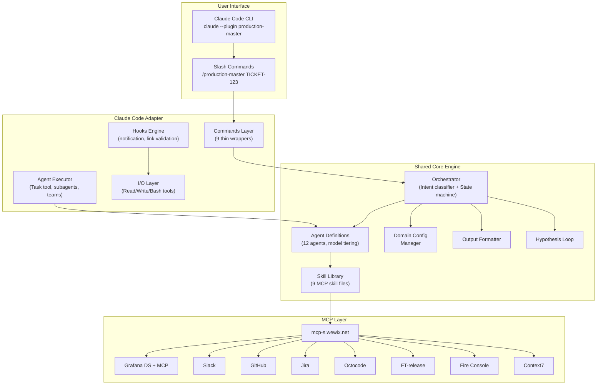
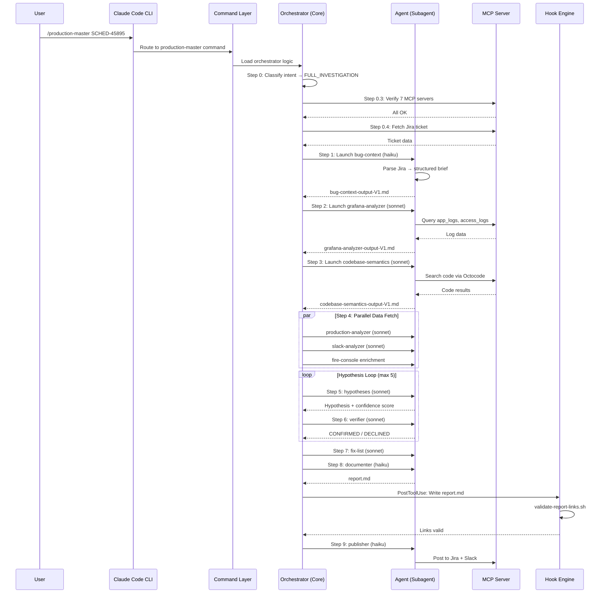
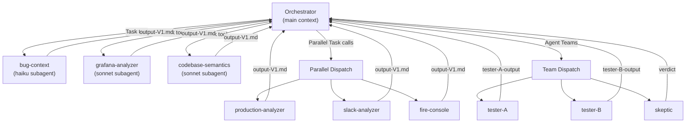
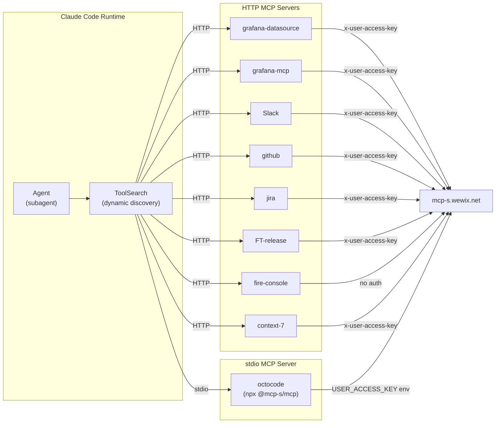
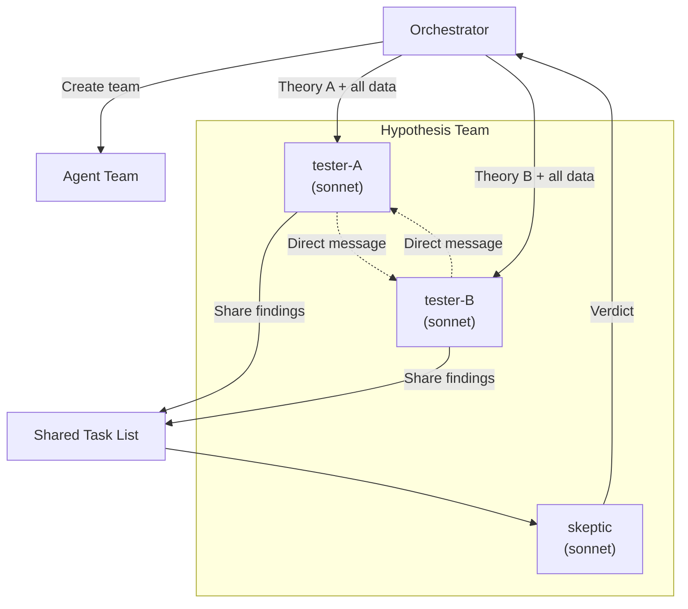
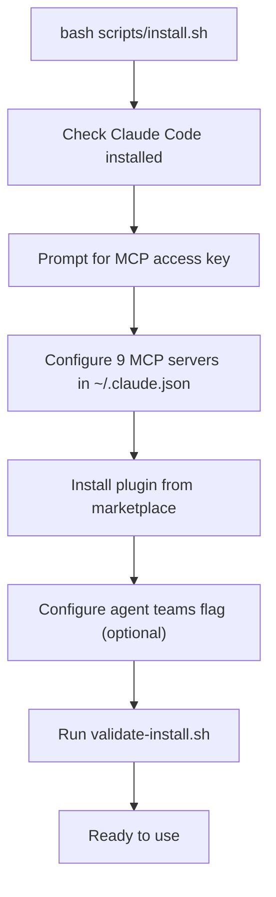
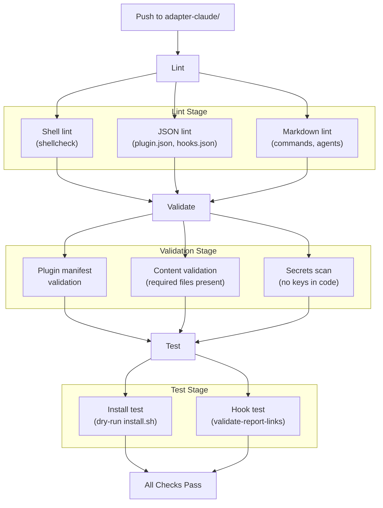

# Production Master: Claude Code Plugin Design

> **Document Type:** Application Design & Implementation
> **Version:** 1.0
> **Date:** 2026-02-21
> **Author:** Tamir Cohen
> **Status:** Draft
> **Platform:** Claude Code (CLI)

---

## Table of Contents

1. [Executive Summary](#executive-summary)
2. [Current State Analysis](#current-state-analysis)
3. [Architecture Overview](#architecture-overview)
4. [Plugin Manifest & Packaging](#plugin-manifest--packaging)
5. [Commands Architecture](#commands-architecture)
6. [Agent Execution Model](#agent-execution-model)
7. [Skills System](#skills-system)
8. [Hooks System](#hooks-system)
9. [MCP Integration](#mcp-integration)
10. [Agent Teams](#agent-teams)
11. [Memory & Context Strategy](#memory--context-strategy)
12. [Domain Configuration](#domain-configuration)
13. [Output & Reporting](#output--reporting)
14. [Installation & Distribution](#installation--distribution)
15. [CI/CD Pipeline](#cicd-pipeline)
16. [Migration from Current to Monorepo](#migration-from-current-to-monorepo)
17. [References & Citations](#references--citations)

---

## Executive Summary

The Claude Code plugin is the **primary and most mature** distribution of Production Master. It leverages Claude Code's native capabilities — subagents with independent context windows, experimental agent teams for parallel hypothesis testing, lifecycle hooks for output validation, and CLI-first interaction — to deliver a full autonomous investigation pipeline.

This document covers the evolution from the current standalone plugin (v1.0.3-beta) to the monorepo adapter model, where the Claude Code adapter becomes a thin wrapper around the shared core engine.

### Key Platform Advantages

| Advantage | Description | Source |
|-----------|-------------|--------|
| **Agent Teams** | Native parallel sessions with shared task list — enables competing hypothesis testing | [Claude Code Docs](https://code.claude.com/docs/en/sub-agents) |
| **Subagent Memory** | Subagents support `memory: user|project|local` for cross-session learning | [Plugins Research](./Plugins%20-%20deep-research-report.md) |
| **Lifecycle Hooks** | Pre/post hooks on tool use, file edits, commands for deterministic automation | [Claude Code Hooks](https://code.claude.com/docs/en/hooks) |
| **CLI Integration** | Headless operation enables CI/CD pipeline integration | [Claude Code Docs](https://code.claude.com/docs/en/plugins) |
| **Rich Tool Access** | Native Read, Write, Bash, Glob, Grep tools for file and system operations | Built-in Claude Code tools |

---

## Current State Analysis

### What Exists Today (v1.0.3-beta)

The current Production Master is **already a fully functional Claude Code plugin**:

```
production-master/           # Current structure
├── .claude-plugin/
│   ├── plugin.json          # name: "production-master", version: "1.0.3-beta"
│   └── marketplace.json
├── agents/                  # 12 agent definitions (YAML frontmatter + markdown)
├── commands/                # 9 slash commands
├── skills/                  # 9 MCP skill reference files
├── hooks/hooks.json         # Notification + link validation hooks
├── output-styles/           # Investigation report + publisher formatting
├── scripts/                 # install.sh, validate-install.sh, statusline.sh, etc.
├── mcp-servers.json         # MCP template (9 servers)
├── Domain/                  # Domain configs
└── docs/                    # Architecture, flow, commands, agents, troubleshooting
```

Source: [Current repository](https://github.com/TamirCohen-Wix/production-master)

### What Changes in Monorepo Model

| Component | Current Location | Future Location | Change |
|-----------|-----------------|-----------------|--------|
| Agent definitions | `agents/` | `core/agents/` | Move to core (shared) |
| Skills | `skills/` | `core/skills/` | Move to core (shared) |
| Orchestrator logic | `commands/production-master.md` | `core/orchestrator/` | Extract to core modules |
| Output styles | `output-styles/` | `core/output-styles/` | Move to core (shared) |
| Domain configs | `Domain/` | Root `Domain/` | Stay at repo root (shared) |
| MCP template | `mcp-servers.json` | `core/mcp-servers.json` | Move to core |
| **Commands** | `commands/` | `adapter-claude/commands/` | **Thin wrappers** referencing core |
| **Hooks** | `hooks/hooks.json` | `adapter-claude/hooks/hooks.json` | Claude-specific |
| **Scripts** | `scripts/` | `adapter-claude/scripts/` | Claude-specific |
| **Plugin manifest** | `.claude-plugin/` | `adapter-claude/.claude-plugin/` | Claude-specific |

---

## Architecture Overview

### High-Level Architecture



### Component Interaction Sequence



---

## Plugin Manifest & Packaging

### Plugin Manifest (`adapter-claude/.claude-plugin/plugin.json`)

```json
{
  "name": "production-master",
  "description": "Autonomous production investigation pipeline — 12 agents, hypothesis loops, 9 MCP integrations, and direct query commands",
  "version": "1.1.0",
  "author": {
    "name": "Tamir Cohen",
    "email": "tamirc@wix.com"
  },
  "repository": "https://github.com/TamirCohen-Wix/production-master",
  "license": "MIT",
  "keywords": [
    "production",
    "investigation",
    "debugging",
    "sre",
    "incident-response",
    "autonomous",
    "multi-agent"
  ]
}
```

Source: [Claude Code Plugin Manifest Schema](https://code.claude.com/docs/en/plugins-reference#plugin-manifest-schema)

### Marketplace Entry (`adapter-claude/.claude-plugin/marketplace.json`)

```json
{
  "name": "production-master-marketplace",
  "owner": {
    "name": "Tamir Cohen",
    "email": "tamirc@wix.com"
  },
  "plugins": [
    {
      "name": "production-master",
      "source": ".",
      "description": "Autonomous production investigation pipeline"
    }
  ]
}
```

Source: [Claude Code Plugin Marketplaces](https://code.claude.com/docs/en/plugin-marketplaces)

### Directory Structure

```
adapter-claude/
├── .claude-plugin/
│   ├── plugin.json               # Plugin metadata
│   └── marketplace.json          # Marketplace listing
│
├── commands/                     # 9 commands (thin wrappers)
│   ├── production-master.md      # Main orchestrator → includes core/orchestrator/*
│   ├── grafana-query.md          # Direct log/metric queries
│   ├── slack-search.md           # Slack search
│   ├── production-changes.md     # PR/commit/toggle search
│   ├── resolve-artifact.md       # Service name validation
│   ├── fire-console.md           # gRPC domain queries
│   ├── update-context.md         # Domain config creation
│   ├── production-master-report.md  # GitHub issue submission
│   └── git-update-agents.md      # Agent sync to repo
│
├── hooks/
│   └── hooks.json                # Notification + link validation hooks
│
├── scripts/
│   ├── install.sh                # Claude Code-specific installer
│   ├── validate-install.sh       # Installation diagnostics
│   ├── validate-report-links.sh  # Report link validator (hook)
│   ├── statusline.sh             # Claude Code status bar
│   └── bump-version.sh           # Version bump & release
│
├── settings.json                 # Default plugin settings (optional)
│
└── README.md                     # Claude Code-specific docs
```

---

## Commands Architecture

### Command Design Pattern

Each command in the Claude Code adapter is a **thin wrapper** that:
1. Handles Claude Code-specific input (CLI arguments, `$ARGUMENTS`)
2. Includes the relevant core orchestrator modules
3. Dispatches agent execution via Claude Code's `Task` tool

### Command Manifest

| Command | Trigger | Core Module | Agent(s) Used |
|---------|---------|-------------|---------------|
| `production-master` | `/production-master TICKET-ID` | `core/orchestrator/*` | All 12 |
| `grafana-query` | `/grafana-query SERVICE --level ERROR` | `core/orchestrator/intent-classifier.md` | grafana-analyzer |
| `slack-search` | `/slack-search KEYWORD` | — | slack-analyzer |
| `production-changes` | `/production-changes SERVICE --since 7d` | — | production-analyzer |
| `resolve-artifact` | `/resolve-artifact SERVICE-NAME` | — | artifact-resolver |
| `fire-console` | `/fire-console DOMAIN-TYPE ID` | — | — (direct MCP) |
| `update-context` | `/update-context` | `core/domain/` | — (interactive) |
| `production-master-report` | `/production-master-report` | — | — (GitHub API) |
| `git-update-agents` | `/git-update-agents` | — | — (git operations) |

### Command Structure Example

The main orchestrator command references core modules:

```markdown
---
name: production-master
description: Autonomous production investigation pipeline
---

# Production Master

[Include core/orchestrator/intent-classifier.md]
[Include core/orchestrator/state-machine.md]
[Include core/orchestrator/hypothesis-loop.md]
[Include core/orchestrator/agent-dispatch.md]

## Claude Code-Specific Execution

### Agent Dispatch
Use the `Task` tool with `subagent_type` to launch agents...

### Parallel Execution
Launch multiple `Task` calls in a single message for Step 4...

### Agent Teams (Experimental)
When `CLAUDE_CODE_EXPERIMENTAL_AGENT_TEAMS=1` is set, use agent teams for hypothesis phase...
```

---

## Agent Execution Model

### Subagent Execution

Claude Code agents are executed via the `Task` tool with specific `subagent_type` parameters. Each agent runs in its own context window with:
- Independent system prompt (from `core/agents/*.md`)
- Model selection (from agent frontmatter)
- Tool restrictions (from agent frontmatter)
- Skill content injection (from `core/skills/*/SKILL.md`)

Source: [Claude Code Subagents](https://code.claude.com/docs/en/sub-agents)

### Execution Flow



### Agent Definition Format

Each agent in `core/agents/` uses YAML frontmatter compatible with Claude Code:

```yaml
---
name: grafana-analyzer
description: Queries production logs and metrics, reports raw findings
model: sonnet
allowed_tools:
  - Read
  - Write
  - Bash
  - Glob
  - Grep
  - mcp__grafana-datasource__*
  - mcp__grafana-mcp__*
---

# Grafana Analyzer Agent

## TASK
$TASK_INPUT

## SKILL REFERENCE
$GRAFANA_DATASOURCE_SKILL

## RULES
1. Report raw findings ONLY — no analysis
2. Write output to: $OUTPUT_PATH/grafana-analyzer-output-V$N.md
3. Write trace to: $OUTPUT_PATH/grafana-analyzer-trace-V$N.md
...
```

### Parallel Execution Strategy

Claude Code supports true parallelism by launching multiple `Task` calls in a single message. This is used in Step 4 (Parallel Data Fetch):

```
Single orchestrator message → 3-4 Task calls simultaneously:
  - Task: production-analyzer (queries PRs, commits, toggles)
  - Task: slack-analyzer (searches Slack discussions)
  - Task: codebase PRs (additional code context)
  - Task: fire-console enrichment (domain object queries)
```

Source: [Claude Code Task tool documentation](https://code.claude.com/docs/en/sub-agents)

---

## Skills System

### Skill Architecture

Skills serve as **MCP tool documentation** distributed to agents. Each skill file describes:
- Available tools and their parameters
- Decision matrices for tool selection
- Query templates and examples
- Best practices

Source: [Claude Code Skills](https://code.claude.com/docs/en/skills)

### Skill Discovery

Claude Code auto-discovers skills in:
1. `~/.claude/skills/` (user scope)
2. `.claude/skills/` (project scope)
3. Plugin `skills/<skill>/SKILL.md` (plugin scope)

For the monorepo, skills live in `core/skills/` and are symlinked or copied to `adapter-claude/skills/` during build.

### Skill Loading in Pipeline

The orchestrator loads all 9 skill files once during Step 0.5, then injects relevant skill content into each agent's task prompt:

```
Step 0.5: Read all skill files
  ├── octocode/SKILL.md → inject into codebase-semantics
  ├── grafana-datasource/SKILL.md → inject into grafana-analyzer
  ├── slack/SKILL.md → inject into slack-analyzer
  ├── github/SKILL.md → inject into production-analyzer
  ├── jira/SKILL.md → inject into bug-context, publisher
  ├── ft-release/SKILL.md → inject into production-analyzer, fix-list
  ├── fire-console/SKILL.md → inject into hypotheses, verifier
  ├── grafana-mcp/SKILL.md → inject into grafana-analyzer
  └── context7/SKILL.md → inject into codebase-semantics
```

---

## Hooks System

### Current Hooks

The Claude Code adapter uses hooks for deterministic automation:

```json
{
  "hooks": {
    "Notification": [
      {
        "matcher": "",
        "hooks": [
          {
            "type": "command",
            "command": "osascript -e 'display notification \"Production Master needs attention\" with title \"Claude Code\"'"
          }
        ]
      }
    ],
    "PostToolUse": [
      {
        "matcher": "Write",
        "hooks": [
          {
            "type": "command",
            "command": "./scripts/validate-report-links.sh",
            "match_files": ["*report.md"]
          }
        ]
      }
    ]
  }
}
```

Source: [Claude Code Hooks](https://code.claude.com/docs/en/hooks)

### Planned Hooks

| Hook Event | Purpose | Implementation |
|------------|---------|----------------|
| `PostToolUse: Write` | Link validation on report files | `validate-report-links.sh` (exists) |
| `Notification` | Desktop notification when attention needed | `osascript` (exists) |
| `PreToolUse: Bash` | Block dangerous commands during investigation | New: deny `rm -rf`, `git push --force` |
| `PostToolUse: mcp__*` | Log MCP tool calls for observability | New: append to trace file |
| `sessionStart` | Check MCP server availability | New: early validation |
| `sessionEnd` | Generate investigation summary | New: auto-report |

---

## MCP Integration

### Configuration Method

Claude Code MCP servers are configured in `~/.claude.json`. The `install.sh` script:
1. Prompts for user access key
2. Reads `core/mcp-servers.json` template
3. Substitutes `<YOUR_ACCESS_KEY>` with user's key
4. Merges only missing servers into `~/.claude.json`

### MCP Server Architecture



### Tool Discovery

Agents use `ToolSearch("+<server> <tool>")` for dynamic tool discovery because MCP tool names are prefixed with installation-specific server keys (e.g., `mcp__grafana-datasource__grafana_datasource__query_sql`).

Source: [Current skills implementation](../skills/)

---

## Agent Teams

### Architecture

When `CLAUDE_CODE_EXPERIMENTAL_AGENT_TEAMS=1` is set, the hypothesis phase uses agent teams for parallel competing investigation:



Source: [Claude Code Agent Teams](https://code.claude.com/docs/en/sub-agents), [Plugins Research](./Plugins%20-%20deep-research-report.md)

### Team vs Subagent Decision

| Scenario | Use Subagents | Use Agent Teams |
|----------|:------------:|:---------------:|
| Data collection (independent, report back) | Yes | — |
| Hypothesis testing (competing theories) | — | Yes |
| Cross-examination (debate pattern) | — | Yes |
| Template-driven output (documenter, publisher) | Yes | — |
| Sequential pipeline steps | Yes | — |

### Limitations

- **No persistent memory for teammates** — each starts fresh ([Plugins Research](./Plugins%20-%20deep-research-report.md))
- **Higher token cost** — each teammate uses its own context window
- **Experimental feature** — requires environment variable flag
- **No nested teams** — teammates cannot spawn further teams

---

## Memory & Context Strategy

### Memory Scopes

| Scope | Claude Code Support | Use |
|-------|:------------------:|-----|
| **Ephemeral** (per-investigation) | `debug-*/` file writes | Agent outputs, traces, findings summary |
| **Project** (per-repo) | `memory: project` in subagents | Domain-specific investigation knowledge |
| **User** (global) | `memory: user` in subagents | Cross-repo patterns |
| **Team** (agent teams) | Not supported | — |

Source: [Plugins Research](./Plugins%20-%20deep-research-report.md)

### Context Window Management

The orchestrator's 71 KB command file is large. Context management strategies:

1. **Skill files loaded once** — injected into agents, not kept in orchestrator context
2. **Agent outputs read selectively** — only hypothesis/verifier see all reports
3. **Findings summary as state** — compact persistent state vs. full agent outputs
4. **Auto-compression** — Claude Code automatically compresses prior messages

---

## Domain Configuration

### Loading Priority

1. `~/.claude/production-master/domains/<repo-name>/domain.json` (primary)
2. `.claude/domain.json` (repo-local fallback)
3. `~/.claude/domain.json` (legacy global fallback)

### Domain Config Structure

```json
{
  "company": "Wix",
  "division": "Bookings",
  "side": "Server",
  "repo": "scheduler",
  "github_org": "wix-private",
  "github_repo": "wix-private/scheduler",
  "jira_project": "SCHED",
  "artifact_prefix": "com.wixpress.bookings",
  "primary_services": [
    {"name": "bookings-service", "artifact_id": "com.wixpress.bookings.bookings-service"}
  ],
  "slack_channels": {
    "alerts": "#bookings-alerts",
    "dev": "#bookings-dev"
  },
  "toggle_prefix": "specs.bookings",
  "language": "scala",
  "build_system": "bazel"
}
```

Source: [Current domain config docs](../docs/domain-configs.md)

---

## Output & Reporting

### Output Directory Structure

```
.claude/debug/debug-SCHED-45895-2026-02-14-143000/
├── findings-summary.md           # Persistent pipeline state
├── report.md                     # Final investigation report
├── bug-context/                  # Created on-write by bug-context agent
│   ├── bug-context-output-V1.md
│   └── bug-context-trace-V1.md
├── grafana-analyzer/             # Created on-write by grafana-analyzer
│   └── grafana-analyzer-output-V1.md
├── hypotheses/
│   ├── hypotheses-tester-A-output-V1.md
│   └── hypotheses-tester-B-output-V1.md
└── ...                           # One dir per agent that ran
```

### Output Validation

The `PostToolUse` hook validates report links before continuing:
- Malformed Grafana URLs
- Bad GitHub PR links
- Invalid Slack archive links
- Placeholder text

Source: [Current hooks.json](../hooks/hooks.json)

---

## Installation & Distribution

### Installation Flow



### Distribution Channels

| Channel | Method | Use Case |
|---------|--------|----------|
| **Marketplace** | `claude plugin install production-master@marketplace` | Standard installation |
| **Git** | `claude --plugin-dir ./production-master` | Development testing |
| **Direct** | Clone + `install.sh` | Enterprise installation |

Source: [Claude Code Plugin Distribution](https://code.claude.com/docs/en/discover-plugins)

---

## CI/CD Pipeline

### GitHub Actions Workflow (`ci-claude.yml`)



### Release Pipeline (`release-claude.yml`)

1. Triggered by tag `claude/vX.Y.Z`
2. Runs full CI
3. Updates `plugin.json` version
4. Publishes to Claude Code marketplace
5. Creates GitHub Release

---

## Migration from Current to Monorepo

### Phase 1: Extract Core
1. Create `core/` directory structure
2. Copy agents, skills, output-styles, domain schema to core
3. Extract orchestrator logic from `commands/production-master.md` into core modules
4. Validate: adapter-claude commands reference core modules

### Phase 2: Create Adapter
1. Create `adapter-claude/` with current Claude-specific files
2. Commands become thin wrappers including core modules
3. Scripts, hooks, manifest remain Claude-specific
4. Install script updated to reference new paths

### Phase 3: CI/CD Split
1. Create `ci-claude.yml` with path filters
2. Create `release-claude.yml` with tag-based triggers
3. Maintain backward compatibility with existing installations

### Migration Checklist

- [ ] Core agents match current agent definitions exactly
- [ ] Core skills match current skill files exactly
- [ ] Claude adapter commands produce identical behavior
- [ ] Install script works with new paths
- [ ] Hooks function identically
- [ ] Domain config loading unchanged
- [ ] Output directory structure unchanged
- [ ] Marketplace installation works

---

## References & Citations

1. **Claude Code Plugin Documentation** — [code.claude.com/docs/en/plugins](https://code.claude.com/docs/en/plugins) — Plugin creation, manifest, quickstart
2. **Claude Code Plugins Reference** — [code.claude.com/docs/en/plugins-reference](https://code.claude.com/docs/en/plugins-reference) — Full manifest schema, directory structure, debugging
3. **Claude Code Skills** — [code.claude.com/docs/en/skills](https://code.claude.com/docs/en/skills) — Skill authoring, frontmatter, auto-discovery
4. **Claude Code Hooks** — [code.claude.com/docs/en/hooks](https://code.claude.com/docs/en/hooks) — Lifecycle events, hook JSON format
5. **Claude Code Subagents** — [code.claude.com/docs/en/sub-agents](https://code.claude.com/docs/en/sub-agents) — Subagent execution, agent teams, memory
6. **Claude Code Plugin Marketplaces** — [code.claude.com/docs/en/plugin-marketplaces](https://code.claude.com/docs/en/plugin-marketplaces) — Distribution, marketplace.json
7. **Production Master Repository** — [github.com/TamirCohen-Wix/production-master](https://github.com/TamirCohen-Wix/production-master) — v1.0.3-beta source
8. **Wix MCP Server Portal** — [mcp-s-connect.wewix.net/mcp-servers](https://mcp-s-connect.wewix.net/mcp-servers) — MCP access keys and server list
9. **Plugins Deep Research Report** — Local: `Plugins - deep-research-report.md` — Claude Code deep dive, comparison, memory isolation
10. **Wix Deep Research Report** — Local: `WIX - deep-research-report.md` — Multi-agent orchestration, CI/CD strategy
11. **General Deep Research Report** — Local: `General - deep-research-report.md` — Industry landscape, SRE practices, architecture paradigms
12. **Current Architecture Doc** — [docs/architecture.md](../docs/architecture.md) — Pipeline design, agent table, data flow
13. **Current Investigation Flow** — [docs/investigation-flow.md](../docs/investigation-flow.md) — State machine, hypothesis loop, output structure
