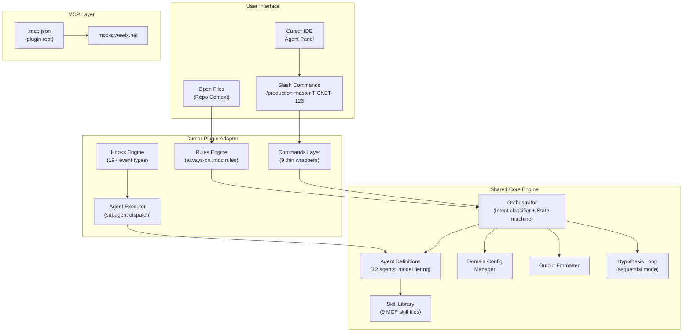
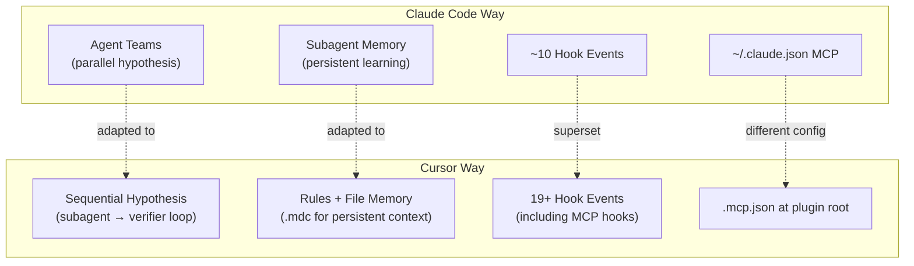
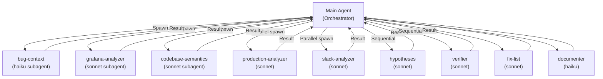
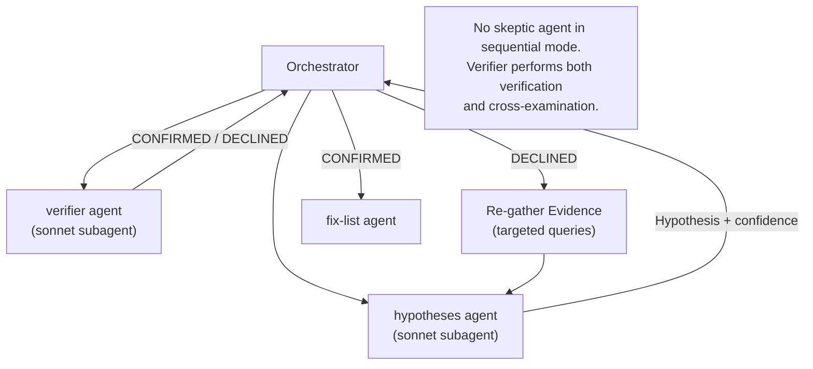
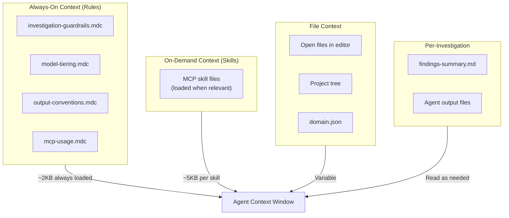
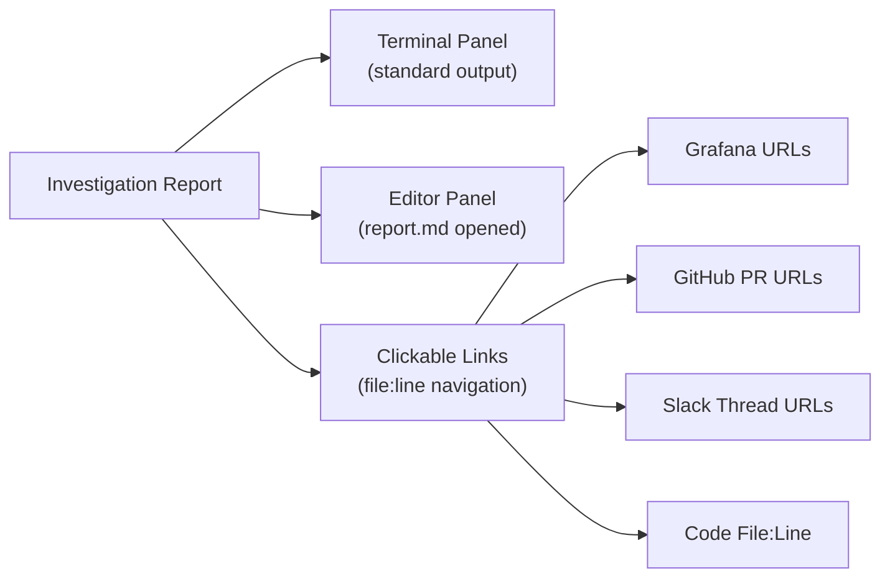
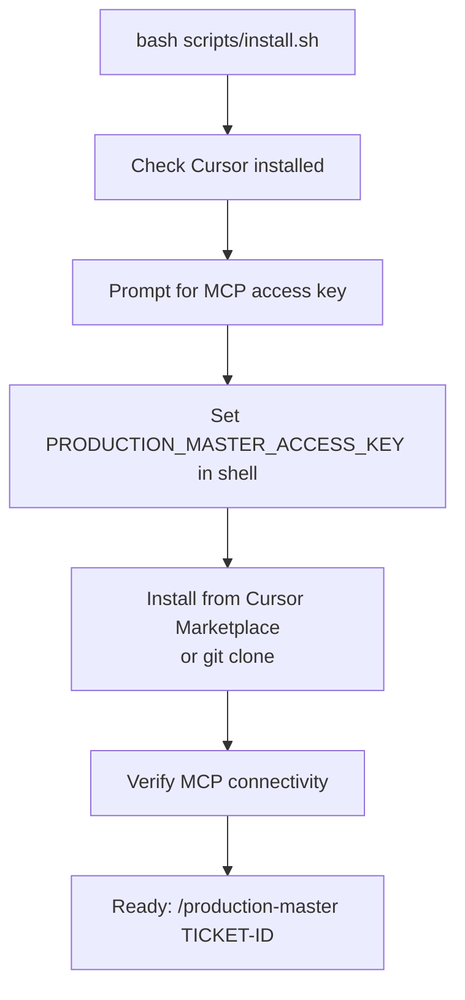
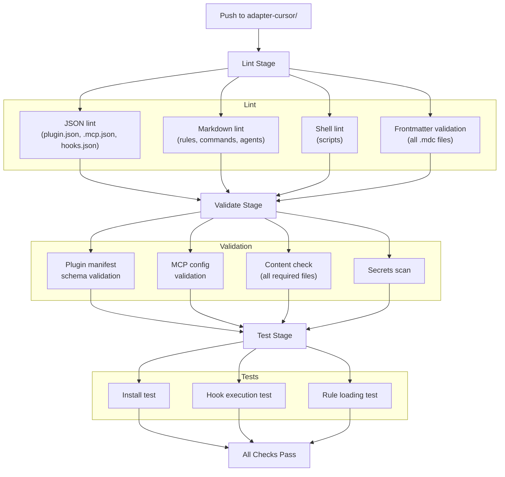
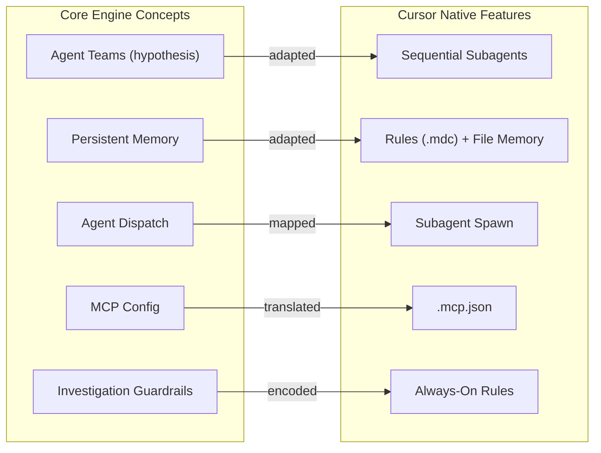

# Production Master: Cursor Plugin Design

> **Navigation:** [Index](./README.md) | Previous: [01 — Claude Code plugin design](./01-claude-code-plugin.md) | Next: [03 — Cloud pipeline design](./03-cloud-pipeline.md)

> **Document Type:** Application Design & Implementation
> **Version:** 1.0
> **Date:** 2026-02-21
> **Author:** Tamir Cohen
> **Status:** Draft
> **Platform:** Cursor IDE (v2.5+)

---

## Table of Contents

1. [Executive Summary](#executive-summary)
2. [Platform Capabilities & Constraints](#platform-capabilities--constraints)
3. [Architecture Overview](#architecture-overview)
4. [Plugin Manifest & Packaging](#plugin-manifest--packaging)
5. [Rules System](#rules-system)
6. [Commands Architecture](#commands-architecture)
7. [Agent Execution Model](#agent-execution-model)
8. [Skills System](#skills-system)
9. [Hooks System](#hooks-system)
10. [MCP Integration](#mcp-integration)
11. [Context & Memory Strategy](#context--memory-strategy)
12. [IDE-Specific Features](#ide-specific-features)
13. [Installation & Distribution](#installation--distribution)
14. [CI/CD Pipeline](#cicd-pipeline)
15. [Platform Adaptation Strategy](#platform-adaptation-strategy)
16. [References & Citations](#references--citations)

---

## Executive Summary

The Cursor plugin adapts Production Master for IDE-native investigation within the Cursor editor. Cursor's plugin architecture (since v2.5) provides **rules** for always-on context, **skills** for on-demand capabilities, **subagents** for parallel task execution, **hooks** for lifecycle automation, and **MCP integration** for external tool access ([Cursor Plugin Docs](https://cursor.com/docs/plugins/building)).

Unlike Claude Code, Cursor does **not** support agent teams or persistent memory. The Cursor adapter must therefore:
- Replace agent teams with sequential hypothesis testing via subagents
- Use rules (`.mdc`) for persistent investigation context instead of memory scopes
- Leverage the IDE's file awareness for code-centric investigations
- Adapt the 71 KB orchestrator into Cursor's context window constraints

### Key Platform Advantages

| Advantage | Description | Source |
|-----------|-------------|--------|
| **IDE File Awareness** | Native access to open files, project tree, and editor context | [Cursor IDE](https://cursor.com) |
| **Always-On Rules** | `.mdc` rules provide persistent investigation context | [Cursor Rules](https://cursor.com/docs/plugins/building) |
| **Subagent Parallelism** | Parallel subagents for independent data collection tasks | [Cursor Subagents](https://cursor.com/docs/plugins/building) |
| **Rich Hook Events** | 19+ hook events including MCP-specific hooks | [Cursor Hooks](https://cursor.com/docs/plugins/building) |
| **Marketplace Distribution** | Direct marketplace publishing for team-wide installation | [Cursor Marketplace](https://cursor.com/marketplace) |

### Key Platform Constraints

| Constraint | Impact | Mitigation |
|------------|--------|------------|
| **No Agent Teams** | Cannot do parallel competing hypotheses | Sequential hypothesis → verifier loop |
| **No Persistent Memory** | No cross-session learning | Rules for persistent context; external file-based memory |
| **Subagents Can't Share Memory** | Each subagent has isolated context | Orchestrator aggregates and distributes |
| **No Nested Subagents** | Subagents cannot spawn further subagents | Flat subagent hierarchy |
| **Context Window Limits** | IDE-bound context is smaller than CLI | Aggressive context management |

Source: [Plugins Research](./Plugins%20-%20deep-research-report.md)

---

## Platform Capabilities & Constraints

### Feature Comparison: Cursor vs Claude Code

| Feature | Cursor | Claude Code | Design Decision |
|---------|--------|-------------|-----------------|
| **Plugin Manifest** | `.cursor-plugin/plugin.json` | `.claude-plugin/plugin.json` | Separate manifests, same metadata |
| **Rules** | `.mdc` files, always-on | No native rules (use CLAUDE.md) | Use rules for investigation guardrails |
| **Skills** | `SKILL.md`, on-demand | `SKILL.md`, auto-discovery | Same skill format, shared from core |
| **Commands** | `commands/*.md` | `commands/*.md` | Same format, thin wrappers |
| **Agents** | `agents/*.md` with frontmatter | `agents/*.md` with frontmatter | Same format, shared from core |
| **Subagents** | Parallel, own context | Parallel, own context | Same pattern |
| **Agent Teams** | **Not supported** | Experimental, parallel sessions | **Fallback to sequential** |
| **Hooks** | 19+ event types | ~10 event types | Cursor has **more** hook events |
| **MCP** | `.mcp.json` at plugin root | `~/.claude.json` entries | Different config method |
| **Memory** | **No persistent memory** | Subagent memory scopes | File-based memory fallback |
| **Distribution** | Cursor Marketplace | Claude Code Marketplace | Separate marketplace submissions |

Source: [Cursor Docs](https://cursor.com/docs/plugins/building), [Claude Code Docs](https://code.claude.com/docs/en/plugins)

---

## Architecture Overview

### High-Level Architecture



### Cursor-Specific Adaptations



---

## Plugin Manifest & Packaging

### Plugin Manifest (`adapter-cursor/.cursor-plugin/plugin.json`)

```json
{
  "name": "production-master",
  "version": "1.0.0",
  "description": "Autonomous production investigation pipeline — 12 agents, hypothesis loops, 9 MCP integrations, IDE-native debugging",
  "author": {
    "name": "Tamir Cohen",
    "email": "tamirc@wix.com"
  },
  "repository": "https://github.com/TamirCohen-Wix/production-master",
  "license": "MIT",
  "keywords": [
    "production",
    "investigation",
    "debugging",
    "sre",
    "incident-response"
  ],
  "logo": "assets/logo.svg"
}
```

Source: [Cursor Plugin Manifest](https://cursor.com/docs/plugins/building)

### Directory Structure

```
adapter-cursor/
├── .cursor-plugin/
│   └── plugin.json                    # Plugin metadata
│
├── rules/                             # Cursor-specific always-on rules
│   ├── investigation-guardrails.mdc   # Citation requirements, data isolation
│   ├── model-tiering.mdc             # Which models for which agents
│   ├── output-conventions.mdc        # Output file naming, directory rules
│   └── mcp-usage.mdc                 # MCP tool discovery patterns
│
├── commands/                          # 9 commands (thin wrappers)
│   ├── production-master.md
│   ├── grafana-query.md
│   ├── slack-search.md
│   ├── production-changes.md
│   ├── resolve-artifact.md
│   ├── fire-console.md
│   ├── update-context.md
│   ├── production-master-report.md
│   └── git-update-agents.md
│
├── agents/                            # Cursor agent configs (referencing core)
│   ├── bug-context.md
│   ├── artifact-resolver.md
│   ├── grafana-analyzer.md
│   ├── codebase-semantics.md
│   ├── production-analyzer.md
│   ├── slack-analyzer.md
│   ├── hypotheses.md
│   ├── verifier.md
│   ├── fix-list.md
│   ├── documenter.md
│   └── publisher.md
│
├── skills/                            # Symlinked from core
│   ├── octocode/SKILL.md
│   ├── grafana-datasource/SKILL.md
│   └── ...
│
├── hooks/
│   └── hooks.json                     # Cursor-specific hooks
│
├── .mcp.json                          # MCP server configuration
│
├── assets/
│   └── logo.svg                       # Plugin logo
│
├── scripts/
│   ├── install.sh                     # Cursor-specific installer
│   ├── validate-report-links.sh       # Report link validator
│   └── format-output.sh              # Post-write formatter
│
└── README.md
```

---

## Rules System

### Design Philosophy

Cursor rules (`.mdc` files) provide **always-on context** that the agent sees at the start of every conversation. This is a unique Cursor feature not available in Claude Code.

> _"Rules provide persistent instructions... as always-on context that the agent sees at the start of every conversation."_ — [Cursor Docs](https://cursor.com/docs/plugins/building)

We use rules to encode the investigation guardrails that Claude Code embeds in its 71 KB orchestrator command.

### Rule Definitions

#### `investigation-guardrails.mdc`

```markdown
---
description: Production Master investigation guardrails — citation, isolation, and evidence standards
alwaysApply: true
---

## Citation Requirements
- NEVER state "X calls Y" without file:line or GitHub link
- NEVER state traffic numbers without Grafana query reference
- NEVER reference frontend repos without verifying existence
- When unsure, say "unverified" and flag for user

## Data Isolation
- Data agents (grafana-analyzer, codebase-semantics, production-analyzer, slack-analyzer) NEVER see each other's outputs
- Only Hypothesis and Verifier agents synthesize across all data sources
- This prevents confirmation bias

## Evidence Standards
- Every hypothesis must have verifiable evidence
- Confidence scores must be 0-100%
- The 5-point verification checklist must pass for CONFIRMED:
  1. Pinpoint explanation of what went wrong
  2. Why it started (trigger event)
  3. Whether the bug is still in code
  4. Why it stopped (if resolved)
  5. Evidence completeness
```

#### `model-tiering.mdc`

```markdown
---
description: Model assignment rules for Production Master agents
alwaysApply: true
---

## Model Tiering
- **Haiku**: bug-context, artifact-resolver, documenter, publisher (structured parsing, templates)
- **Sonnet**: grafana-analyzer, codebase-semantics, production-analyzer, slack-analyzer, hypotheses, verifier, fix-list (reasoning required)
- **Never Opus** for subagent workloads (cost + unnecessary quality delta)
```

#### `output-conventions.mdc`

```markdown
---
description: Output file naming and directory conventions
alwaysApply: true
---

## Output Directory
- Inside a git repo: `.cursor/debug/debug-{TICKET}-{TIMESTAMP}/`
- Agent subdirectories created on-write, not pre-created
- File naming: `{agent}-output-V{N}.md` (clean data), `{agent}-trace-V{N}.md` (debug only)
- Each run is completely fresh — never read previous debug directories

## Findings Summary
- `findings-summary.md` is the persistent state file
- Updated after every pipeline step
- Contains: incident window, services, top errors, what's proven, what's missing
```

#### `mcp-usage.mdc`

```markdown
---
description: MCP tool discovery and usage patterns
alwaysApply: true
globs: ["**/*.md"]
---

## MCP Tool Discovery
- Use ToolSearch("+<server> <tool>") for dynamic tool discovery
- Tool names are prefixed: mcp__<server_key>__<namespace>__<tool>
- Server keys may vary per installation — always discover dynamically
- Available servers: grafana-datasource, grafana-mcp, Slack, github, jira, octocode, FT-release, fire-console, context-7
```

Source: [Cursor Rules Documentation](https://cursor.com/docs/plugins/building)

---

## Commands Architecture

### Command Format

Cursor commands use the same markdown + YAML frontmatter format as Claude Code:

```markdown
---
name: production-master
description: Autonomous production investigation pipeline
---

# Production Master Investigation

## Usage
/production-master TICKET-ID [--mode fast|balanced|deep]

[Core orchestrator logic - adapted for Cursor subagent dispatch]
```

Source: [Cursor Commands](https://cursor.com/docs/plugins/building)

### Command Adaptation

| Command | Claude Code Specific | Cursor Adaptation |
|---------|---------------------|-------------------|
| `production-master` | Uses `Task` tool, agent teams | Uses subagent dispatch, sequential hypothesis |
| `grafana-query` | Same | Same |
| `slack-search` | Same | Same |
| `production-changes` | Same | Same |
| `resolve-artifact` | Same | Same |
| `fire-console` | Same | Same |
| `update-context` | Writes to `~/.claude/` | Writes to `~/.cursor/` |
| `production-master-report` | Same | Same |
| `git-update-agents` | Syncs `.claude/agents/` | Syncs `.cursor/agents/` |

---

## Agent Execution Model

### Subagent Architecture

Cursor subagents operate similarly to Claude Code subagents but with key differences:



Source: [Cursor Subagent Documentation](https://cursor.com/docs/plugins/building)

### Hypothesis Phase: Sequential Mode

Since Cursor lacks agent teams, the hypothesis phase uses a sequential pattern:



### Agent Definition Format

Cursor agents in `agents/` use `.md` files with YAML frontmatter:

```markdown
---
name: grafana-analyzer
description: Queries production logs and metrics, reports raw findings
---

# Grafana Analyzer Agent

You are a specialized agent for querying production logs and metrics.

## Rules
1. Report raw findings ONLY — no analysis
2. Use grafana-datasource MCP tools for all queries
3. Always inspect the `data` column in app_logs
4. Write output to the specified output path
```

Source: [Cursor Agent Configuration](https://cursor.com/docs/plugins/building)

---

## Skills System

### Skill Format

Cursor skills use the same `SKILL.md` format with YAML frontmatter. They are loaded **on-demand** rather than always-on:

> _"Unlike Rules which are always included, Skills are loaded dynamically when the agent decides they're relevant."_ — [Cursor Docs](https://cursor.com/docs/plugins/building)

### Skill Files (Symlinked from Core)

```
skills/
├── octocode/SKILL.md           # Code search patterns
├── grafana-datasource/SKILL.md # SQL/PromQL/LogQL templates
├── grafana-mcp/SKILL.md        # Dashboard and alert operations
├── slack/SKILL.md              # Search operators, channel resolution
├── github/SKILL.md             # PR queries, commit search
├── jira/SKILL.md               # JQL syntax, field lists
├── fire-console/SKILL.md       # gRPC invocation, domain schemas
├── ft-release/SKILL.md         # Feature toggle operations
└── context7/SKILL.md           # Library documentation lookup
```

### Skill Loading Strategy

Unlike Claude Code where the orchestrator manually reads all skills, Cursor's dynamic loading is leveraged:

1. **Rules** tell the agent which skills exist and when to use them
2. **Cursor runtime** loads relevant skills based on agent description matching
3. **Agent frontmatter** can reference specific skills

---

## Hooks System

### Available Hook Events

Cursor provides **19+ hook events** — significantly more than Claude Code:

| Hook Event | Use in Production Master | Priority |
|------------|-------------------------|----------|
| `sessionStart` | Pre-flight MCP server check | P1 |
| `sessionEnd` | Generate investigation summary | P2 |
| `beforeShellExecution` | Block dangerous commands | P1 |
| `afterShellExecution` | Log shell command results | P3 |
| `beforeReadFile` | Track file access patterns | P3 |
| `afterFileEdit` | Auto-format, link validation | P1 |
| `preToolUse` | Sanitize MCP inputs | P2 |
| `postToolUse` | Log MCP tool calls | P2 |
| `postToolUseFailure` | MCP error recovery | P1 |
| `beforeMCPExecution` | Validate MCP request params | P2 |
| `afterMCPExecution` | Log MCP responses for trace | P2 |
| `subagentStart` | Track agent launch | P3 |
| `subagentStop` | Collect agent results | P2 |
| `beforeSubmitPrompt` | Context validation | P3 |
| `stop` | Loop control (investigation continue/stop) | P1 |
| `afterAgentResponse` | Response quality check | P3 |
| `preCompact` | Save state before compression | P2 |

Source: [Cursor Hooks Documentation](https://cursor.com/docs/plugins/building)

### Hooks Configuration (`hooks/hooks.json`)

```json
{
  "hooks": {
    "sessionStart": [
      {
        "command": "./scripts/check-mcp-servers.sh",
        "description": "Verify MCP server connectivity before investigation"
      }
    ],
    "afterFileEdit": [
      {
        "command": "./scripts/validate-report-links.sh",
        "matcher": "*report.md",
        "description": "Validate report links after writing"
      },
      {
        "command": "./scripts/format-output.sh",
        "matcher": "*output-V*.md",
        "description": "Format agent output files"
      }
    ],
    "postToolUseFailure": [
      {
        "command": "./scripts/mcp-error-handler.sh",
        "matcher": "mcp__*",
        "description": "Handle MCP tool failures gracefully"
      }
    ],
    "beforeShellExecution": [
      {
        "command": "./scripts/validate-command.sh",
        "matcher": "rm|git push|curl",
        "description": "Block dangerous commands during investigation"
      }
    ],
    "stop": [
      {
        "command": "./scripts/investigation-loop-check.sh",
        "description": "Check if hypothesis loop should continue"
      }
    ]
  }
}
```

---

## MCP Integration

### Configuration Method

Cursor plugins use `.mcp.json` at the plugin root for MCP server definitions. Unlike Claude Code's `~/.claude.json`, Cursor can auto-start MCP servers when the plugin loads.

Source: [Cursor MCP Configuration](https://cursor.com/docs/plugins/building)

### MCP Configuration (`.mcp.json`)

```json
{
  "mcpServers": {
    "octocode": {
      "command": "npx",
      "args": ["-y", "@mcp-s/mcp"],
      "env": {
        "BASE_URL": "https://mcp-s.wewix.net",
        "USER_ACCESS_KEY": "${PRODUCTION_MASTER_ACCESS_KEY}",
        "MCP": "octocode"
      }
    },
    "grafana-datasource": {
      "type": "http",
      "url": "https://mcp-s.wewix.net/mcp?mcp=grafana-datasource",
      "headers": {
        "x-user-access-key": "${PRODUCTION_MASTER_ACCESS_KEY}"
      }
    },
    "grafana-mcp": {
      "type": "http",
      "url": "https://mcp-s.wewix.net/mcp?mcp=grafana-mcp",
      "headers": {
        "x-user-access-key": "${PRODUCTION_MASTER_ACCESS_KEY}"
      }
    },
    "Slack": {
      "type": "http",
      "url": "https://mcp-s.wewix.net/mcp?mcp=slack",
      "headers": {
        "x-user-access-key": "${PRODUCTION_MASTER_ACCESS_KEY}"
      }
    },
    "github": {
      "type": "http",
      "url": "https://mcp-s.wewix.net/mcp?mcp=github",
      "headers": {
        "x-user-access-key": "${PRODUCTION_MASTER_ACCESS_KEY}"
      }
    },
    "jira": {
      "type": "http",
      "url": "https://mcp-s.wewix.net/mcp?mcp=jira",
      "headers": {
        "x-user-access-key": "${PRODUCTION_MASTER_ACCESS_KEY}"
      }
    },
    "FT-release": {
      "type": "http",
      "url": "https://mcp-s.wewix.net/mcp?mcp=gradual-feature-release",
      "headers": {
        "x-user-access-key": "${PRODUCTION_MASTER_ACCESS_KEY}"
      }
    },
    "fire-console": {
      "type": "http",
      "url": "https://mcp-s.wewix.net/mcp?mcp=fire-console"
    },
    "context-7": {
      "type": "http",
      "url": "https://mcp-s.wewix.net/mcp?mcp=context7",
      "headers": {
        "x-user-access-key": "${PRODUCTION_MASTER_ACCESS_KEY}"
      }
    }
  }
}
```

### Environment Variable Setup

Users must set `PRODUCTION_MASTER_ACCESS_KEY` in their shell profile or Cursor settings. The `install.sh` script handles this:

```bash
# Prompt user for access key
echo "Enter your MCP access key from https://mcp-s-connect.wewix.net/mcp-servers:"
read -s ACCESS_KEY
echo "export PRODUCTION_MASTER_ACCESS_KEY='$ACCESS_KEY'" >> ~/.zshrc
```

---

## Context & Memory Strategy

### Context Management

Cursor's context window is IDE-bound and potentially smaller than Claude Code's CLI context. Strategies:



### Memory Workaround

Since Cursor has no persistent memory, we use file-based memory:

| Memory Type | Storage | Read By |
|-------------|---------|---------|
| **Domain config** | `~/.cursor/production-master/domains/<repo>/domain.json` | Orchestrator |
| **Repo knowledge** | `~/.cursor/production-master/domains/<repo>/memory/MEMORY.md` | Orchestrator (included via rules) |
| **Investigation state** | `.cursor/debug/debug-*/findings-summary.md` | Orchestrator |

---

## IDE-Specific Features

### Code Navigation Integration

Cursor's IDE context enables features not available in Claude Code:

1. **Open File Context** — The agent sees currently open files, enabling faster code analysis
2. **Project Tree** — Automatic awareness of repository structure
3. **Inline Code References** — Agent can reference `file:line` that users can click to navigate
4. **Error Highlighting** — Investigation findings can highlight relevant code in the editor

### IDE-Adapted Output



---

## Installation & Distribution

### Installation Flow



### Distribution Channels

| Channel | Method | Use Case | Source |
|---------|--------|----------|--------|
| **Cursor Marketplace** | Submit via [cursor.com/marketplace/publish](https://cursor.com/marketplace/publish) | Standard installation | [Cursor Marketplace](https://cursor.com/docs/plugins/building) |
| **Git** | `cursor --plugin-dir ./adapter-cursor` | Development testing | [Cursor Docs](https://cursor.com/docs/plugins/building) |
| **Team Marketplace** | `.cursor-plugin/marketplace.json` in shared repo | Enterprise distribution | [Cursor Docs](https://cursor.com/docs/plugins/building) |

### Marketplace Submission Checklist

- [ ] Valid `.cursor-plugin/plugin.json` with unique kebab-case name
- [ ] Clear description explaining purpose
- [ ] All components have proper YAML frontmatter
- [ ] Logo committed to repo with relative path reference
- [ ] Comprehensive README.md
- [ ] All manifest paths are relative
- [ ] Locally tested via `--plugin-dir`

Source: [Cursor Publishing Checklist](https://cursor.com/docs/plugins/building)

---

## CI/CD Pipeline

### GitHub Actions Workflow (`ci-cursor.yml`)



### Release Pipeline (`release-cursor.yml`)

1. Triggered by tag `cursor/vX.Y.Z`
2. Runs full CI
3. Updates `plugin.json` version
4. Packages plugin for marketplace
5. Submits to Cursor Marketplace review
6. Creates GitHub Release

---

## Platform Adaptation Strategy

### Adaptation Layer Design

The Cursor adapter implements a translation layer between core engine concepts and Cursor-native features:



### Key Adaptations

| Core Feature | Claude Code Implementation | Cursor Implementation | Trade-off |
|-------------|---------------------------|----------------------|-----------|
| **Competing hypotheses** | Agent teams (parallel) | Sequential hypothesis + verifier | Slower but simpler |
| **Cross-examination** | Skeptic agent in team | Verifier handles both verification and skepticism | Less diverse perspectives |
| **Persistent learning** | `memory: project` scope | File-based `MEMORY.md` loaded via rules | Manual management required |
| **Investigation guardrails** | Embedded in 71KB command | Extracted to `.mdc` rules | Cleaner separation |
| **MCP auth** | `install.sh` → `~/.claude.json` | Env vars → `.mcp.json` | Different user flow |
| **Output directory** | `.claude/debug/` | `.cursor/debug/` | Platform-specific path |

---

## References & Citations

1. **Cursor Plugin Documentation** — [cursor.com/docs/plugins/building](https://cursor.com/docs/plugins/building) — Complete plugin building guide, manifest, rules, skills, hooks, agents, MCP, marketplace
2. **Cursor Marketplace** — [cursor.com/marketplace](https://cursor.com/marketplace) — Plugin distribution platform
3. **Cursor Plugin Template** — [github.com/cursor/plugin-template](https://github.com/cursor/plugin-template) — Starter scaffolding
4. **Production Master Repository** — [github.com/TamirCohen-Wix/production-master](https://github.com/TamirCohen-Wix/production-master) — v1.0.3-beta source
5. **Wix MCP Server Portal** — [mcp-s-connect.wewix.net/mcp-servers](https://mcp-s-connect.wewix.net/mcp-servers) — MCP access keys and server list
6. **Plugins Deep Research Report** — Local: `Plugins - deep-research-report.md` — Cursor deep dive, rules vs skills, subagent model, hooks system
7. **Wix Deep Research Report** — Local: `WIX - deep-research-report.md` — CI/CD strategy, deployment architecture
8. **General Deep Research Report** — Local: `General - deep-research-report.md` — Multi-agent patterns, planner-executor, model routing
9. **Current Architecture Doc** — [docs/architecture.md](../docs/architecture.md) — Pipeline design, agent table, data flow
10. **Current Investigation Flow** — [docs/investigation-flow.md](../docs/investigation-flow.md) — State machine, hypothesis loop
11. **Claude Code Docs (for comparison)** — [code.claude.com/docs/en/plugins](https://code.claude.com/docs/en/plugins) — Compared features
12. **AWS Bedrock Intelligent Routing** — [aws.amazon.com/blogs/machine-learning/intelligent-prompt-routing-bedrock/](https://aws.amazon.com/blogs/machine-learning/intelligent-prompt-routing-bedrock/) — Cost-aware model routing patterns
