# Production Master: Cloud Pipeline Service Design

> **Navigation:** [Index](./README.md) | Previous: [02 — Cursor plugin design](./02-cursor-plugin.md) | Next: [04 — Implementation plan](./04-implementation-plan.md)

> **Document Type:** Application Design & Implementation
> **Version:** 1.0
> **Date:** 2026-02-21
> **Author:** Tamir Cohen
> **Status:** Draft
> **Platform:** Cloud Service (Kubernetes)

---

## Table of Contents

1. [Executive Summary](#executive-summary)
2. [Architecture Overview](#architecture-overview)
3. [Service Architecture](#service-architecture)
4. [API Design](#api-design)
5. [Agent Execution Engine](#agent-execution-engine)
6. [Event-Driven Triggers](#event-driven-triggers)
7. [MCP Integration](#mcp-integration)
8. [Knowledge Base & Persistence](#knowledge-base--persistence)
9. [Observability & Monitoring](#observability--monitoring)
10. [Deployment Architecture](#deployment-architecture)
11. [Security Architecture](#security-architecture)
12. [Scaling Strategy](#scaling-strategy)
13. [CI/CD Pipeline](#cicd-pipeline)
14. [Cost Management](#cost-management)
15. [Migration & Rollout Plan](#migration--rollout-plan)
16. [References & Citations](#references--citations)

---

## Executive Summary

The Cloud Pipeline is a **headless, API-driven service** that runs Production Master investigations without requiring a developer's local environment. It extends the investigation pipeline from individual developer tools (Claude Code, Cursor) to an **organizational capability** — triggered by alerts, Jira tickets, Slack commands, or scheduled health checks.

### Key Differentiators from Plugin Variants

| Aspect | Plugin (Claude/Cursor) | Cloud Pipeline |
|--------|----------------------|----------------|
| **Trigger** | Manual (developer types command) | Automated (webhook, API, schedule) |
| **Runtime** | Developer's machine | Kubernetes cluster |
| **Concurrency** | Single investigation at a time | Multiple parallel investigations |
| **Authentication** | Developer's personal MCP key | Service account + Vault |
| **Output** | Terminal/IDE | API response + Jira/Slack publishing |
| **Persistence** | Local files | Database + object storage |
| **Observability** | Trace files | Full OpenTelemetry + Prometheus |
| **Availability** | When developer is online | 24/7 |

### Use Cases

| Use Case | Trigger | Value |
|----------|---------|-------|
| **Auto-triage alerts** | PagerDuty/Grafana webhook | Immediate investigation starts before on-call picks up |
| **Jira-triggered investigation** | Jira ticket creation with label | Bug reported → investigation runs automatically |
| **Slack-initiated** | `/investigate SCHED-45895` in Slack | Engineers trigger from Slack without switching tools |
| **Scheduled health checks** | Cron (hourly/daily) | Proactive detection of emerging issues |
| **CI/CD post-deploy** | Deployment webhook | Automatic post-deployment validation |
| **Batch re-investigation** | API with list of tickets | Re-investigate old tickets with updated knowledge |

---

## Architecture Overview

### High-Level Architecture


### Component Interaction Sequence


---

## Service Architecture

### Microservice Decomposition


### Service Responsibilities

| Service | Responsibility | Scaling |
|---------|---------------|---------|
| **API Service** | REST API, authentication, rate limiting | Horizontal (stateless) |
| **Orchestrator** | Pipeline state machine, agent dispatch, hypothesis loop | Horizontal (partitioned by investigation) |
| **Agent Worker** | Execute individual agent tasks with LLM calls | Horizontal (pool-based, auto-scale) |
| **Webhook Receiver** | Translate Jira/Slack/Alert webhooks to API calls | Horizontal (stateless) |

---

## API Design

### REST API Endpoints

```
POST   /api/v1/investigate                    # Start new investigation
GET    /api/v1/investigations                  # List investigations (paginated)
GET    /api/v1/investigations/{id}             # Get investigation status & report
GET    /api/v1/investigations/{id}/report      # Get full report
GET    /api/v1/investigations/{id}/traces      # Get agent traces
DELETE /api/v1/investigations/{id}             # Cancel investigation
POST   /api/v1/investigate/batch               # Start batch investigations

POST   /api/v1/query/grafana                   # Direct Grafana query
POST   /api/v1/query/slack                     # Direct Slack search
POST   /api/v1/query/production-changes        # Direct production changes query

GET    /api/v1/domains                         # List configured domains
POST   /api/v1/domains                         # Create/update domain config
GET    /api/v1/domains/{repo}/config            # Get domain config

GET    /api/v1/health                          # Health check
GET    /api/v1/metrics                         # Prometheus metrics
```

### Request/Response Examples

#### Start Investigation

```json
// POST /api/v1/investigate
{
  "ticket_id": "SCHED-45895",
  "mode": "balanced",           // fast | balanced | deep
  "domain": "Bookings/Server/scheduler",
  "publish": {
    "jira": true,
    "slack": "#bookings-alerts"
  },
  "callback_url": "https://example.com/webhook/investigation-complete"
}

// Response: 202 Accepted
{
  "investigation_id": "inv-2026-02-21-143000-sched45895",
  "status": "QUEUED",
  "estimated_duration_minutes": 15,
  "status_url": "/api/v1/investigations/inv-2026-02-21-143000-sched45895"
}
```

#### Investigation Status

```json
// GET /api/v1/investigations/inv-2026-02-21-143000-sched45895
{
  "investigation_id": "inv-2026-02-21-143000-sched45895",
  "ticket_id": "SCHED-45895",
  "status": "HYPOTHESIS_GENERATION",
  "phase": 5,
  "total_phases": 9,
  "hypothesis_iteration": 2,
  "agents_completed": ["bug-context", "grafana-analyzer", "codebase-semantics", "production-analyzer", "slack-analyzer"],
  "agents_running": ["hypotheses"],
  "started_at": "2026-02-21T14:30:00Z",
  "elapsed_seconds": 420,
  "token_usage": {
    "total": 125000,
    "by_model": {"haiku": 15000, "sonnet": 110000}
  }
}
```

#### Investigation Report

```json
// GET /api/v1/investigations/inv-2026-02-21-143000-sched45895/report
{
  "investigation_id": "inv-2026-02-21-143000-sched45895",
  "ticket_id": "SCHED-45895",
  "status": "COMPLETE",
  "verdict": "CONFIRMED",
  "confidence": 92,
  "root_cause": {
    "summary": "Feature toggle specs.bookings.newScheduler rolled out at 2026-02-20T08:00Z caused NPE in BookingValidator when resource field is empty",
    "evidence": [
      {"type": "grafana_log", "description": "NPE spike correlating with toggle rollout", "url": "https://grafana.wixpress.com/..."},
      {"type": "code", "description": "BookingValidator.java:142 - missing null check", "url": "https://github.com/wix-private/scheduler/blob/main/..."}
    ]
  },
  "fix_plan": {
    "steps": [
      {"action": "rollback_toggle", "target": "specs.bookings.newScheduler", "priority": "immediate"},
      {"action": "code_fix", "description": "Add null check in BookingValidator.java:142", "priority": "follow-up"}
    ]
  },
  "report_markdown": "# Investigation Report\n...",
  "report_jira_wiki": "{panel}...",
  "published_to": {
    "jira": {"comment_id": "12345", "url": "https://jira.wixpress.com/browse/SCHED-45895"},
    "slack": {"message_ts": "1708531800.123456", "channel": "#bookings-alerts"}
  },
  "duration_seconds": 840,
  "token_usage": {"total": 245000}
}
```

---

## Agent Execution Engine

### Worker Architecture


### Agent Task Execution

Unlike the plugin variants where the LLM runtime (Claude Code / Cursor) handles agent execution, the cloud pipeline must implement its own agent execution:

1. **Load agent definition** from `core/agents/{name}.md`
2. **Construct prompt** — system prompt + task input + skill content + investigation context
3. **Call LLM API** (Anthropic Claude) with the constructed prompt
4. **Handle tool calls** — when the LLM requests MCP tool usage, execute via HTTP
5. **Collect output** — write agent output and trace files to object storage
6. **Report completion** — notify orchestrator via queue

### Tool Call Handling


### LLM API Integration

The cloud service calls the Anthropic API directly (not via Claude Code CLI):

| Parameter | Value | Source |
|-----------|-------|--------|
| **API** | `api.anthropic.com/v1/messages` | [Anthropic API](https://docs.anthropic.com/en/api/messages) |
| **Model (Haiku)** | `claude-haiku-4-5-20251001` | For structured parsing agents |
| **Model (Sonnet)** | `claude-sonnet-4-6` | For reasoning agents |
| **Max Tokens** | 8192 (agents), 16384 (orchestrator) | Configurable per agent |
| **Temperature** | 0.0 (deterministic) | Investigation accuracy |
| **Tools** | MCP tools registered as Anthropic tool definitions | Translated from MCP schema |

---

## Event-Driven Triggers

### Webhook Architecture

```mermaid
flowchart TD
    subgraph EXTERNAL["External Systems"]
        JIRA_SYS["Jira<br/>(Issue Created webhook)"]
        SLACK_SYS["Slack<br/>(Slash command)"]
        PD["PagerDuty<br/>(Incident webhook)"]
        GRAFANA_ALERT["Grafana<br/>(Alert notification)"]
        CICD_SYS["CI/CD<br/>(Deploy webhook)"]
    end

    subgraph RECEIVER["Webhook Receiver Service"]
        JIRA_ADAPTER["Jira Adapter<br/>(Extract ticket ID, labels)"]
        SLACK_ADAPTER["Slack Adapter<br/>(Parse /investigate command)"]
        ALERT_ADAPTER["Alert Adapter<br/>(Extract service, severity)"]
        CICD_ADAPTER["CI/CD Adapter<br/>(Extract deploy info)"]
    end

    subgraph FILTER["Filter & Enrich"]
        DEDUP["Deduplication<br/>(Same ticket? Skip)"]
        DOMAIN_LOOKUP["Domain Lookup<br/>(Which repo/domain?)"]
        PRIORITY["Priority Assignment<br/>(P1=immediate, P2=queue)"]
    end

    JIRA_SYS --> JIRA_ADAPTER
    SLACK_SYS --> SLACK_ADAPTER
    PD & GRAFANA_ALERT --> ALERT_ADAPTER
    CICD_SYS --> CICD_ADAPTER

    JIRA_ADAPTER & SLACK_ADAPTER & ALERT_ADAPTER & CICD_ADAPTER --> DEDUP
    DEDUP --> DOMAIN_LOOKUP --> PRIORITY

    PRIORITY --> |"P1: Immediate"| FAST_QUEUE["Fast Queue<br/>(priority processing)"]
    PRIORITY --> |"P2: Normal"| NORMAL_QUEUE["Normal Queue"]
    PRIORITY --> |"P3: Background"| BG_QUEUE["Background Queue"]
```



### Trigger Configuration

| Trigger | Webhook URL | Filter | Auto-Action |
|---------|------------|--------|-------------|
| **Jira** | `/webhooks/jira` | Labels: `auto-investigate`, `production-bug` | Start investigation for ticket |
| **Slack** | `/webhooks/slack/command` | Command: `/investigate` | Start investigation for provided ticket |
| **PagerDuty** | `/webhooks/pagerduty` | Severity: P1, P2 | Start investigation, link to incident |
| **Grafana** | `/webhooks/grafana/alert` | Alert name contains `error_rate` | Start investigation for affected service |
| **CI/CD** | `/webhooks/deploy` | Environment: `production` | Post-deploy health check |

### Scheduled Jobs

| Schedule | Job | Description |
|----------|-----|-------------|
| Every 1h | `health-check` | Check error rates for all configured domains |
| Daily 6am | `stale-ticket-review` | Re-investigate open P1 tickets older than 24h |
| Weekly | `knowledge-update` | Re-index MEMORY.md from all domain configs |

---

## MCP Integration

### Service Account Authentication

Unlike plugins that use personal developer keys, the cloud pipeline uses a **service account**:


### MCP Configuration

```yaml
# config/mcp-config.yaml
mcp_proxy:
  base_url: "https://mcp-s.wewix.net"
  auth:
    type: "vault"
    vault_path: "secret/production-master/mcp-access-key"
    rotation_interval: "24h"

servers:
  grafana-datasource:
    path: "/mcp?mcp=grafana-datasource"
    timeout: 30s
    retry: 3
  grafana-mcp:
    path: "/mcp?mcp=grafana-mcp"
    timeout: 30s
    retry: 3
  slack:
    path: "/mcp?mcp=slack"
    timeout: 15s
    retry: 2
  github:
    path: "/mcp?mcp=github"
    timeout: 20s
    retry: 3
  jira:
    path: "/mcp?mcp=jira"
    timeout: 15s
    retry: 2
  octocode:
    type: "stdio"
    command: "npx"
    args: ["-y", "@mcp-s/mcp"]
    env:
      MCP: "octocode"
  ft-release:
    path: "/mcp?mcp=gradual-feature-release"
    timeout: 15s
    retry: 2
  fire-console:
    path: "/mcp?mcp=fire-console"
    auth: false
    timeout: 30s
    retry: 3
  context-7:
    path: "/mcp?mcp=context7"
    timeout: 10s
    retry: 2
```

Source: [Wix MCP Proxy](https://mcp-s-connect.wewix.net/mcp-servers), [Wix Research](./WIX%20-%20deep-research-report.md)

---

## Knowledge Base & Persistence

### Data Model


### Storage Architecture

| Data | Storage | Retention | Purpose |
|------|---------|-----------|---------|
| **Investigation state** | PostgreSQL | Indefinite | Pipeline state machine, query history |
| **Agent outputs** | Object Storage (S3) | 90 days | Full agent output files |
| **Agent traces** | Object Storage (S3) | 30 days | Debugging, audit |
| **Final reports** | PostgreSQL + S3 | Indefinite | Searchable reports |
| **Domain configs** | PostgreSQL | Indefinite | Domain configuration |
| **Incident embeddings** | Vector DB (Weaviate/Pinecone) | Indefinite | Similarity search |
| **Active sessions** | Redis | 24h TTL | Real-time state cache |
| **Metrics** | Prometheus/VictoriaMetrics | 1 year | Operational metrics |

### Knowledge Base Evolution


This evolution follows industry recommendations for enterprise RAG and GraphRAG ([GraphRAG Research](./Plugins%20-%20deep-research-report.md), [General Research](./General%20-%20deep-research-report.md)).

---

## Observability & Monitoring

### OpenTelemetry Integration


Source: [OpenTelemetry LLM Observability](https://opentelemetry.io/blog/2024/llm-observability/), [Traceloop Blog](https://www.traceloop.com/blog/opentelemetry-for-llm-observability)

### Key Metrics

| Metric | Type | Description |
|--------|------|-------------|
| `investigation_total` | Counter | Total investigations started |
| `investigation_duration_seconds` | Histogram | Time to complete investigation |
| `investigation_status` | Gauge | Current status distribution |
| `agent_execution_duration_seconds` | Histogram | Per-agent execution time |
| `agent_tokens_total` | Counter | Tokens consumed per agent |
| `mcp_call_duration_seconds` | Histogram | MCP tool call latency |
| `mcp_call_errors_total` | Counter | MCP tool call failures |
| `hypothesis_iterations` | Histogram | Hypothesis loop iterations |
| `hypothesis_confidence` | Histogram | Final confidence scores |
| `llm_cost_dollars` | Counter | Estimated LLM API cost |
| `queue_depth` | Gauge | Pending jobs in queue |
| `worker_utilization` | Gauge | Worker pool utilization |

### Dashboard Design

```
┌─────────────────────────────────────────────────────────────────┐
│                  Production Master Cloud Dashboard               │
├───────────────────────────────┬───────────────────────────────────┤
│  Active Investigations: 3     │  Avg Duration: 14m                │
│  Queued: 7                   │  Success Rate: 87%                │
│  Completed Today: 24         │  Avg Confidence: 78%              │
├───────────────────────────────┴───────────────────────────────────┤
│  Token Usage (24h)           │  Cost (24h)                       │
│  ██████████ 2.4M tokens      │  $12.50 (Haiku: $1.20, Sonnet: $11.30) │
├───────────────────────────────┴───────────────────────────────────┤
│  Investigation Timeline (last 24h)                               │
│  ▓▓▓▓▓▓░░░░▓▓▓▓▓▓▓░░░░░▓▓▓▓▓▓▓▓▓░░░░░░░░▓▓▓▓▓▓▓              │
│  00:00    06:00    12:00    18:00    24:00                        │
├──────────────────────────────────────────────────────────────────┤
│  Top Domains           │  Hypothesis Loop Stats                  │
│  Bookings: 12          │  1 iteration: 45%                       │
│  Payments: 8           │  2 iterations: 30%                      │
│  Events: 4             │  3+ iterations: 25%                     │
└──────────────────────────────────────────────────────────────────┘
```

---

## Deployment Architecture

### Kubernetes Architecture


### Helm Chart Values

```yaml
# helm/values.yaml
api:
  replicas: 2
  resources:
    requests: {cpu: "250m", memory: "512Mi"}
    limits: {cpu: "1000m", memory: "1Gi"}

orchestrator:
  replicas: 2
  resources:
    requests: {cpu: "500m", memory: "1Gi"}
    limits: {cpu: "2000m", memory: "2Gi"}

worker:
  minReplicas: 2
  maxReplicas: 10
  targetQueueDepth: 3
  resources:
    requests: {cpu: "500m", memory: "1Gi"}
    limits: {cpu: "2000m", memory: "4Gi"}

webhook:
  replicas: 1
  resources:
    requests: {cpu: "100m", memory: "256Mi"}

redis:
  cluster:
    enabled: true
    replicas: 3

postgresql:
  primary:
    resources:
      requests: {cpu: "500m", memory: "1Gi"}
  readReplicas:
    replicaCount: 2
```

### Industry Deployment Patterns

Our Kubernetes + worker pool architecture should be evaluated against established industry patterns:

| Platform | Architecture | Orchestration | Scaling | Our Comparison |
|----------|-------------|---------------|---------|----------------|
| AWS SageMaker Pipelines | Managed DAG execution on containerized steps | Step Functions + SageMaker Runtime | Auto-scaling endpoints, spot instances | We use K8s Jobs instead of managed DAGs — more control, more ops burden |
| Azure AI Studio | Prompt flow with managed compute | Azure ML Pipeline orchestrator | Compute instance pools, serverless inference | Similar worker pool concept; we avoid vendor lock-in but lose managed tooling |
| Google Vertex AI | Pipeline components on GKE/Cloud Run | Kubeflow Pipelines (KFP) | GKE autopilot, TPU allocation | Closest to our approach — K8s native, but with Google-managed infrastructure |
| LangGraph Cloud | Graph-based agent orchestration | LangGraph runtime | Horizontal pod scaling | Purpose-built for agents; we chose general K8s for flexibility |

#### Design Choice Justification

1. **K8s over managed services**: Avoids cloud vendor lock-in, enables hybrid/on-prem deployment, gives full control over scheduling and resource allocation
2. **Worker pool over serverless**: Predictable latency (no cold starts), persistent MCP connections, stateful investigation context within a worker
3. **Custom orchestrator over workflow engines**: Investigation-specific optimizations (adaptive phase selection, real-time signal routing) that general DAG engines don't support natively
4. **Trade-off acknowledged**: Higher operational burden than managed alternatives — mitigated by Helm charts, Terraform modules, and comprehensive monitoring (see Observability section)

---

## Security Architecture

### Security Model


Source: [Wix Research](./WIX%20-%20deep-research-report.md) — Zero-trust networking, Vault secrets management

### Security Controls

| Layer | Control | Implementation |
|-------|---------|----------------|
| **Network** | TLS everywhere, mTLS between services | Istio service mesh |
| **Authentication** | API key + JWT for clients, service accounts for internal | Auth middleware |
| **Authorization** | RBAC per endpoint, domain-level access | K8s RBAC + custom policies |
| **Secrets** | All credentials in Vault, short-lived tokens | HashiCorp Vault |
| **Data** | PII redaction in logs, encryption at rest | Log sanitization, AES-256 |
| **Audit** | All API calls logged, MCP calls traced | OpenTelemetry + immutable logs |
| **Input Validation** | Sanitize all webhook payloads and ticket data | Input validation middleware |
| **Network Policies** | Workers can only reach MCP proxy and storage | K8s NetworkPolicy |

---

## Scaling Strategy

### Auto-Scaling Rules


### Capacity Planning

| Component | Min | Max | Scale Metric | Target |
|-----------|-----|-----|-------------|--------|
| **API** | 2 | 8 | Request rate | 100 req/s per pod |
| **Orchestrator** | 2 | 6 | Active investigations | 10 per pod |
| **Worker** | 2 | 20 | Queue depth | 3 pending per pod |
| **Redis** | 3 | 3 | Fixed cluster | — |
| **PostgreSQL** | 1+2 | 1+4 | Connection count | 100 per primary |

---

## CI/CD Pipeline

### Build & Deploy Pipeline


### Deployment Commands

```bash
# Build & push
docker build -t production-master-cloud:$(git describe --tags) -f adapter-cloud/Dockerfile .
docker push <your-registry>/production-master-cloud:$(git describe --tags)

# Deploy to staging
helm upgrade --install production-master-staging adapter-cloud/helm/ \
  --namespace production-master-staging \
  --values adapter-cloud/helm/values-staging.yaml

# Deploy to production (canary)
helm upgrade --install production-master adapter-cloud/helm/ \
  --namespace production-master \
  --values adapter-cloud/helm/values-production.yaml \
  --set worker.canary.enabled=true \
  --set worker.canary.weight=10
```

---

## Cost Management

### Cost Model

| Cost Component | Unit Cost | Estimated Monthly (50 investigations/day) |
|---------------|-----------|-------------------------------------------|
| **Claude Haiku** | $0.25/1M input, $1.25/1M output | ~$25 |
| **Claude Sonnet** | $3/1M input, $15/1M output | ~$450 |
| **Kubernetes** | ~$500/month (10 worker pods avg) | ~$500 |
| **PostgreSQL** | ~$100/month (managed) | ~$100 |
| **Object Storage** | ~$10/month | ~$10 |
| **Redis** | ~$50/month | ~$50 |
| **Total** | | **~$1,135/month** |

### Cost Optimization

| Strategy | Savings | Source |
|----------|---------|--------|
| **Model tiering** (Haiku for structured tasks) | ~40% on LLM costs | [AWS Bedrock Routing](https://aws.amazon.com/blogs/machine-learning/intelligent-prompt-routing-bedrock/) |
| **Response caching** (deduplicate similar queries) | ~15% on LLM costs | — |
| **Spot instances** for workers | ~60% on compute | K8s spot node pools |
| **Auto-scaling down** during off-hours | ~30% on compute | HPA + scheduled scaling |
| **Investigation deduplication** (same ticket) | Variable | Queue-level dedup |

### Cost Management

#### Per-Investigation Cost Tracking

Every investigation tracks its cost breakdown in real-time:

    {
      "investigation_id": "inv-20240115-abc",
      "cost_breakdown": {
        "llm_tokens": { "input": 45000, "output": 12000, "cost_usd": 0.82 },
        "mcp_calls": { "count": 18, "cost_usd": 0.00 },
        "compute": { "worker_seconds": 45, "cost_usd": 0.003 },
        "total_usd": 0.823
      }
    }

#### Cost Budgets

Administrators can set cost ceilings at multiple levels:

| Budget Level | Scope | Default | Action on Breach |
|-------------|-------|---------|-----------------|
| Per-investigation | Single investigation run | $5.00 | Terminate investigation, publish partial findings |
| Per-domain | Monthly spend per service domain | $500 | Alert + throttle to essential-only investigations |
| Per-tenant | Monthly spend per team/org | $2,000 | Alert + require manual approval for new investigations |
| Global | Monthly platform-wide ceiling | $10,000 | Pause all non-critical investigations |

#### Cost Alerts and Auto-Throttling

- **80% threshold**: Warning alert to platform administrators
- **90% threshold**: Auto-throttle — only `alert-response` intent investigations proceed; `metrics-exploration` and `knowledge-query` are queued
- **100% threshold**: Hard stop — all new investigations require manual approval; in-progress investigations complete but no new ones start

Cost data is exposed via:
- Grafana dashboard (real-time per-investigation and aggregate views)
- `GET /api/v1/costs/summary` — current period cost summary
- `GET /api/v1/costs/investigation/:id` — per-investigation breakdown
- Webhook notifications for budget alerts

---

## Migration & Rollout Plan

### Phased Rollout


### Phase 1 (MVP) Deliverables

- [ ] REST API for starting/querying investigations
- [ ] Orchestrator service with full 9-phase pipeline
- [ ] Agent workers with Anthropic API integration
- [ ] MCP integration via service account
- [ ] PostgreSQL state management
- [ ] S3 report storage
- [ ] Basic health endpoint
- [ ] Helm chart for deployment
- [ ] Single domain configuration (Bookings)

---

## References & Citations

1. **Wix Deep Research Report** — Local: `WIX - deep-research-report.md` — Deployment architecture, Kubernetes, secrets management, zero-trust networking
2. **General Deep Research Report** — Local: `General - deep-research-report.md` — Event-driven architectures, microservice patterns, AWS reference architecture
3. **Plugins Deep Research Report** — Local: `Plugins - deep-research-report.md` — Core+adapter architecture, CI/CD pipeline design
4. **Production Master Repository** — [github.com/TamirCohen-Wix/production-master](https://github.com/TamirCohen-Wix/production-master) — Current implementation
5. **Wix MCP Server Portal** — [mcp-s-connect.wewix.net/mcp-servers](https://mcp-s-connect.wewix.net/mcp-servers) — MCP access keys and server list
6. **Anthropic API Documentation** — [docs.anthropic.com/en/api/messages](https://docs.anthropic.com/en/api/messages) — Claude API for agent execution
7. **OpenTelemetry LLM Observability** — [opentelemetry.io/blog/2024/llm-observability/](https://opentelemetry.io/blog/2024/llm-observability/) — Trace semantic conventions for AI
8. **Traceloop Blog** — [traceloop.com/blog/opentelemetry-for-llm-observability](https://www.traceloop.com/blog/opentelemetry-for-llm-observability) — End-to-end LLM trace capture
9. **AWS Bedrock Intelligent Prompt Routing** — [aws.amazon.com/blogs/machine-learning/intelligent-prompt-routing-bedrock/](https://aws.amazon.com/blogs/machine-learning/intelligent-prompt-routing-bedrock/) — Cost-aware model routing
10. **AWS Incident Response Reference Architecture** — Referenced in General Research — Serverless event-driven investigation pipeline
11. **Meta DrP Platform** — Referenced in General Research — 20-80% MTTR reduction at scale
12. **Datadog Bits AI SRE** — Referenced in General Research — 90% faster recovery via autonomous investigation
13. **HashiCorp Vault** — [vaultproject.io](https://www.vaultproject.io/) — Secrets management for service accounts
14. **Kubernetes HPA** — [kubernetes.io/docs/tasks/run-application/horizontal-pod-autoscale/](https://kubernetes.io/docs/tasks/run-application/horizontal-pod-autoscale/) — Auto-scaling workers
15. **Helm Charts** — [helm.sh](https://helm.sh/) — Kubernetes package management
16. **OWASP LLM Top 10** — [owasp.org/www-project-top-10-for-large-language-model-applications/](https://owasp.org/www-project-top-10-for-large-language-model-applications/) — Security risks for AI applications
